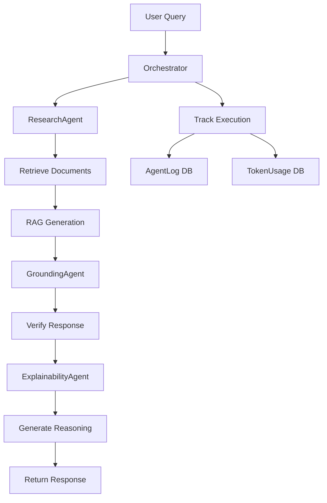
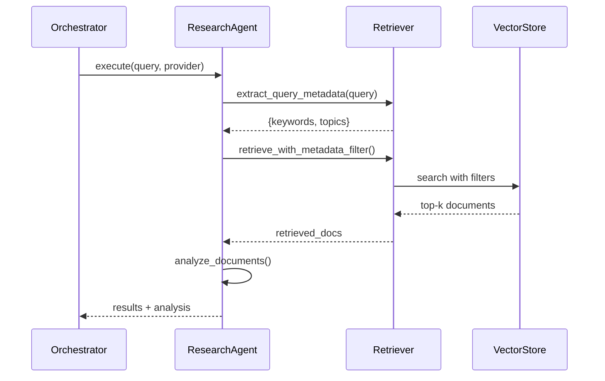
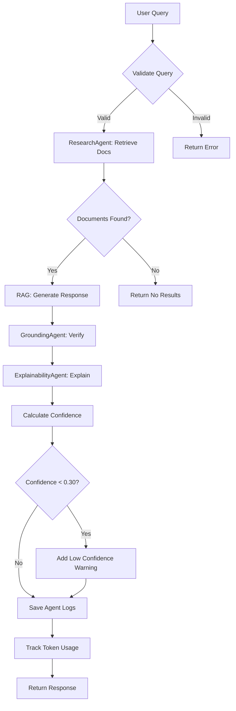

# Agent System Documentation

## Table of Contents
1. [Overview](#overview)
2. [Agent Architecture](#agent-architecture)
3. [Agent Types](#agent-types)
4. [Orchestration Flow](#orchestration-flow)
5. [Communication Patterns](#communication-patterns)
6. [Execution Lifecycle](#execution-lifecycle)
7. [Memory Management](#memory-management)
8. [Error Handling](#error-handling)
9. [Extending the System](#extending-the-system)
10. [Best Practices](#best-practices)

---

## Overview

The **Multi-Agent System** orchestrates specialized AI agents to perform complex reasoning tasks. Each agent has a specific role, and the orchestrator coordinates their execution to produce comprehensive, explainable responses.

### Why Multi-Agent Architecture?

1. **Separation of Concerns**: Each agent focuses on one task
2. **Modularity**: Easy to add/modify agents without affecting others
3. **Explainability**: Track which agent made which decision
4. **Scalability**: Agents can run in parallel (future enhancement)
5. **Testability**: Test agents independently

### Agent System Flow



---

## Agent Architecture

### BaseAgent Class

Abstract base class for all agents:

```python
class BaseAgent(ABC):
    def __init__(self, name: str, agent_type: str, description: str):
        self.name = name  # Agent identifier
        self.agent_type = agent_type  # Category (research, analyzer, etc.)
        self.description = description  # Human-readable description
        self.memory = []  # Short-term memory (last 50 items)

    @abstractmethod
    async def execute(self, input_data: Dict, provider: str) -> Dict:
        """Execute agent task - must be implemented by subclasses"""
        pass

    def add_to_memory(self, item: Dict):
        """Store execution results in memory"""
        pass

    def get_memory_context(self, limit: int = 5) -> str:
        """Retrieve recent memory for context"""
        pass
```

### Agent Registry

Centralized registry for agent discovery:

```python
AGENT_REGISTRY = {
    'research': ResearchAgent,
    'analyzer': AnalyzerAgent,
    'grounding': GroundingAgent,
    'explainability': ExplainabilityAgent
}

def get_agent(agent_type: str) -> BaseAgent:
    """Factory method to create agent instances"""
    if agent_type not in AGENT_REGISTRY:
        raise ValueError(f"Unknown agent type: {agent_type}")
    return AGENT_REGISTRY[agent_type]()
```

---

## Agent Types

### 1. ResearchAgent

**Purpose**: Retrieve and analyze relevant information from documents

**Capabilities**:
- Semantic document search
- Metadata-enhanced retrieval
- Multi-collection querying (global + user-specific)
- Document relevance analysis

**Input**:
```python
{
    'query': "What are the Q3 financial results?",
    'use_metadata_boost': True,  # Enable intelligent filtering
    'filters': {...},  # Optional metadata filters
    'user_id': 1  # For multi-tenant search
}
```

**Output**:
```python
{
    'status': 'completed',
    'agent': 'ResearchAgent',
    'results': [
        {
            'document_id': 'uuid',
            'chunk_id': 'uuid',
            'content': 'Revenue increased by 15%...',
            'similarity': 0.89,
            'metadata': {...}
        }
    ],
    'analysis': 'Retrieved documents show strong Q3 performance...',
    'summary': 'Retrieved 5 relevant documents',
    'confidence': 0.87,
    'reasoning': 'Found 5 documents with average similarity 0.87',
    'execution_time': 1.23
}
```

**Execution Flow**:


**Memory Management**:
```python
# Agent stores research history
self.add_to_memory({
    'query': query,
    'doc_count': len(retrieved_docs),
    'summary': result['summary']
})

# Future queries can reference past research
context = self.get_memory_context(limit=5)
```

---

### 2. AnalyzerAgent

**Purpose**: Perform data analysis and generate insights

**Capabilities**:
- General analysis (summarization, key points)
- Comparative analysis (compare documents/data)
- Trend analysis (identify patterns)
- Statistical analysis (from CSV data)

**Input**:
```python
{
    'analysis_type': 'comparative',  # general, comparative, trend
    'data': [...],  # Documents or data to analyze
    'focus': 'Revenue comparison across quarters'
}
```

**Output**:
```python
{
    'status': 'completed',
    'agent': 'AnalyzerAgent',
    'analysis': 'Comparative analysis reveals...',
    'insights': ['Insight 1', 'Insight 2'],
    'summary': 'Key findings: Revenue grew 15%, expenses stable',
    'confidence': 0.85,
    'reasoning': 'Analysis based on 3 quarters of data',
    'execution_time': 2.1
}
```

**Analysis Types**:

**General Analysis**:
```python
prompt = f"""
Analyze the following information:
{data}

Provide:
1. Key points
2. Summary
3. Important insights
"""
```

**Comparative Analysis**:
```python
prompt = f"""
Compare the following items:
{format_data(data)}

Provide:
1. Similarities
2. Differences
3. Trends
4. Recommendations
"""
```

**Trend Analysis**:
```python
prompt = f"""
Analyze trends in the data:
{time_series_data}

Identify:
1. Patterns
2. Anomalies
3. Predictions
4. Causal factors
```

---

### 3. GroundingAgent

**Purpose**: Verify response accuracy against source documents

**Capabilities**:
- Extract factual claims from responses
- Verify each claim against sources
- Calculate grounding score
- Provide evidence for/against claims

**Input**:
```python
{
    'response': 'Revenue increased by 15% in Q3...',
    'sources': [
        {'content': '...Q3 revenue grew 15%...', 'filename': 'q3_report.pdf'},
        ...
    ]
}
```

**Output**:
```python
{
    'status': 'completed',
    'agent': 'GroundingAgent',
    'grounding_score': 0.88,
    'verified_claims': [
        'Revenue increased by 15%',
        'Operating expenses decreased'
    ],
    'unverified_claims': ['Market share expected to grow'],
    'evidence': [
        "Claim 'Revenue increased by 15%' verified in q3_report.pdf: 'Q3 revenue grew 15% year-over-year'"
    ],
    'reasoning': '2 of 3 claims verified against sources',
    'confidence': 0.88,
    'execution_time': 1.5
}
```

**Verification Process**:

**Step 1: Extract Claims**:
```python
async def extract_claims(response: str) -> List[str]:
    prompt = f"""
    Extract factual claims from this response:
    {response}

    Return as JSON: ["claim1", "claim2", ...]
    """
    claims = await llm_service.invoke(prompt)
    return parse_json(claims)
```

**Step 2: Verify Each Claim**:
```python
async def verify_claim(claim: str, sources: List[str]) -> Dict:
    prompt = f"""
    Claim: {claim}

    Sources:
    {format_sources(sources)}

    Is the claim supported? (supported/partially_supported/unsupported)
    Provide evidence quote.
    """
    result = await llm_service.invoke(prompt)
    return parse_verification(result)
```

**Step 3: Calculate Grounding Score**:
```python
grounding_score = (fully_supported + partially_supported * 0.5) / total_claims
```

---

### 4. ExplainabilityAgent

**Purpose**: Generate transparent reasoning chains and explanations

**Capabilities**:
- Generate step-by-step reasoning
- Create transparency reports (Basic/Detailed/Debug)
- Map decisions to sources
- Explain agent coordination

**Input**:
```python
{
    'response': 'Revenue increased by 15%...',
    'agent_logs': [...],  # Logs from other agents
    'sources': [...],
    'level': 'detailed'  # basic, detailed, debug
}
```

**Output**:
```python
{
    'status': 'completed',
    'agent': 'ExplainabilityAgent',
    'explanation': 'The response was generated through...',
    'reasoning_chain': [
        {
            'step': 1,
            'agent': 'ResearchAgent',
            'action': 'Document retrieval',
            'reasoning': 'Searched knowledge base using query keywords...',
            'outcome': 'Retrieved 5 relevant documents'
        },
        {
            'step': 2,
            'action': 'Response generation',
            'reasoning': 'Synthesized information from retrieved documents...',
            'outcome': 'Generated response with 3 source citations'
        },
        {
            'step': 3,
            'agent': 'GroundingAgent',
            'action': 'Verification',
            'reasoning': 'Verified factual claims against sources...',
            'outcome': 'Grounding score: 0.88'
        }
    ],
    'confidence': 0.85,
    'execution_time': 0.8
}
```

**Explainability Levels**:

**Basic**:
```python
# Concise summary
"The answer was generated by searching 5 documents and verifying accuracy against sources."
```

**Detailed**:
```python
# Step-by-step reasoning
"""
1. Document Retrieval: Searched knowledge base using semantic similarity
   - Found 5 relevant documents with average relevance 0.87

2. Response Generation: Synthesized information from sources
   - Used 3 primary sources with direct citations

3. Verification: Verified factual claims
   - 2 of 3 claims fully supported (grounding score: 0.88)
"""
```

**Debug**:
```python
# Technical details for developers
"""
Agent Execution Timeline:
- 00:00.000 - ResearchAgent started
- 00:01.234 - Retrieved 5 documents from ChromaDB
- 00:01.500 - RAG generation (1500 tokens)
- 00:02.800 - GroundingAgent verification (800 tokens)
- 00:03.200 - ExplainabilityAgent explanation (400 tokens)

Total tokens: 2700 (prompt: 1800, completion: 900)
Estimated cost: $0.0042
"""
```

---

## Orchestration Flow

### AgentOrchestrator Class

Coordinates agent execution and manages the RAG pipeline:

```python
class AgentOrchestrator:
    def __init__(self):
        self.agents = AGENT_REGISTRY
        self.execution_history = []

    async def execute_rag_with_agents(
        self,
        query: str,
        provider: str,
        explainability_level: str,
        include_grounding: bool,
        user_id: Optional[int],
        document_filter: Optional[Dict]
    ) -> Dict:
        """Execute full RAG pipeline with agent coordination"""
        pass
```

### Execution Pipeline



### Sequential Execution

Currently, agents execute **sequentially**:

```python
# Step 1: Research
research_result = await research_agent.execute(...)

# Step 2: Generate (uses research results)
rag_result = await rag_retriever.generate_with_context(
    retrieved_docs=research_result['results']
)

# Step 3: Ground (uses generated response)
grounding_result = await grounding_agent.execute(
    response=rag_result['response']
)

# Step 4: Explain (uses all previous results)
explanation_result = await explainability_agent.execute(
    agent_logs=[research_result, grounding_result]
)
```

**Why Sequential?**:
- Dependencies between agents (each needs previous output)
- Simpler error handling
- Easier to debug

**Future Enhancement: Parallel Execution**:
```python
# Agents without dependencies can run in parallel
results = await asyncio.gather(
    analyzer_agent.execute(...),
    alternative_research_agent.execute(...)
)
```

---

## Communication Patterns

### Agent-to-Agent Communication

Agents don't communicate directly. The orchestrator mediates:

```python
# Bad: Direct agent communication
class AgentA:
    async def execute(self):
        result = await AgentB().execute()  # ❌ Tight coupling

# Good: Orchestrator-mediated
class Orchestrator:
    async def execute_pipeline(self):
        result_a = await agent_a.execute()
        result_b = await agent_b.execute(result_a)  # ✅ Loose coupling
```

**Benefits**:
- Agents remain independent
- Easy to modify pipeline
- Clear execution order

### Data Flow

```python
# Agent input/output contract
Input = Dict[str, Any]  # Flexible dictionary
Output = {
    'status': 'completed' | 'failed' | 'timeout',
    'agent': 'AgentName',
    'result': Any,  # Agent-specific result
    'confidence': float,  # 0.0-1.0
    'reasoning': str,  # Human-readable explanation
    'execution_time': float,  # Seconds
    'token_usage': Optional[Dict]  # If LLM used
}
```

---

## Execution Lifecycle

### 1. Initialization

```python
orchestrator = AgentOrchestrator()
# Agents loaded from registry
# No state preserved between requests (stateless)
```

### 2. Pre-Execution

```python
# Validate inputs
if not query or len(query) < 3:
    raise ValueError("Invalid query")

# Check permissions
if not user.has_permission('agents:execute'):
    raise PermissionError()

# Start timer
start_time = datetime.utcnow()
```

### 3. Agent Execution

```python
async def execute_agent(agent, input_data):
    try:
        result = await agent.execute(input_data, provider)

        # Log execution
        agent_log = AgentLog(
            agent_name=agent.name,
            agent_type=agent.agent_type,
            action=input_data.get('action'),
            input_data=input_data,
            output_data=result,
            status='success',
            execution_time=result['execution_time']
        )
        db.add(agent_log)

        return result

    except Exception as e:
        # Log failure
        agent_log = AgentLog(
            agent_name=agent.name,
            status='failed',
            error_message=str(e)
        )
        db.add(agent_log)
        raise
```

### 4. Post-Execution

```python
# Calculate total execution time
total_time = (datetime.utcnow() - start_time).total_seconds()

# Aggregate token usage across all agents
total_tokens = sum(log.tokens_used for log in agent_logs)

# Save results
message = Message(
    content=response,
    confidence_score=confidence,
    reasoning_chain=reasoning_chain,
    agents_involved=[log.agent_name for log in agent_logs]
)
db.add(message)
db.commit()
```

### 5. Streaming Support

For real-time updates via Server-Sent Events (SSE):

```python
async def execute_with_streaming():
    # Event: Agent started
    yield {
        'event': 'agent_start',
        'data': {'agent': 'ResearchAgent', 'status': 'started'}
    }

    # Execute agent
    result = await research_agent.execute(...)

    # Event: Agent completed
    yield {
        'event': 'agent_complete',
        'data': {'agent': 'ResearchAgent', 'status': 'completed', 'time': 1.2}
    }

    # Event: Streaming response tokens
    async for token in generate_response_stream():
        yield {
            'event': 'token',
            'data': {'content': token}
        }

    # Event: Complete
    yield {
        'event': 'complete',
        'data': {'confidence': 0.85, 'sources': [...]}
    }
```

---

## Memory Management

### Short-Term Memory

Each agent maintains a memory of recent executions:

```python
class BaseAgent:
    def __init__(self):
        self.memory = []  # List of execution results

    def add_to_memory(self, item: Dict):
        self.memory.append({
            **item,
            'timestamp': datetime.utcnow().isoformat()
        })

        # Keep only last 50 items
        if len(self.memory) > 50:
            self.memory = self.memory[-50:]

    def get_memory_context(self, limit: int = 5) -> str:
        """Get recent executions for context"""
        recent = self.memory[-limit:]
        return "\n".join([item['summary'] for item in recent])
```

**Use Case**: Agent can reference past executions
```python
# In agent execution
context = self.get_memory_context(limit=3)
prompt = f"""
Previous research:
{context}

New query: {current_query}
"""
```

### Long-Term Memory (Database)

All executions logged to `agent_logs` table:

```python
agent_log = AgentLog(
    message_id=message.id,
    agent_name='ResearchAgent',
    action='document_retrieval',
    input_data={'query': '...'},
    output_data={'results': [...]},
    execution_time=1.23,
    status='success'
)
db.add(agent_log)
```

**Benefits**:
- Auditing and debugging
- Performance analysis
- Usage analytics
- Explainability

---

## Error Handling

### Agent-Level Errors

```python
class BaseAgent:
    async def execute(self, input_data, provider):
        try:
            # Agent logic
            result = await self.perform_task(input_data)
            return {
                'status': 'completed',
                'result': result
            }

        except LLMError as e:
            logger.error(f"LLM error in {self.name}: {e}")
            return {
                'status': 'failed',
                'error': 'LLM service unavailable',
                'reasoning': 'Could not connect to language model'
            }

        except ValidationError as e:
            logger.error(f"Invalid input for {self.name}: {e}")
            return {
                'status': 'failed',
                'error': 'Invalid input',
                'reasoning': str(e)
            }

        except Exception as e:
            logger.exception(f"Unexpected error in {self.name}")
            return {
                'status': 'failed',
                'error': 'Internal agent error',
                'reasoning': 'An unexpected error occurred'
            }
```

### Orchestrator-Level Errors

```python
async def execute_rag_with_agents(self, query, ...):
    try:
        # Pipeline execution
        ...

    except AgentExecutionError:
        # Graceful degradation: return partial results
        return {
            'response': 'I encountered an error processing your request.',
            'confidence': 0.0,
            'agents_involved': [completed_agents],
            'error': 'Agent execution failed'
        }

    except Exception as e:
        # Log and re-raise
        logger.exception("Orchestrator fatal error")
        raise
```

### Retry Logic

For transient failures (e.g., network issues):

```python
async def execute_with_retry(agent, input_data, max_retries=3):
    for attempt in range(max_retries):
        try:
            return await agent.execute(input_data)
        except TransientError as e:
            if attempt == max_retries - 1:
                raise
            await asyncio.sleep(2 ** attempt)  # Exponential backoff
```

---

## Extending the System

### Adding a New Agent

**Step 1: Create Agent Class**

```python
class SummarizerAgent(BaseAgent):
    def __init__(self):
        super().__init__(
            name="SummarizerAgent",
            agent_type="summarizer",
            description="Generates concise summaries of documents"
        )

    async def execute(self, input_data, provider="custom"):
        document = input_data.get('document')
        max_words = input_data.get('max_words', 200)

        prompt = f"""
        Summarize this document in {max_words} words:
        {document}
        """

        summary = await llm_service.invoke(prompt, provider)

        return {
            'status': 'completed',
            'agent': self.name,
            'summary': summary,
            'word_count': len(summary.split()),
            'confidence': 0.9,
            'reasoning': f'Summarized {len(document)} chars to {max_words} words'
        }
```

**Step 2: Register Agent**

```python
# In base_agents.py
AGENT_REGISTRY = {
    'research': ResearchAgent,
    'analyzer': AnalyzerAgent,
    'grounding': GroundingAgent,
    'explainability': ExplainabilityAgent,
    'summarizer': SummarizerAgent  # ← Add new agent
}
```

**Step 3: Use in Orchestrator**

```python
# In orchestrator.py
summarizer_agent = get_agent('summarizer')
summary = await summarizer_agent.execute({
    'document': long_document,
    'max_words': 150
})
```

### Adding Custom Agent Logic

**Example: Multi-Step Agent**

```python
class ComplexAgent(BaseAgent):
    async def execute(self, input_data, provider):
        # Step 1: Preprocessing
        processed = await self.preprocess(input_data)

        # Step 2: Main task
        result = await self.main_task(processed, provider)

        # Step 3: Post-processing
        final = await self.postprocess(result)

        return {
            'status': 'completed',
            'result': final,
            'steps': ['preprocess', 'main_task', 'postprocess']
        }
```

---

## Best Practices

### 1. Keep Agents Focused

```python
# ✅ Good: Single responsibility
class ResearchAgent:
    async def execute(self):
        return await self.retrieve_documents()

# ❌ Bad: Multiple responsibilities
class SuperAgent:
    async def execute(self):
        docs = await self.retrieve_documents()
        analysis = await self.analyze()
        explanation = await self.explain()
        # Too much in one agent!
```

### 2. Use Clear Contracts

```python
# Define expected input/output
class MyAgent(BaseAgent):
    """
    Input:
        - query: str (required)
        - filters: Dict (optional)

    Output:
        - status: str
        - result: Any
        - confidence: float
    """
    async def execute(self, input_data, provider):
        # Validate inputs
        if 'query' not in input_data:
            return {'status': 'failed', 'error': 'Missing query'}
        ...
```

### 3. Log Everything

```python
async def execute(self, input_data, provider):
    logger.info(f"[{self.name}] Starting execution")
    logger.debug(f"[{self.name}] Input: {input_data}")

    result = await self.perform_task()

    logger.info(f"[{self.name}] Completed in {execution_time}s")
    logger.debug(f"[{self.name}] Output: {result}")

    return result
```

### 4. Handle Errors Gracefully

```python
async def execute(self, input_data, provider):
    try:
        result = await self.risky_operation()
    except SpecificError as e:
        # Log and return graceful failure
        logger.warning(f"Expected error: {e}")
        return {
            'status': 'completed',  # Still completed, just with no results
            'result': None,
            'reasoning': 'No data available for this query'
        }
```

### 5. Track Token Usage

```python
async def execute(self, input_data, provider):
    result = await llm_service.invoke(prompt, provider)

    return {
        'status': 'completed',
        'result': result['response'],
        'token_usage': {
            'prompt_tokens': result.get('prompt_tokens'),
            'completion_tokens': result.get('completion_tokens')
        }
    }
```

---

## Future Enhancements

1. **Parallel Agent Execution**: Independent agents run concurrently
2. **Agent Voting**: Multiple agents vote on best answer
3. **Dynamic Agent Selection**: Orchestrator chooses agents based on query type
4. **Agent Collaboration**: Agents can request help from other agents
5. **Reinforcement Learning**: Agents improve from user feedback
6. **Agent Specialization**: Domain-specific agents (legal, medical, etc.)
7. **Multi-Modal Agents**: Agents that process images, audio, video
8. **Agent Marketplace**: Community-contributed agents

---

## Related Documentation

- [Architecture Overview](./ARCHITECTURE.md)
- [RAG System](./RAG_SYSTEM.md)
- [API Reference](./API_REFERENCE.md)
- [Extending the System](./guides/EXTENDING.md)
