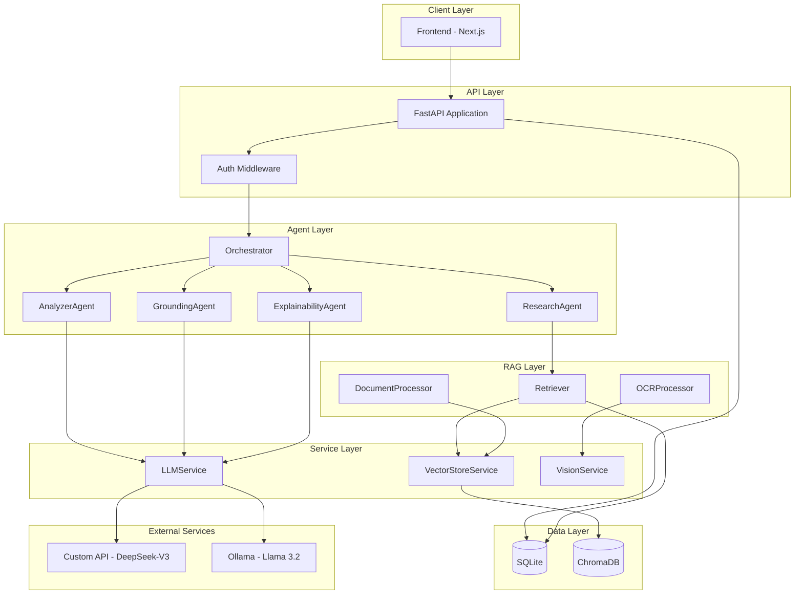
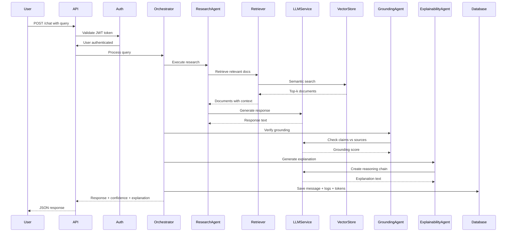
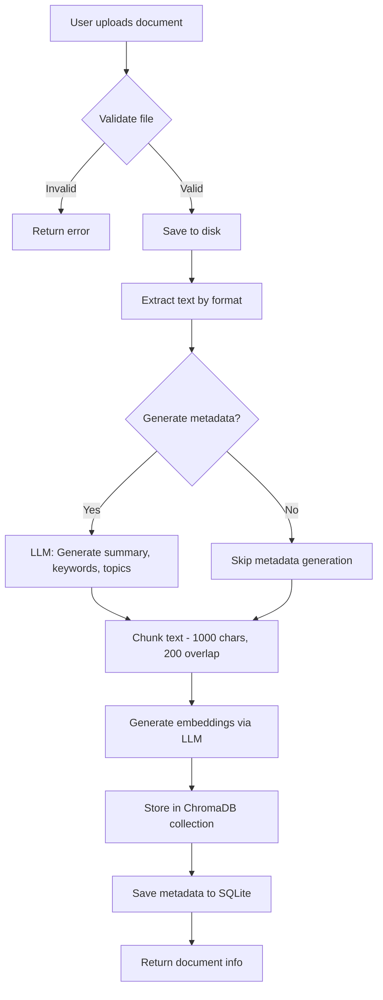

# Backend Architecture Documentation

## Table of Contents
1. [System Overview](#system-overview)
2. [Architecture Pattern](#architecture-pattern)
3. [Component Layers](#component-layers)
4. [Design Patterns](#design-patterns)
5. [Technology Stack](#technology-stack)
6. [Key Design Decisions](#key-design-decisions)
7. [System Diagrams](#system-diagrams)
8. [Data Flow](#data-flow)

---

## System Overview

The backend is an **enterprise-grade RAG (Retrieval-Augmented Generation) and Multi-Agent AI System** designed to enable organizations to build intelligent, document-based knowledge bases with explainable AI capabilities.

### Core Capabilities

- **Document-Based Q&A**: Semantic search with LLM-synthesized responses
- **Multi-Agent Orchestration**: Specialized agents for research, analysis, grounding, and explainability
- **Explainable AI**: Transparent decision-making with confidence scoring and reasoning chains
- **Dual LLM Support**: Custom API (DeepSeek-V3) and local Ollama (Llama 3.2)
- **Role-Based Access Control**: Secure multi-user environment with fine-grained permissions
- **Token Usage Metering**: Comprehensive cost tracking and optimization
- **OCR Processing**: Vision-based text extraction from images and PDFs
- **Real-time Streaming**: Server-Sent Events for progressive response delivery

### Target Use Cases

1. **Enterprise Knowledge Management**: Build searchable document repositories
2. **Compliance & Legal**: Query regulatory documents with source attribution
3. **Research & Analysis**: Multi-document analysis with explainable insights
4. **Customer Support**: Context-aware responses from knowledge bases
5. **Technical Documentation**: Intelligent Q&A over technical manuals

---

## Architecture Pattern

### Layered Architecture

The system follows a **strict layered architecture** with clear separation of concerns and unidirectional dependencies:

```
┌─────────────────────────────────────────────────────────────┐
│                      API Layer (FastAPI)                     │
│  Routes, Request/Response Validation, Auth Middleware        │
└────────────────────┬────────────────────────────────────────┘
                     │ depends on
┌────────────────────▼────────────────────────────────────────┐
│                    Agent Layer                               │
│  Orchestrator, ResearchAgent, AnalyzerAgent, etc.           │
└────────────────────┬────────────────────────────────────────┘
                     │ depends on
┌────────────────────▼────────────────────────────────────────┐
│                  Service Layer                               │
│  LLMService, VectorStoreService, VisionService              │
└────────────────────┬────────────────────────────────────────┘
                     │ depends on
┌────────────────────▼────────────────────────────────────────┐
│                    RAG Layer                                 │
│  DocumentProcessor, Retriever, OCRProcessor                 │
└────────────────────┬────────────────────────────────────────┘
                     │ depends on
┌────────────────────▼────────────────────────────────────────┐
│                   Data Layer                                 │
│  SQLAlchemy Models, Database Session, ChromaDB              │
└─────────────────────────────────────────────────────────────┘
```

### Benefits of This Architecture

1. **Maintainability**: Changes in one layer don't affect others
2. **Testability**: Each layer can be tested independently with mocks
3. **Scalability**: Layers can be scaled independently (e.g., service layer on separate servers)
4. **Reusability**: Services and components can be reused across different endpoints
5. **Clear Dependencies**: Prevents circular dependencies and spaghetti code

---

## Component Layers

### 1. API Layer (`app/api/v1/`)

**Responsibility**: HTTP request handling, authentication, input validation, response formatting

**Components**:
- `auth.py`: User registration, login, token generation
- `chat.py`: Conversational interface, streaming responses
- `documents.py`: Document upload, retrieval, deletion
- `agents.py`: Agent status, execution logs
- `admin.py`: User management, system configuration
- `explainability.py`: Transparency features, confidence reporting
- `metering.py`: Token usage analytics, cost tracking
- `utilities.py`: OCR processing, vision services

**Key Features**:
- FastAPI's automatic OpenAPI documentation
- Pydantic models for request/response validation
- Dependency injection for authentication
- CORS middleware for frontend integration
- Exception handlers for consistent error responses

### 2. Agent Layer (`app/agents/`)

**Responsibility**: Multi-agent orchestration, task decomposition, specialized reasoning

**Components**:
- `base_agents.py`: Abstract `BaseAgent` class with memory management
- `orchestrator.py`: Agent coordination, execution pipeline

**Agents**:
1. **ResearchAgent**:
   - Document retrieval with semantic search
   - Metadata-enhanced filtering
   - Multi-collection querying (global + user-specific)

2. **AnalyzerAgent**:
   - General data analysis
   - Comparative analysis across documents
   - Trend identification

3. **GroundingAgent**:
   - Verifies response accuracy against sources
   - Calculates grounding scores
   - Identifies unsupported claims

4. **ExplainabilityAgent**:
   - Generates reasoning chains
   - Produces transparency reports (Basic/Detailed/Debug levels)
   - Maps decisions to sources

**Orchestration Flow**:
```python
User Query
    ↓
ResearchAgent (retrieve relevant docs)
    ↓
RAG Generation (create response with context)
    ↓
GroundingAgent (verify factual accuracy)
    ↓
ExplainabilityAgent (generate explanation)
    ↓
Response with confidence + explanation
```

### 3. Service Layer (`app/services/`)

**Responsibility**: Business logic, external service integration, reusable components

**LLMService** (`llm_service.py`):
- Dual provider support (Custom API + Ollama)
- Async invocation with retry logic (3 attempts, exponential backoff)
- Token usage extraction
- Document metadata generation (summaries, keywords, topics)
- Configurable temperature, max_tokens, top_p

**VectorStoreService** (`vector_store.py`):
- ChromaDB persistent client
- Multi-collection architecture per user/provider
- Calibrated similarity scoring
- Document embedding and retrieval
- Collection lifecycle management

**VisionService** (`vision_service.py`):
- OCR via vision-capable LLMs
- Image preprocessing (resize, format conversion)
- Confidence scoring for extracted text
- Multi-page PDF processing

### 4. RAG Layer (`app/rag/`)

**Responsibility**: Document processing, information retrieval, confidence calculation

**DocumentProcessor** (`document_processor.py`):
- Multi-format support: PDF, DOCX, TXT, CSV
- Intelligent text chunking (recursive, token-aware)
- Metadata enrichment via LLM
- Format-specific extraction logic

**Retriever** (`retriever.py`):
- **Query Enhancement**: Extract keywords/topics from query
- **Metadata Filtering**: Filter documents by metadata before semantic search
- **Multi-Collection Search**: Query global + user-specific collections
- **Confidence Calculation**: Multi-factor scoring algorithm
  - Similarity component (40%)
  - Citation component (30%)
  - Query quality (20%)
  - Response length (10%)
- **Grounding Verification**: LLM-based claim checking against sources
- **Source Attribution**: Extract [Source N] citations

**OCRProcessor** (`ocr_processor.py`):
- Image preprocessing pipeline
- PDF-to-image conversion (300 DPI)
- Batch processing support
- Format validation

**QueryValidator** (`query_validator.py`):
- Gibberish detection (character distribution analysis)
- Word coherence checking
- Quality scoring (0.0-1.0 scale)

### 5. Data Layer (`app/database/`)

**Responsibility**: Data persistence, schema management, ORM models

**Models** (`models.py`):
- **User**: Authentication, preferences (preferred_llm, explainability_level)
- **Role**: Access control levels (admin, analyst, viewer)
- **Permission**: Granular rights (documents:create, agents:execute, etc.)
- **Document**: File metadata, LLM-generated summary/keywords/topics
- **DocumentChunk**: Text segments with vector embeddings
- **Conversation**: Chat sessions with LLM config, document scoping
- **Message**: User/assistant messages with RAG context
- **AgentLog**: Execution history, agent status
- **TokenUsage**: Comprehensive metering (prompt/completion/embedding tokens)

**Database Session** (`db.py`):
- SQLAlchemy engine and session factory
- Connection pooling
- Transaction management
- Dependency injection for routes

### 6. Auth Layer (`app/auth/`)

**Responsibility**: Authentication, authorization, security

**Security** (`security.py`):
- JWT token generation/validation
- Password hashing (Argon2)
- Permission-based decorators
- Role-based access control

**Schemas** (`schemas.py`):
- Pydantic models for auth requests/responses
- Token payload validation

---

## Design Patterns

### 1. Dependency Injection

FastAPI's `Depends` mechanism provides clean dependency management:

```python
# Database session injection
def get_db():
    db = SessionLocal()
    try:
        yield db
    finally:
        db.close()

@app.get("/users")
def list_users(db: Session = Depends(get_db)):
    return db.query(User).all()
```

**Benefits**:
- Easy testing (inject mocks)
- Lifecycle management (automatic cleanup)
- Reduces boilerplate

### 2. Factory Pattern

Agent registry for dynamic agent creation:

```python
AGENT_REGISTRY = {
    "research": ResearchAgent,
    "analyzer": AnalyzerAgent,
    "grounding": GroundingAgent,
    "explainability": ExplainabilityAgent
}

def create_agent(agent_type: str):
    return AGENT_REGISTRY[agent_type]()
```

**Benefits**:
- Extensible (add new agents without modifying existing code)
- Centralized agent management

### 3. Strategy Pattern

LLM provider switching based on configuration:

```python
class LLMService:
    async def invoke(self, provider: str, prompt: str):
        if provider == "custom":
            return await self._invoke_custom_api(prompt)
        elif provider == "ollama":
            return await self._invoke_ollama(prompt)
```

**Benefits**:
- Runtime provider selection
- Easy to add new providers

### 4. Repository Pattern

Database access abstraction:

```python
# Direct queries encapsulated in repository methods
def get_user_documents(db: Session, user_id: int):
    return db.query(Document).filter(
        Document.uploaded_by == user_id
    ).all()
```

**Benefits**:
- Centralizes database logic
- Easier to test (mock repository)
- Prevents query duplication

### 5. Orchestrator Pattern

Agent coordination in `Orchestrator`:

```python
async def process_query(self, query: str):
    # Step 1: Research
    docs = await self.research_agent.execute(query)

    # Step 2: Generate response
    response = await self.generate_response(query, docs)

    # Step 3: Ground
    grounding_score = await self.grounding_agent.execute(response, docs)

    # Step 4: Explain
    explanation = await self.explainability_agent.execute(response)

    return response, grounding_score, explanation
```

**Benefits**:
- Complex workflows simplified
- Agent isolation (agents don't know about each other)
- Easy to modify pipeline

### 6. Singleton Pattern

Single ChromaDB client instance:

```python
class VectorStoreService:
    _client = None

    def __init__(self):
        if VectorStoreService._client is None:
            VectorStoreService._client = chromadb.PersistentClient(
                path=settings.CHROMA_DB_PATH
            )
        self.client = VectorStoreService._client
```

**Benefits**:
- Resource efficiency (one DB connection)
- Consistent state across requests

---

## Technology Stack

### Core Framework
- **FastAPI** (0.104.1): Modern, async web framework
  - Automatic OpenAPI documentation
  - Pydantic validation
  - Dependency injection
  - WebSocket/SSE support

### Data Storage
- **SQLite** (via SQLAlchemy 2.0.23): Relational data
  - User accounts, roles, permissions
  - Document metadata
  - Conversation history
  - Token usage logs
- **ChromaDB** (0.4.18): Vector embeddings
  - Document chunk embeddings
  - Semantic search
  - Multi-collection support

### LLM Integration
- **LangChain** (0.1.0): LLM orchestration
  - Prompt templates
  - Chain composition
  - Retry logic
- **OpenAI SDK**: Custom API client (DeepSeek-V3)
- **Ollama SDK**: Local LLM client

### Document Processing
- **PyPDF** (3.17.4): PDF text extraction
- **python-docx** (1.1.0): Word document parsing
- **pandas** (2.1.4): CSV processing
- **Pillow** (10.1.0): Image manipulation
- **pdf2image** (1.16.3): PDF-to-image conversion

### Authentication & Security
- **python-jose** (3.3.0): JWT handling
- **passlib** (1.7.4): Password hashing (Argon2)
- **python-multipart**: File upload support

### Utilities
- **pydantic** (2.5.2): Data validation
- **uvicorn** (0.24.0): ASGI server
- **python-dotenv** (1.0.0): Environment variables

---

## Key Design Decisions

### 1. Dual LLM Provider Support

**Decision**: Support both Custom API (cloud) and Ollama (local)

**Rationale**:
- **Flexibility**: Users can choose based on cost, privacy, performance
- **Redundancy**: Fallback if one provider is unavailable
- **Development**: Local Ollama for dev, Custom API for production

**Trade-offs**:
- Increased complexity (maintain two integration paths)
- Provider-specific quirks (token counting, API formats)

### 2. Calibrated Confidence Scoring

**Decision**: Multi-factor confidence calculation instead of raw similarity scores

**Rationale**:
- Raw similarity scores are misleading in high-dimensional spaces (all similarities ~0.7-0.9)
- Gibberish queries should not get high confidence
- Users need calibrated scores for decision-making

**Algorithm**:
```python
confidence = (
    similarity_component * 0.4 +
    citation_component * 0.3 +
    query_quality * 0.2 +
    response_length * 0.1
)
```

**Trade-offs**:
- More complex implementation
- Harder to tune thresholds
- But: More trustworthy confidence scores

### 3. Multi-Collection Vector Store

**Decision**: Separate ChromaDB collections per user and provider

**Collections**:
- `rag_documents_global_custom` (shared docs, Custom API embeddings)
- `rag_documents_user_1_custom` (user 1's private docs, Custom API)
- `rag_documents_global_ollama` (shared docs, Ollama embeddings)
- `rag_documents_user_1_ollama` (user 1's private docs, Ollama)

**Rationale**:
- **Security**: User data isolation
- **Multi-tenancy**: Each user has private document space
- **Provider isolation**: Different embedding models aren't comparable

**Trade-offs**:
- Storage overhead (same document embedded twice if both providers used)
- Query complexity (must search multiple collections)

### 4. Agent-Based Architecture

**Decision**: Specialized agents instead of monolithic LLM calls

**Rationale**:
- **Modularity**: Each agent has clear responsibility
- **Explainability**: Track which agent made which decision
- **Extensibility**: Add new agents without touching existing code
- **Testing**: Test agents independently

**Trade-offs**:
- More LLM calls → higher token costs
- Increased latency (sequential agent execution)
- But: Better quality, transparency, maintainability

### 5. LLM-Generated Document Metadata

**Decision**: Generate summary, keywords, topics via LLM instead of simple extraction

**Rationale**:
- **Better search**: Semantic metadata improves retrieval
- **User experience**: Rich previews in document list
- **Query enhancement**: Match query topics to document topics

**Trade-offs**:
- Upfront cost (tokens for each document)
- Slower upload process
- But: Significantly better search results

### 6. Grounding Verification

**Decision**: Separate grounding agent validates responses against sources

**Rationale**:
- **Hallucination detection**: LLMs can fabricate information
- **Trust**: Users need assurance responses are factually grounded
- **Compliance**: Critical in legal/medical domains

**Trade-offs**:
- Extra LLM call per response
- Potential false positives/negatives
- But: Essential for enterprise adoption

### 7. Token Usage Metering

**Decision**: Track every token used across all operations

**Rationale**:
- **Cost visibility**: Users need to understand LLM costs
- **Optimization**: Identify expensive operations
- **Billing**: Enable usage-based pricing
- **Debugging**: Track token consumption patterns

**Implementation**:
- Record tokens per message, agent, operation type
- Store provider, model, timestamp
- Calculate costs based on provider pricing

### 8. Document Scoping (Global vs User)

**Decision**: Documents can be shared (global) or private (user-specific)

**Rationale**:
- **Flexibility**: Some docs are organizational, others personal
- **Security**: Sensitive documents stay private
- **Collaboration**: Teams can share knowledge bases

**Implementation**:
- `scope` field in Document model: "global" or "user"
- Search queries include both global + user's private docs
- Separate ChromaDB collections enforce isolation

### 9. Streaming Responses

**Decision**: Use Server-Sent Events (SSE) for real-time updates

**Rationale**:
- **UX**: Users see progress instead of waiting
- **Transparency**: Track which agent is executing
- **Perceived performance**: Feels faster than batch response

**Trade-offs**:
- More complex frontend handling
- Can't use standard HTTP caching
- But: Much better user experience

---

## System Diagrams

### High-Level System Architecture



### Request Flow Diagram



### Document Upload Flow



---

## Data Flow

### Chat Query Processing

1. **Authentication**:
   - JWT token validated
   - User loaded with roles/permissions
   - Permission check: `agents:execute`

2. **Query Preprocessing**:
   - Load conversation context (last N messages)
   - Validate query quality (gibberish detection)
   - Extract metadata (keywords, topics) from query

3. **Research Phase (ResearchAgent)**:
   - Metadata-enhanced search in ChromaDB
   - Query both global and user-specific collections
   - Return top-k documents (default: 5)

4. **Generation Phase**:
   - Construct prompt with:
     - System instructions
     - Retrieved document context
     - Conversation history
     - User query
   - LLM generates response with [Source N] citations

5. **Grounding Phase (GroundingAgent)**:
   - Extract claims from response
   - Verify each claim against source documents
   - Calculate grounding score (0.0-1.0)

6. **Explainability Phase (ExplainabilityAgent)**:
   - Generate reasoning chain
   - Map decisions to sources
   - Create transparency report (Basic/Detailed/Debug)

7. **Confidence Calculation**:
   - Combine similarity, citations, query quality, response length
   - Apply calibration formula
   - Flag low confidence (<0.30) with warning

8. **Persistence**:
   - Save Message to database
   - Create AgentLog entries for each agent
   - Record TokenUsage for all LLM calls
   - Update conversation metadata

9. **Response**:
   - Return response text
   - Include confidence score
   - Attach explanation
   - Provide source documents

### Document Processing Pipeline

1. **Upload**:
   - File saved to `uploads/` directory
   - UUID-based filename for uniqueness

2. **Text Extraction**:
   - **PDF**: PyPDF extraction, fallback to OCR if needed
   - **DOCX**: python-docx paragraph extraction
   - **TXT**: Direct file read
   - **CSV**: Pandas DataFrame to text conversion

3. **Metadata Generation**:
   - **Summary**: LLM generates 200-300 word overview
   - **Keywords**: LLM extracts top 10 relevant terms
   - **Topics**: LLM classifies into 5 themes
   - **Content Type**: technical/legal/financial/academic/business/medical/general

4. **Text Chunking**:
   - Recursive character splitter
   - Chunk size: 1000 characters
   - Chunk overlap: 200 characters
   - Preserves sentence boundaries

5. **Embedding**:
   - Generate embeddings via LLMService
   - Provider-specific models:
     - Custom API: text-embedding-3-large (3072 dimensions)
     - Ollama: nomic-embed-text (768 dimensions)

6. **Storage**:
   - **ChromaDB**: Store chunks with embeddings
   - **SQLite**: Store Document and DocumentChunk records
   - Link chunks to parent document

### Authentication Flow

1. **Registration**:
   - Validate username uniqueness
   - Hash password with Argon2
   - Assign default role (viewer)
   - Create User record

2. **Login**:
   - Lookup user by username
   - Verify password hash
   - Generate JWT token with expiration
   - Return token + user info

3. **Protected Request**:
   - Extract token from Authorization header
   - Decode and validate JWT
   - Load user with roles/permissions
   - Check required permission
   - Allow or deny (403 Forbidden)

---

## Extension Points

The architecture is designed for extensibility. Here are the primary extension points:

### 1. Adding New Agents

```python
# 1. Create agent class
class CustomAgent(BaseAgent):
    async def execute(self, context: dict) -> dict:
        # Your logic here
        pass

# 2. Register in AGENT_REGISTRY
AGENT_REGISTRY["custom"] = CustomAgent

# 3. Add to orchestrator pipeline
orchestrator.add_agent("custom")
```

### 2. Adding New LLM Providers

```python
# In LLMService
async def _invoke_custom_provider(self, prompt: str):
    # Integration logic
    pass

# Update provider switch
if provider == "custom_provider":
    return await self._invoke_custom_provider(prompt)
```

### 3. Adding New Document Formats

```python
# In DocumentProcessor
def extract_text(self, file_path: str, file_type: str) -> str:
    if file_type == "new_format":
        return self._extract_new_format(file_path)
```

### 4. Custom Confidence Scoring

```python
# In Retriever
def calculate_calibrated_confidence(self, factors: dict) -> float:
    # Your custom formula
    pass
```

### 5. New API Endpoints

```python
# In app/api/v1/custom.py
@router.post("/custom-endpoint")
@require_permission("custom:permission")
async def custom_endpoint(db: Session = Depends(get_db)):
    # Your logic
    pass
```

### 6. New Permissions

```python
# In database/models.py, add to seed data
new_permission = Permission(
    name="custom:action",
    description="Custom action permission"
)
```

---

## Performance Considerations

### 1. Database Connection Pooling
- SQLAlchemy session factory with connection reuse
- Automatic session cleanup via dependency injection

### 2. Vector Search Optimization
- ChromaDB indexes for fast similarity search
- Limit top-k results (default: 5) to reduce latency

### 3. Caching Strategy
- No built-in caching currently
- Future: Redis for LLM response caching (same query → same response)

### 4. Async Operations
- FastAPI async endpoints for concurrent request handling
- Async LLM calls for non-blocking I/O

### 5. Chunking Strategy
- Balance chunk size (1000 chars) vs retrieval granularity
- Overlap (200 chars) prevents context loss at boundaries

---

## Security Considerations

### 1. Authentication
- JWT tokens with expiration (24 hours default)
- Argon2 password hashing (memory-hard, GPU-resistant)
- Secure token secret stored in environment variables

### 2. Authorization
- Role-based access control (RBAC)
- Permission checks on every protected endpoint
- Principle of least privilege

### 3. Input Validation
- Pydantic models validate all inputs
- File upload size limits (10MB default)
- File extension whitelist

### 4. SQL Injection Prevention
- SQLAlchemy ORM prevents SQL injection
- Parameterized queries throughout

### 5. CORS Configuration
- Configurable allowed origins
- Credentials support for cookies/headers

### 6. API Key Security
- API keys masked in admin endpoints (show first 3 + last 3 chars)
- Keys stored in environment variables, not code

---

## Monitoring & Observability

### Current State
- Basic logging with Python's `logging` module
- Token usage tracking in database
- Agent execution logs

### Future Enhancements
- **Structured Logging**: JSON logs for easier parsing
- **Distributed Tracing**: OpenTelemetry for request tracking across layers
- **Metrics**: Prometheus metrics for latency, error rates
- **Alerting**: Alert on high error rates, token budget exceeded
- **APM**: Application Performance Monitoring (e.g., DataDog, New Relic)

---

## Scalability Considerations

### Current Limitations (Single-Server Design)
- SQLite not suitable for high concurrency
- ChromaDB local storage limits horizontal scaling
- Single LLM provider rate limits

### Scaling Strategies
1. **Database Migration**: SQLite → PostgreSQL for production
2. **Vector Store**: ChromaDB → Pinecone/Weaviate for managed cloud
3. **Load Balancing**: Multiple FastAPI instances behind nginx/ALB
4. **Queue System**: Celery for async document processing
5. **Caching**: Redis for frequent queries
6. **CDN**: Static assets served via CloudFront/Cloudflare

---

## Testing Strategy

### Unit Tests
- Service layer methods (LLMService, VectorStoreService)
- RAG components (Retriever, DocumentProcessor)
- Utility functions (confidence calculation, query validation)

### Integration Tests
- API endpoints with test database
- Agent orchestration flows
- Authentication/authorization logic

### Test Infrastructure
- `pytest` framework
- `pytest-asyncio` for async tests
- `conftest.py` with fixtures (test DB, mock LLM)

### Current Coverage
- See `backend/tests/` directory for existing tests
- Focus on critical paths (chat, documents, auth)

---

## Conclusion

This architecture provides a solid foundation for an enterprise RAG system with:
- **Clear separation of concerns** via layered architecture
- **Extensibility** through well-defined patterns and interfaces
- **Security** with RBAC and input validation
- **Transparency** via explainable AI and confidence scoring
- **Flexibility** with dual LLM provider support

The design prioritizes maintainability and testability while delivering production-grade features for document-based AI applications.

For specific implementation details, see:
- [API Reference](./API_REFERENCE.md)
- [Database Schema](./DATABASE.md)
- [RAG System](./RAG_SYSTEM.md)
- [Agent System](./AGENT_SYSTEM.md)
- [Setup Guide](./guides/SETUP.md)
- [Extending the System](./guides/EXTENDING.md)
