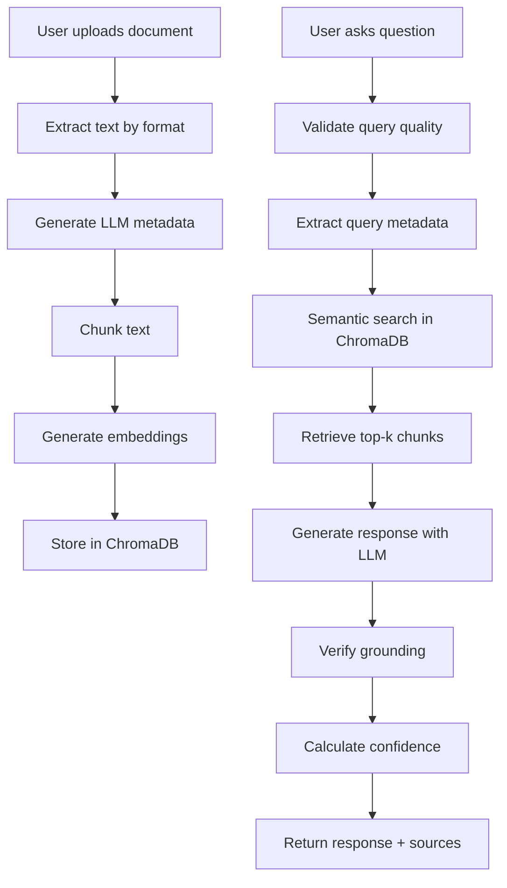
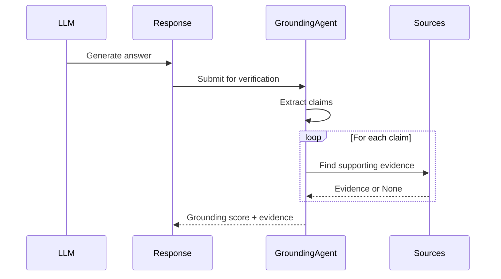

# RAG System Documentation

## Table of Contents
1. [Overview](#overview)
2. [Document Processing Pipeline](#document-processing-pipeline)
3. [Retrieval Mechanism](#retrieval-mechanism)
4. [Confidence Scoring](#confidence-scoring)
5. [Grounding Verification](#grounding-verification)
6. [Query Enhancement](#query-enhancement)
7. [Vector Store Architecture](#vector-store-architecture)
8. [OCR Processing](#ocr-processing)
9. [Performance Optimization](#performance-optimization)
10. [Troubleshooting](#troubleshooting)

---

## Overview

The **Retrieval-Augmented Generation (RAG) system** enables the application to answer questions by retrieving relevant information from a knowledge base of documents and generating contextually-aware responses.

### Key Components

1. **DocumentProcessor**: Extracts text from various file formats
2. **TextChunker**: Splits documents into searchable chunks
3. **VectorStoreService**: Manages embeddings in ChromaDB
4. **Retriever**: Performs semantic search and retrieval
5. **GroundingAgent**: Verifies response accuracy
6. **QueryValidator**: Detects low-quality queries

### RAG Pipeline Flow



---

## Document Processing Pipeline

### Supported Formats

| Format | Extension | Processor | Features |
|--------|-----------|-----------|----------|
| PDF | `.pdf` | PyPDF | Page-by-page extraction, fallback to OCR |
| Word | `.docx` | python-docx | Paragraph extraction, preserves structure |
| Text | `.txt` | Built-in | Direct file read, UTF-8 encoding |
| CSV | `.csv` | Pandas | Column analysis, summary statistics |

### Processing Steps

#### 1. File Upload and Validation

```python
# Validation checks
- File extension in ALLOWED_EXTENSIONS
- File size <= MAX_UPLOAD_SIZE (10MB default)
- Valid file content (not corrupted)
```

#### 2. Text Extraction

**PDF Processing** (`extract_text_from_pdf`):
```python
def extract_text_from_pdf(file_path: str) -> tuple[str, Dict]:
    # Uses PyPDF for text extraction
    # Returns: (full_text, metadata)
    # Metadata includes: pages, format
```

**DOCX Processing** (`extract_text_from_docx`):
```python
def extract_text_from_docx(file_path: str) -> tuple[str, Dict]:
    # Extracts paragraph-by-paragraph
    # Preserves document structure
    # Returns: (full_text, metadata)
    # Metadata includes: paragraphs, format
```

**CSV Processing** (`extract_text_from_csv`):
```python
def extract_text_from_csv(file_path: str) -> tuple[str, Dict]:
    # Converts DataFrame to text representation
    # Includes: column headers, statistics, sample rows
    # Returns: (full_text, metadata)
    # Metadata includes: rows, columns, column_names
```

#### 3. LLM-Generated Metadata

**Purpose**: Enhance search relevance and discoverability

**Metadata Types**:

1. **Summary** (200-300 words):
   ```python
   summary = await llm_service.generate_summary(
       text=document_text,
       provider=provider,
       min_words=200,
       max_words=300
   )
   ```
   - Concise overview of document content
   - Used for document previews in UI
   - Helps users understand document without reading full text

2. **Keywords** (Top 10):
   ```python
   keywords = await llm_service.extract_keywords(
       text=document_text,
       provider=provider,
       max_keywords=10
   )
   ```
   - Most relevant terms in document
   - Used for metadata-enhanced search
   - Enables keyword-based filtering

3. **Topics** (5 themes):
   ```python
   topics = await llm_service.classify_topics(
       text=document_text,
       provider=provider,
       max_topics=5
   )
   ```
   - High-level themes (e.g., "Financial Analysis", "Legal Compliance")
   - Enables topic-based filtering
   - Improves retrieval relevance

4. **Content Type**:
   ```python
   content_type = await llm_service.determine_content_type(
       text=document_text,
       provider=provider
   )
   ```
   - Classification: technical, legal, financial, academic, business, medical, general
   - Used for domain-specific handling
   - Future: Content-type-specific prompts

**Token Usage**: All metadata generation is tracked in `TokenUsage` table for cost monitoring.

#### 4. Text Chunking

**Strategy**: Recursive character splitting with overlap

**Configuration**:
```python
CHUNK_SIZE = 1000  # characters
CHUNK_OVERLAP = 200  # characters
```

**Chunking Process**:

```python
class TextChunker:
    def chunk_text(self, text: str) -> List[str]:
        # 1. Split by paragraphs first
        paragraphs = text.split('\n\n')

        # 2. For large paragraphs, split by sentences
        # 3. For large sentences, split by characters
        # 4. Apply overlap between chunks

        # Ensures semantic coherence within chunks
```

**Why Overlap?**:
- Prevents information loss at chunk boundaries
- Context spans chunk edges (e.g., a concept explained across two paragraphs)
- Improves retrieval quality

**Example**:
```
Chunk 1: [0:1000] "The company reported revenue..."
Chunk 2: [800:1800] "...revenue growth of 15%. Operating expenses..." (overlaps 200 chars)
```

#### 5. Embedding Generation

**Process**:
```python
for chunk in chunks:
    embedding = await llm_service.generate_embedding(
        text=chunk.content,
        provider=provider
    )
    # Store in ChromaDB
```

**Embedding Models**:
- **Custom API**: `text-embedding-3-large` (3072 dimensions)
- **Ollama**: `nomic-embed-text` (768 dimensions)

**Why Different Models?**:
- Embeddings from different models are **not comparable**
- Each provider has its own collection in ChromaDB
- Users can switch providers, but retrieval only searches within the same provider's embeddings

#### 6. Storage

**SQLite** (Document metadata):
```python
document = Document(
    filename=file.filename,
    file_path=file_path,
    auto_summary=summary,
    auto_keywords=keywords,
    auto_topics=topics,
    content_type=content_type,
    num_chunks=len(chunks)
)
db.add(document)
```

**ChromaDB** (Embeddings):
```python
collection.add(
    embeddings=[chunk.embedding],
    documents=[chunk.content],
    metadatas=[{
        "document_id": document.id,
        "chunk_index": chunk.chunk_index,
        "filename": document.filename,
        ...
    }],
    ids=[chunk.uuid]
)
```

---

## Retrieval Mechanism

### Semantic Search Process

**1. Query Embedding**:
```python
query_embedding = await llm_service.generate_embedding(
    text=user_query,
    provider=provider
)
```

**2. Vector Similarity Search**:
```python
results = collection.query(
    query_embeddings=[query_embedding],
    n_results=5,  # Top 5 most relevant
    include=['documents', 'metadatas', 'distances']
)
```

**3. Similarity Metric**:
- ChromaDB uses **Squared Euclidean Distance**
- Lower distance = Higher similarity
- Typical range: 0.5 to 2.0 in high-dimensional space

**4. Calibrated Scoring**:
```python
def calibrate_similarity_score(distance: float) -> float:
    """Convert distance to 0-1 similarity score"""
    if distance < 0.5:
        return 1.0
    elif distance < 1.0:
        return 1.0 - (distance - 0.5) * 1.2
    elif distance < 1.5:
        return 0.4 - (distance - 1.0) * 0.6
    else:
        return max(0.0, 0.1 - (distance - 1.5) * 0.2)
```

**Why Calibration?**:
- Raw distances are hard to interpret
- High-dimensional spaces have narrow similarity ranges
- Calibration maps to intuitive 0-1 scale

### Multi-Collection Search

**Scenario**: User has private documents + shared global documents

**Collections Searched**:
1. `rag_documents_global_{provider}` - Shared docs
2. `rag_documents_user_{user_id}_{provider}` - User's private docs

**Search Process**:
```python
# Search global collection
global_results = global_collection.query(query_embedding, n_results=5)

# Search user collection
user_results = user_collection.query(query_embedding, n_results=5)

# Merge and re-rank by similarity
all_results = merge_results(global_results, user_results)
top_k = sorted(all_results, key=lambda x: x['similarity'])[:5]
```

**Document Scoping**:
If conversation has `selected_document_ids`:
```python
# Filter results to only selected documents
filtered_results = [
    r for r in all_results
    if r['document_id'] in selected_document_ids
]
```

---

## Confidence Scoring

### Multi-Factor Confidence Algorithm

**Purpose**: Provide users with a trustworthy confidence metric

**Formula**:
```python
confidence = (
    similarity_component * 0.4 +
    citation_component * 0.3 +
    query_quality * 0.2 +
    response_length * 0.1
)
```

### Component Breakdown

#### 1. Similarity Component (40%)

Based on vector similarity scores:

```python
def calculate_similarity_component(retrieved_docs: List[Dict]) -> float:
    if not retrieved_docs:
        return 0.0

    # Use top document's calibrated similarity
    top_similarity = retrieved_docs[0]['similarity_score']

    # Apply diminishing returns (multiple similar docs is better)
    avg_similarity = sum(d['similarity_score'] for d in retrieved_docs) / len(retrieved_docs)

    # Weighted average: 70% top doc, 30% average
    return top_similarity * 0.7 + avg_similarity * 0.3
```

**Rationale**:
- Top document most important
- But multiple relevant docs increases confidence

#### 2. Citation Component (30%)

Based on source usage in response:

```python
def calculate_citation_component(response: str, num_sources: int) -> float:
    # Count [Source N] citations in response
    citation_count = response.count('[Source ')

    # Normalize by available sources
    if num_sources == 0:
        return 0.0

    citation_ratio = min(citation_count / num_sources, 1.0)

    # Bonus if multiple sources cited (cross-referencing)
    cross_reference_bonus = 0.0
    if citation_count > 1:
        cross_reference_bonus = min(0.2, citation_count * 0.05)

    return citation_ratio * 0.8 + cross_reference_bonus
```

**Rationale**:
- Response should use provided sources
- Multiple citations indicate thorough sourcing
- Unused sources suggest poor retrieval

#### 3. Query Quality (20%)

Based on query coherence:

```python
def calculate_query_quality(query: str) -> float:
    # Character distribution check (gibberish detection)
    char_distribution = analyze_character_distribution(query)

    # Word coherence (real words vs random strings)
    word_coherence = check_word_coherence(query)

    # Length penalty (very short or very long)
    length_score = calculate_length_score(query)

    return (char_distribution * 0.4 +
            word_coherence * 0.4 +
            length_score * 0.2)
```

**Rationale**:
- Gibberish queries should not get high confidence
- Well-formed questions indicate user intent clarity

#### 4. Response Length (10%)

Based on response completeness:

```python
def calculate_response_length_score(response: str) -> float:
    word_count = len(response.split())

    if word_count < 20:
        return 0.3  # Very short, likely incomplete
    elif word_count < 50:
        return 0.6
    elif word_count < 150:
        return 1.0  # Ideal range
    elif word_count < 300:
        return 0.9  # Detailed, still good
    else:
        return 0.7  # Very long, might be verbose
```

**Rationale**:
- Too short suggests insufficient information
- Too long might indicate uncertainty (verbose hedging)

### Confidence Thresholds

```python
if confidence < 0.30:
    # Low confidence warning prepended to response
    warning = "⚠️ Low confidence: The answer may not be fully supported by the available documents."
    low_confidence_warning = True
elif confidence < 0.50:
    # Moderate confidence (informational only)
    pass
else:
    # High confidence (no action)
    pass
```

---

## Grounding Verification

### Purpose

**Problem**: LLMs can hallucinate (generate plausible but false information)

**Solution**: Verify response claims against source documents

### Grounding Process



### Implementation

**1. Extract Claims**:
```python
async def extract_claims(self, response: str, provider: str) -> List[str]:
    prompt = f"""
    Extract factual claims from this response:

    {response}

    Return as JSON list: ["claim1", "claim2", ...]
    """

    result = await llm_service.invoke(prompt, provider)
    claims = json.loads(result)
    return claims
```

**2. Verify Each Claim**:
```python
async def verify_claim(self, claim: str, sources: List[str], provider: str) -> Dict:
    prompt = f"""
    Claim: {claim}

    Sources:
    {format_sources(sources)}

    Is this claim supported by the sources?
    Answer: supported, partially_supported, or unsupported
    Evidence: <quote from source>
    """

    result = await llm_service.invoke(prompt, provider)
    return parse_verification(result)
```

**3. Calculate Grounding Score**:
```python
def calculate_grounding_score(verifications: List[Dict]) -> float:
    if not verifications:
        return 0.0

    supported = sum(1 for v in verifications if v['status'] == 'supported')
    partial = sum(1 for v in verifications if v['status'] == 'partially_supported')

    # Weighted score
    score = (supported + partial * 0.5) / len(verifications)

    return score
```

**4. Return Evidence**:
```json
{
  "grounding_score": 0.85,
  "verified_claims": [
    "Revenue increased by 15% in Q3"
  ],
  "unverified_claims": [
    "Market share is expected to grow"
  ],
  "evidence": [
    "Claim 'Revenue increased by 15%' verified in Q3_Report.pdf, page 3: 'Our revenue grew 15% year-over-year...'"
  ]
}
```

### Grounding Thresholds

- **> 0.8**: High grounding (most claims verified)
- **0.5-0.8**: Moderate grounding (some claims unverified)
- **< 0.5**: Low grounding (many unsupported claims - flag for review)

---

## Query Enhancement

### Metadata-Boosted Retrieval

**Problem**: Simple semantic search may miss relevant documents with specific metadata

**Solution**: Extract metadata from query and use for filtering

### Process

**1. Extract Query Metadata**:
```python
query_metadata = await retriever.extract_query_metadata(
    query="What were the financial results in Q3?",
    provider=provider
)

# Returns:
{
    'keywords': ['financial', 'results', 'Q3'],
    'topics': ['Financial Analysis', 'Quarterly Report']
}
```

**2. Apply Metadata Filters**:
```python
# Try keyword filter first
filter_metadata = {'keywords': {'$contains': 'financial'}}
results = collection.query(
    query_embedding,
    n_results=5,
    where=filter_metadata
)

# Fallback to topic filter if no results
if not results:
    filter_metadata = {'topics': {'$contains': 'Financial Analysis'}}
    results = collection.query(query_embedding, where=filter_metadata)

# Final fallback: no filter
if not results:
    results = collection.query(query_embedding)
```

**Benefits**:
- More precise retrieval
- Filters out irrelevant documents
- Especially useful with large document collections

---

## Vector Store Architecture

### ChromaDB Collections

**Collection Naming**:
```
rag_documents_{scope}_{provider}
```

**Examples**:
- `rag_documents_global_custom`
- `rag_documents_user_1_custom`
- `rag_documents_global_ollama`
- `rag_documents_user_5_ollama`

### Why Multiple Collections?

1. **User Isolation**: Private docs stay private
2. **Provider Separation**: Different embedding models not comparable
3. **Performance**: Smaller collections = faster search

### Collection Metadata

Each chunk stored with metadata:
```python
{
    "document_id": "uuid",
    "document_uuid": "public_uuid",
    "chunk_id": "uuid",
    "chunk_index": 5,
    "filename": "report.pdf",
    "title": "Q3 Financial Report",
    "page_number": 3,
    "keywords": ["revenue", "expenses"],
    "topics": ["Financial Analysis"],
    "content_type": "financial",
    "user_id": 1,
    "scope": "user"
}
```

**Metadata Filtering Examples**:
```python
# Find chunks from specific document
where={"document_uuid": "550e8400-..."}

# Find chunks with keyword
where={"keywords": {"$contains": "revenue"}}

# Find financial documents
where={"content_type": "financial"}
```

### Persistence

ChromaDB uses persistent storage:
```python
client = chromadb.PersistentClient(path="./chroma_db")
```

**Location**: `backend/chroma_db/`

**Backup Strategy**:
```bash
# Backup ChromaDB directory
tar -czf chroma_backup_$(date +%Y%m%d).tar.gz chroma_db/
```

---

## OCR Processing

### Vision-Based Text Extraction

**Supported Formats**:
- Images: JPG, PNG, TIFF, BMP, WEBP
- Multi-page PDFs

### Process

**1. Image Preprocessing**:
```python
def preprocess_image(image_path: str) -> str:
    img = Image.open(image_path)

    # Resize if too large (max 2000px)
    if max(img.size) > 2000:
        img.thumbnail((2000, 2000))

    # Convert to RGB
    if img.mode != 'RGB':
        img = img.convert('RGB')

    # Save optimized version
    img.save(temp_path, format='JPEG', quality=95)
    return temp_path
```

**2. Vision Model Invocation**:
```python
extracted_text = await vision_service.extract_text_from_image(
    image_path=preprocessed_path,
    provider=provider
)
```

**3. PDF Handling**:
```python
# Convert PDF pages to images
images = convert_from_path(pdf_path, dpi=300)

# OCR each page
page_texts = []
for page_num, image in enumerate(images):
    text = await vision_service.extract_text_from_image(image)
    page_texts.append(text)

# Combine pages
full_text = "\n\n--- Page Break ---\n\n".join(page_texts)
```

### Vision Models

- **Custom API**: Llama-3.2-90B-Vision-Instruct
- **Ollama**: llama3.2-vision

**Prompt**:
```
Extract all text from this image. Return only the text, preserving formatting and structure.
```

---

## Performance Optimization

### Chunking Performance

**Challenge**: Large documents create many chunks
**Solution**: Batch embedding generation

```python
# Bad: One embedding call per chunk
for chunk in chunks:
    embedding = await generate_embedding(chunk.text)

# Good: Batch embeddings (if provider supports)
embeddings = await generate_embeddings([c.text for c in chunks])
```

### Retrieval Performance

**Challenge**: Multi-collection search latency
**Solution**: Parallel queries

```python
# Bad: Sequential search
global_results = global_collection.query(...)
user_results = user_collection.query(...)

# Good: Parallel search
import asyncio
results = await asyncio.gather(
    global_collection.query_async(...),
    user_collection.query_async(...)
)
```

### Caching Strategies

**Embeddings Cache** (Future Enhancement):
```python
# Cache query embeddings (same query = same embedding)
if query in embedding_cache:
    query_embedding = embedding_cache[query]
else:
    query_embedding = await generate_embedding(query)
    embedding_cache[query] = query_embedding
```

**Response Cache** (Future Enhancement):
```python
# Cache frequent queries (TTL: 1 hour)
cache_key = hash(query + provider + selected_docs)
if cache_key in response_cache:
    return response_cache[cache_key]
```

---

## Troubleshooting

### Common Issues

**Issue**: Low retrieval quality
```python
# Symptoms: Irrelevant documents returned
# Causes:
1. Poor chunking (chunks too large/small)
2. Generic metadata (not descriptive enough)
3. Query too vague

# Solutions:
1. Adjust CHUNK_SIZE and CHUNK_OVERLAP
2. Regenerate metadata with better LLM
3. Use query enhancement
4. Increase n_results for more candidates
```

**Issue**: High token costs for metadata
```python
# Symptoms: Expensive document uploads
# Causes: Metadata generation for large documents

# Solutions:
1. Use cheaper provider (Ollama) for metadata
2. Skip metadata for certain document types
3. Truncate very long documents before metadata gen
4. Cache metadata results
```

**Issue**: Slow searches
```python
# Symptoms: Query takes > 2 seconds
# Causes:
1. Too many collections to search
2. Large collection size
3. No metadata filtering

# Solutions:
1. Use document scoping (selected_document_ids)
2. Apply metadata filters
3. Increase ChromaDB resources
4. Consider vector index optimization
```

**Issue**: Grounding always low
```python
# Symptoms: Grounding scores < 0.5
# Causes:
1. Retrieved documents not actually relevant
2. LLM generating content beyond sources
3. Grounding prompt not working

# Solutions:
1. Improve retrieval with metadata boost
2. Modify generation prompt to stick to sources
3. Tune grounding verification prompt
4. Use stricter LLM parameters (temperature=0.3)
```

---

## Best Practices

### 1. Document Preparation

```python
# Clean text before processing
text = remove_headers_footers(text)
text = normalize_whitespace(text)
text = remove_special_chars(text)
```

### 2. Chunking Strategy

```python
# For technical documents: Smaller chunks (800 chars)
# For narratives: Larger chunks (1200 chars)
# For code: Chunk by function/class
```

### 3. Metadata Quality

```python
# Generate metadata with context
prompt = f"""
Document title: {filename}
Document type: {file_type}

Summarize this document:
{text[:5000]}  # Use first 5000 chars for context
"""
```

### 4. Search Optimization

```python
# Always use metadata boost for better results
results = await retriever.retrieve_with_metadata_filter(
    query=query,
    use_metadata_boost=True
)
```

### 5. Confidence Interpretation

```python
# Communicate confidence to users
if confidence < 0.30:
    message = "Low confidence - verify answer independently"
elif confidence < 0.60:
    message = "Moderate confidence - cross-check important details"
else:
    message = "High confidence - answer well-supported"
```

---

## Future Enhancements

1. **Hybrid Search**: Combine semantic + keyword search
2. **Re-ranking**: Two-stage retrieval (fast recall + accurate ranking)
3. **Query Expansion**: Use LLM to rephrase query for better recall
4. **Contextual Chunking**: Chunk based on semantic boundaries (paragraphs, sections)
5. **Multi-modal RAG**: Images, tables, charts as sources
6. **Federated Search**: Search across multiple vector stores
7. **Active Learning**: User feedback to improve retrieval

---

## Related Documentation

- [Architecture Overview](./ARCHITECTURE.md)
- [Agent System](./AGENT_SYSTEM.md)
- [Database Schema](./DATABASE.md)
- [API Reference](./API_REFERENCE.md)
