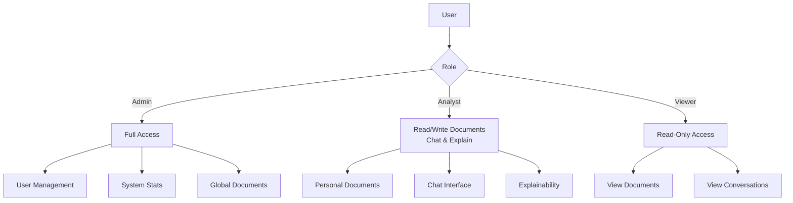
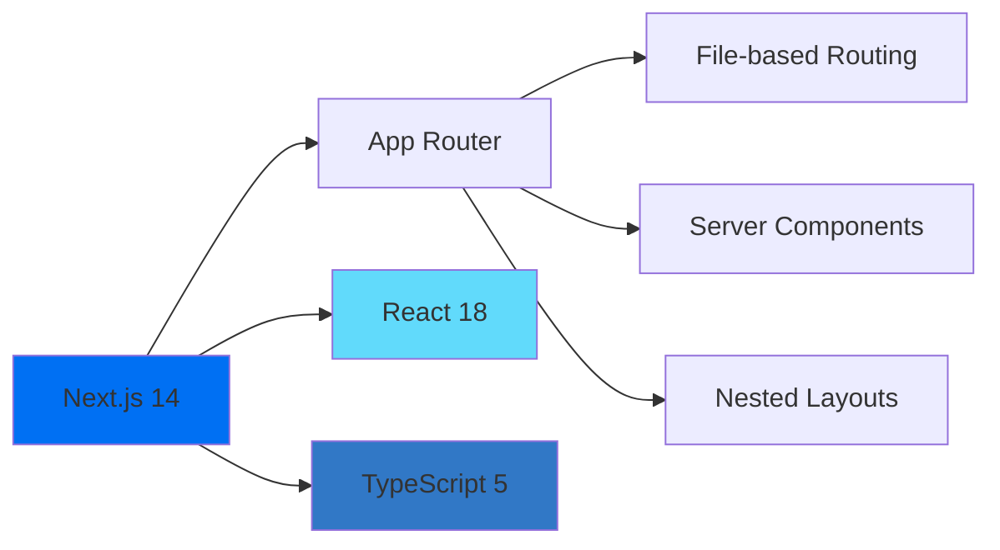
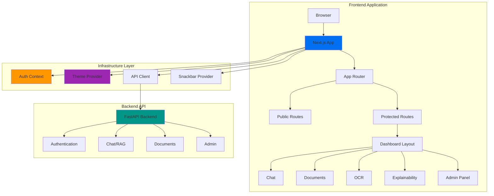
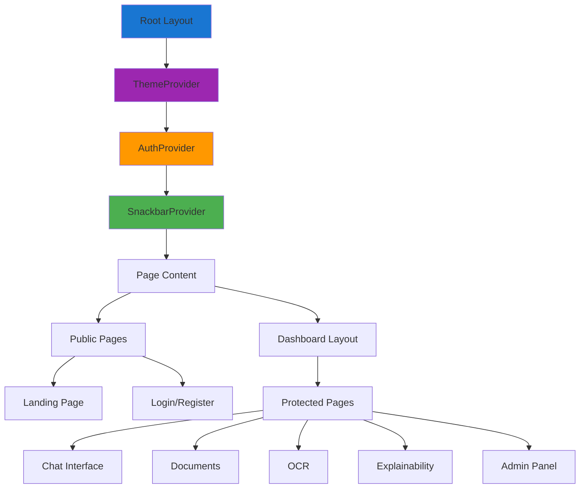
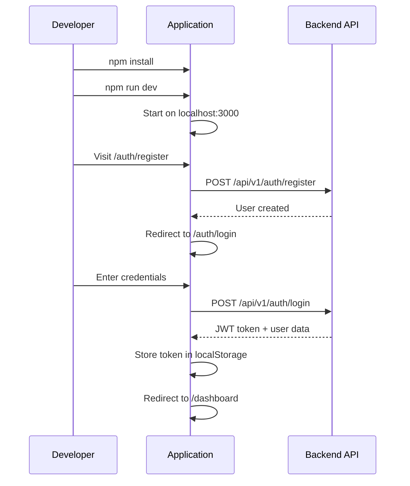
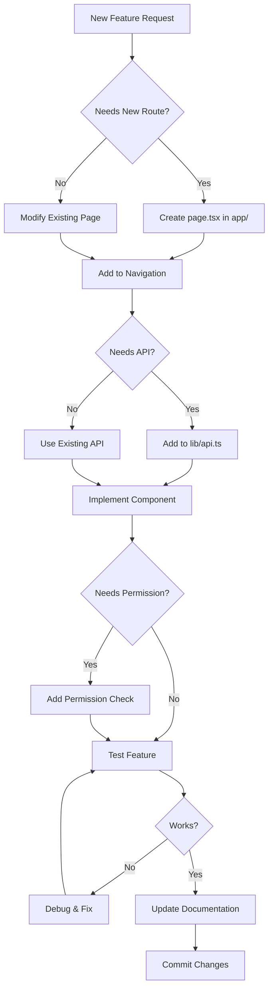
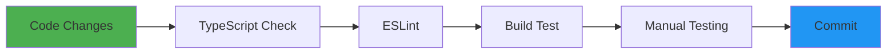

# Frontend Documentation

> **Complete Guide to the RAG-Based Multi-Agent Chat Application Frontend**
> Last Updated: December 4, 2025

## 📋 Table of Contents

- [Overview](#overview)
- [Technology Stack](#technology-stack)
- [Architecture Diagram](#architecture-diagram)
- [Project Structure](#project-structure)
- [Quick Start Guide](#quick-start-guide)
- [Detailed Documentation](#detailed-documentation)
- [Development Workflow](#development-workflow)
- [Key Concepts](#key-concepts)

---

## Overview

This is a Next.js 14-based frontend application that provides a comprehensive interface for an AI-powered RAG (Retrieval-Augmented Generation) chat system with multi-agent orchestration, document management, OCR capabilities, and AI explainability features.

### Core Features

- 🤖 **Real-time Chat**: Streaming responses with multi-agent orchestration visualization
- 📄 **Document Management**: Upload, process, and manage documents for RAG context
- 🔍 **OCR Processing**: Extract text from images and PDFs using vision models
- 📊 **Explainability Dashboard**: AI decision transparency with confidence analysis
- 👥 **Admin Panel**: User and system management with role-based access control
- 🎨 **Modern UI**: Material-UI with dark/light theme switching

### User Roles



---

## Technology Stack

### Core Framework



### UI & Styling

| Library | Version | Purpose |
|---------|---------|---------|
| **Material-UI (MUI)** | 5.15.6 | Component library & design system |
| **Emotion** | 11.11.3 | CSS-in-JS styling |
| **@mui/x-data-grid** | 6.18.7 | Advanced data tables |
| **Recharts** | 3.5.1 | Data visualization charts |

### Data & State Management

| Library | Version | Purpose |
|---------|---------|---------|
| **Axios** | 1.6.5 | HTTP client with interceptors |
| **Zustand** | 4.5.0 | Lightweight state management (notifications) |
| **React Context** | Built-in | Auth & theme state |

### Additional Libraries

- **react-markdown**: Markdown rendering in chat
- **react-countup**: Animated statistics
- **clsx**: Conditional className utility

---

## Architecture Diagram

### High-Level System Architecture



### Component Hierarchy



---

## Project Structure

```
frontend/
├── app/                          # Next.js App Router
│   ├── layout.tsx               # Root layout with providers
│   ├── page.tsx                 # Landing page (/)
│   ├── globals.css              # Global styles
│   │
│   ├── auth/                    # Authentication routes
│   │   ├── login/page.tsx       # Login page
│   │   └── register/page.tsx    # Registration page
│   │
│   └── dashboard/               # Protected dashboard routes
│       ├── layout.tsx           # Dashboard layout wrapper
│       ├── page.tsx             # Dashboard home
│       ├── chat/page.tsx        # Chat interface
│       ├── documents/page.tsx   # Document management
│       ├── ocr/page.tsx         # OCR processing
│       ├── explainability/page.tsx  # AI insights
│       ├── admin/page.tsx       # Admin panel
│       └── utilities/page.tsx   # UI demos
│
├── components/                   # Reusable components
│   ├── ThemeToggle.tsx          # Light/Dark/System theme switcher
│   ├── SnackbarProvider.tsx     # Global notification system
│   ├── AnimatedStats.tsx        # CountUp statistics
│   └── DocumentSelectionModal.tsx # Document picker
│
├── lib/                          # Core utilities
│   ├── api.ts                   # Axios client & API methods
│   ├── auth-context.tsx         # Authentication context
│   ├── theme-context.tsx        # Theme management
│   ├── mui-theme.ts             # MUI theme configuration
│   ├── emotion-cache.ts         # Emotion setup
│   └── utils.ts                 # Helper functions
│
├── docs/                         # Documentation
│   ├── guides/                  # Implementation guides
│   └── features/                # Feature documentation
│
├── data/                         # Static data files
│   └── stats.json               # Landing page statistics
│
├── public/                       # Static assets
│
├── package.json                  # Dependencies
├── next.config.js               # Next.js configuration
├── tsconfig.json                # TypeScript configuration
└── DOCUMENTATION.md             # This file
```

### Routing Structure

```mermaid
graph TD
    A[/] --> B[Landing Page]
    A --> C[/auth]
    A --> D[/dashboard]

    C --> E[/auth/login]
    C --> F[/auth/register]

    D --> G[Dashboard Home]
    D --> H[/dashboard/chat]
    D --> I[/dashboard/documents]
    D --> J[/dashboard/ocr]
    D --> K[/dashboard/explainability]
    D --> L[/dashboard/admin]
    D --> M[/dashboard/utilities]

    style A fill:#2196f3
    style D fill:#ff9800
    style L fill:#f44336
```

---

## Quick Start Guide

### Prerequisites

- Node.js 18+ and npm/yarn
- Backend API running (default: `http://localhost:8000`)

### Installation

```bash
# Navigate to frontend directory
cd frontend

# Install dependencies
npm install

# Set up environment variables (optional)
cp .env.example .env.local

# Start development server
npm run dev
```

### Environment Variables

Create `.env.local` file:

```bash
# API Base URL
NEXT_PUBLIC_API_URL=http://localhost:8000

# Optional: Enable debug mode
NEXT_PUBLIC_DEBUG=false
```

### First-Time Setup Flow



### Demo Account

Use these credentials for testing:

| Role | Username | Password | Access Level |
|------|----------|----------|--------------|
| Admin | `admin` | `admin123` | Full system access |
| Analyst | `analyst` | `analyst123` | Documents + Chat |
| Viewer | `viewer` | `viewer123` | Read-only |

---

## Detailed Documentation

### Core Infrastructure Guides

| Topic | Description | Link |
|-------|-------------|------|
| **Authentication** | Login flow, JWT handling, permissions, route protection | [📖 Read Guide](./docs/guides/AUTHENTICATION.md) |
| **API Integration** | HTTP client, interceptors, error handling, request patterns | [📖 Read Guide](./docs/guides/API_INTEGRATION.md) |
| **Theming & Styling** | MUI theme, dark mode, responsive design, custom styles | [📖 Read Guide](./docs/guides/THEMING_STYLING.md) |
| **State Management** | Context providers, Zustand, local state patterns | [📖 Read Guide](./docs/guides/STATE_MANAGEMENT.md) |
| **Components** | Reusable components, props, usage examples | [📖 Read Guide](./docs/guides/COMPONENTS.md) |
| **Utilities** | Helper functions, formatters, API client modules | [📖 Read Guide](./docs/guides/UTILITIES.md) |

### Feature Documentation

| Feature | Description | Link |
|---------|-------------|------|
| **Chat Interface** | Streaming chat, agent orchestration, document context | [📖 Read Guide](./docs/features/CHAT.md) |
| **Document Management** | Upload, process, organize documents for RAG | [📖 Read Guide](./docs/features/DOCUMENTS.md) |
| **OCR Processing** | Vision-based text extraction from images/PDFs | [📖 Read Guide](./docs/features/OCR.md) |
| **Explainability** | AI transparency, confidence analysis, reasoning chains | [📖 Read Guide](./docs/features/EXPLAINABILITY.md) |
| **Admin Panel** | User management, system stats, configuration | [📖 Read Guide](./docs/features/ADMIN.md) |

### Development Resources

| Resource | Description | Link |
|----------|-------------|------|
| **Development Guide** | Adding features, routes, components, best practices | [📖 Read Guide](./docs/guides/DEVELOPMENT_GUIDE.md) |
| **Architecture Patterns** | Design patterns, conventions, code organization | [📖 Read Guide](./docs/ARCHITECTURE_PATTERNS.md) |

---

## Development Workflow

### Adding a New Feature



### Common Development Tasks

```bash
# Start development server with hot reload
npm run dev

# Build for production
npm run build

# Start production server
npm start

# Run linter
npm run lint

# Type check
npx tsc --noEmit
```

### Code Quality Checks



---

## Key Concepts

### 1. Server-Sent Events (SSE) Streaming

The chat interface uses SSE for real-time streaming responses:

```typescript
const response = await fetch('/api/v1/chat/stream', {
  headers: { 'Accept': 'text/event-stream' }
})

const reader = response.body.getReader()
// Process stream line by line
```

### 2. Route Protection Pattern

All dashboard routes are protected by authentication:

```typescript
// In dashboard/layout.tsx
const { user, loading } = useAuth()

if (loading) return <Loading />
if (!user) redirect('/auth/login')
```

### 3. Permission-Based Access

Features are conditionally rendered based on user permissions:

```typescript
const { hasPermission, hasRole } = useAuth()

if (hasRole('admin')) {
  // Show admin features
}

if (hasPermission('documents:create')) {
  // Show upload button
}
```

### 4. Optimistic UI Updates

Chat messages appear immediately before server confirmation:

```typescript
// Add message to UI
setMessages([...messages, tempMessage])

// Send to API
await chatAPI.sendMessage(data)

// Replace with server response
```

### 5. Global Notification System

Zustand-powered snackbar for user feedback:

```typescript
const { showSnackbar } = useSnackbar()

showSnackbar('Document uploaded successfully!', 'success')
showSnackbar('Error uploading document', 'error')
```

---

## Development Best Practices

### ✅ Do's

- Use TypeScript types for all props and state
- Implement loading and error states for async operations
- Use MUI components for consistency
- Keep components focused and single-purpose
- Leverage existing utilities in `lib/utils.ts`
- Add error boundaries for production stability
- Use semantic HTML and ARIA labels for accessibility

### ❌ Don'ts

- Don't store sensitive data in localStorage without encryption
- Don't make API calls without error handling
- Don't use `any` type unless absolutely necessary
- Don't duplicate code - create reusable components
- Don't ignore TypeScript errors
- Don't commit console.log statements
- Don't hardcode API URLs - use environment variables

---

## Getting Help

### Resources

- 📚 **Next.js Documentation**: [nextjs.org/docs](https://nextjs.org/docs)
- 🎨 **Material-UI Docs**: [mui.com](https://mui.com)
- 🔷 **TypeScript Handbook**: [typescriptlang.org/docs](https://www.typescriptlang.org/docs/)
- 📘 **React Documentation**: [react.dev](https://react.dev)

### Common Issues

| Issue | Solution |
|-------|----------|
| 401 Unauthorized errors | Check JWT token in localStorage, try re-login |
| Theme not persisting | Clear localStorage and browser cache |
| TypeScript errors | Run `npm install` to update type definitions |
| Hot reload not working | Restart dev server with `npm run dev` |
| API connection failed | Verify backend is running on port 8000 |

---

## Next Steps

After reading this overview, proceed to:

1. **[Authentication Guide](./docs/guides/AUTHENTICATION.md)** - Understand the auth system
2. **[Development Guide](./docs/guides/DEVELOPMENT_GUIDE.md)** - Learn how to add features
3. **[Architecture Patterns](./docs/ARCHITECTURE_PATTERNS.md)** - Understand design decisions

For specific features, jump directly to the [Feature Documentation](#feature-documentation) section.

---

**Happy Coding! 🚀**

*For questions or contributions, please refer to the main project README.md*
