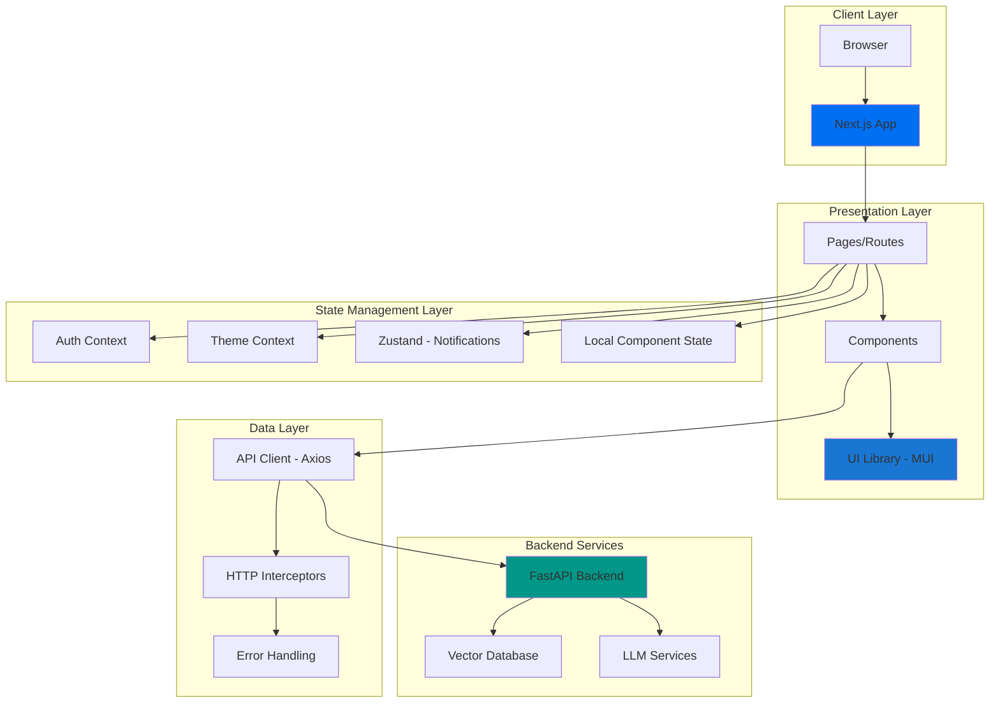
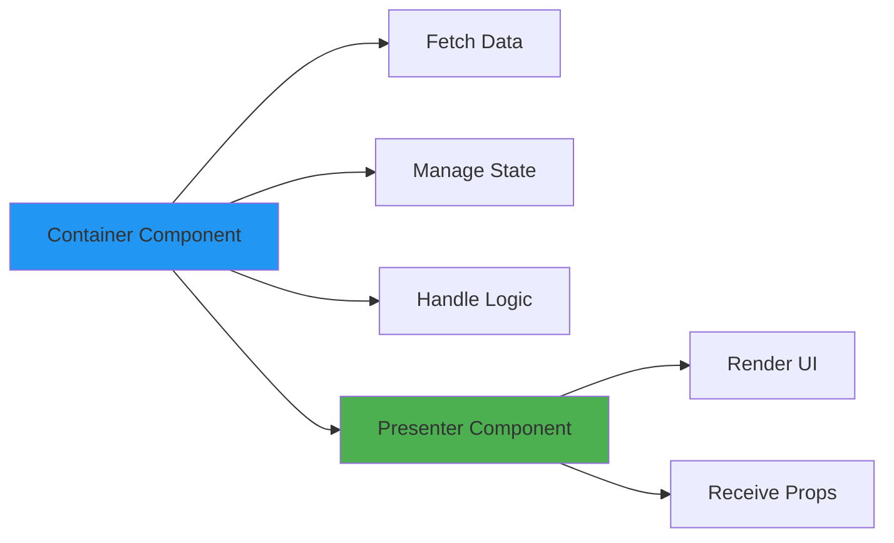
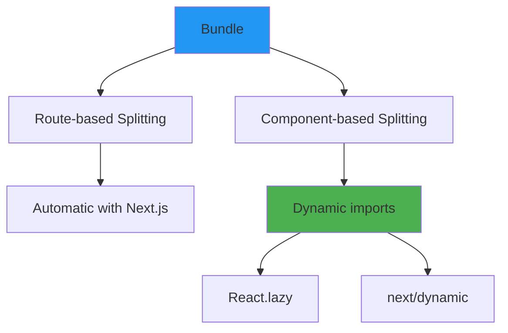
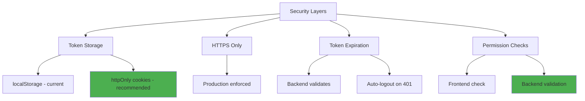
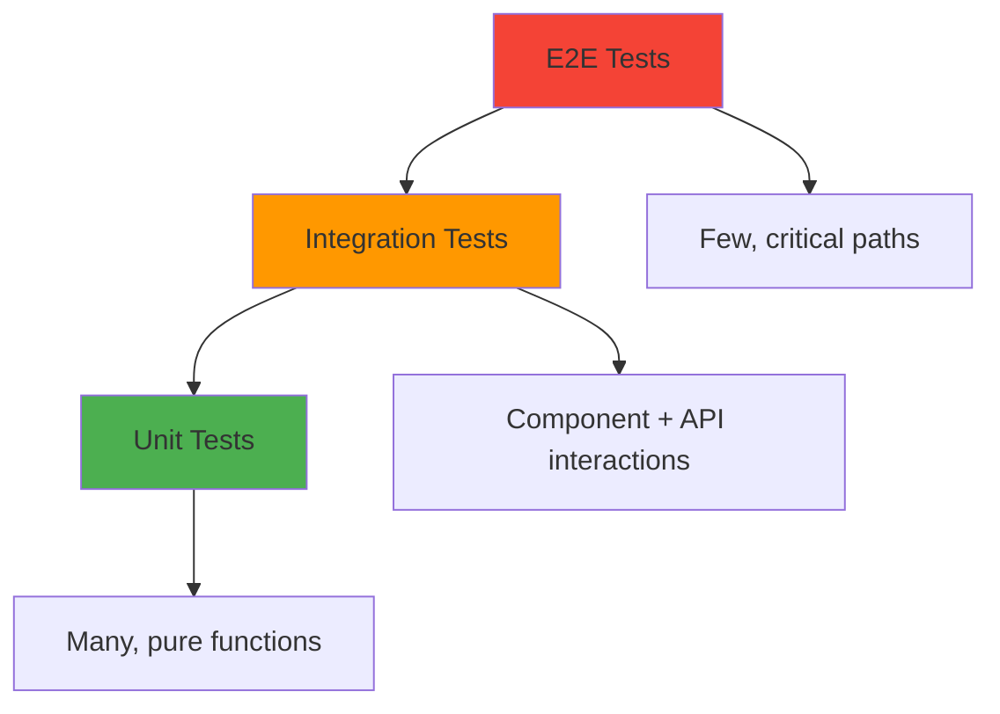

# Architecture & Best Practices

> **Design patterns, conventions, and architectural decisions for the frontend application**

## 📋 Table of Contents

- [Architecture Overview](#architecture-overview)
- [Design Patterns](#design-patterns)
- [Code Organization](#code-organization)
- [Performance Optimization](#performance-optimization)
- [Security Best Practices](#security-best-practices)
- [Testing Strategy](#testing-strategy)
- [Deployment Considerations](#deployment-considerations)

---

## Architecture Overview

### System Architecture



### Layers Explained

#### 1. Client Layer
- **Browser:** User interface runtime
- **Next.js App:** React framework with routing

#### 2. Presentation Layer
- **Pages/Routes:** Next.js App Router pages
- **Components:** Reusable UI components
- **MUI:** Material-UI component library

#### 3. State Management Layer
- **Context Providers:** Global state (auth, theme)
- **Zustand:** Lightweight notifications store
- **Local State:** Component-specific state

#### 4. Data Layer
- **Axios Client:** HTTP request library
- **Interceptors:** Auth token injection, error handling
- **Error Handling:** Centralized error management

---

## Design Patterns

### 1. Container/Presenter Pattern



**Example:**

```typescript
// Container - Handles logic and data
function DocumentsPageContainer() {
  const [documents, setDocuments] = useState([])
  const [loading, setLoading] = useState(true)

  useEffect(() => {
    fetchDocuments()
  }, [])

  const fetchDocuments = async () => {
    const response = await documentsAPI.list()
    setDocuments(response.data)
    setLoading(false)
  }

  const handleDelete = async (id: string) => {
    await documentsAPI.delete(id)
    fetchDocuments()
  }

  return (
    <DocumentsList
      documents={documents}
      loading={loading}
      onDelete={handleDelete}
    />
  )
}

// Presenter - Pure UI rendering
function DocumentsList({ documents, loading, onDelete }) {
  if (loading) return <CircularProgress />

  return (
    <List>
      {documents.map(doc => (
        <DocumentItem
          key={doc.id}
          document={doc}
          onDelete={() => onDelete(doc.id)}
        />
      ))}
    </List>
  )
}
```

### 2. Custom Hooks Pattern

Encapsulate reusable logic in custom hooks:

```typescript
// useDocuments.ts
function useDocuments() {
  const [documents, setDocuments] = useState([])
  const [loading, setLoading] = useState(true)
  const { showSnackbar } = useSnackbar()

  useEffect(() => {
    fetchDocuments()
  }, [])

  const fetchDocuments = async () => {
    try {
      const response = await documentsAPI.list()
      setDocuments(response.data)
    } catch (error) {
      showSnackbar('Failed to load documents', 'error')
    } finally {
      setLoading(false)
    }
  }

  const deleteDocument = async (id: string) => {
    try {
      await documentsAPI.delete(id)
      showSnackbar('Deleted successfully', 'success')
      fetchDocuments()
    } catch (error) {
      showSnackbar('Failed to delete', 'error')
    }
  }

  return { documents, loading, fetchDocuments, deleteDocument }
}

// Usage
function DocumentsPage() {
  const { documents, loading, deleteDocument } = useDocuments()

  return <DocumentsList documents={documents} onDelete={deleteDocument} />
}
```

### 3. Compound Components Pattern

Create flexible, composable components:

```typescript
// Card compound component
function Card({ children }) {
  return <MuiCard>{children}</MuiCard>
}

Card.Header = function CardHeader({ title, action }) {
  return (
    <CardHeader
      title={title}
      action={action}
    />
  )
}

Card.Content = function CardContent({ children }) {
  return <CardContent>{children}</CardContent>
}

Card.Actions = function CardActions({ children }) {
  return <CardActions>{children}</CardActions>
}

// Usage
<Card>
  <Card.Header title="Document" action={<IconButton><MoreIcon /></IconButton>} />
  <Card.Content>
    <Typography>Content here</Typography>
  </Card.Content>
  <Card.Actions>
    <Button>Edit</Button>
    <Button>Delete</Button>
  </Card.Actions>
</Card>
```

### 4. Higher-Order Component (HOC) Pattern

```typescript
// withAuth HOC
function withAuth<P extends object>(
  Component: React.ComponentType<P>,
  requiredPermission?: string
) {
  return function AuthenticatedComponent(props: P) {
    const { user, hasPermission } = useAuth()

    if (!user) {
      return <Navigate to="/auth/login" />
    }

    if (requiredPermission && !hasPermission(requiredPermission)) {
      return <AccessDenied />
    }

    return <Component {...props} />
  }
}

// Usage
const ProtectedPage = withAuth(MyPage, 'feature:access')
```

### 5. Render Props Pattern

```typescript
// DataFetcher component with render prop
function DataFetcher({ url, render }) {
  const [data, setData] = useState(null)
  const [loading, setLoading] = useState(true)

  useEffect(() => {
    fetch(url)
      .then(res => res.json())
      .then(setData)
      .finally(() => setLoading(false))
  }, [url])

  return render({ data, loading })
}

// Usage
<DataFetcher
  url="/api/stats"
  render={({ data, loading }) => (
    loading ? <Spinner /> : <StatsDisplay data={data} />
  )}
/>
```

---

## Code Organization

### File Structure Conventions

```
app/
├── (feature)/           # Group related pages
│   ├── layout.tsx       # Shared layout
│   └── page.tsx         # Page component
│
components/
├── FeatureName.tsx      # PascalCase for components
├── ui/                  # Generic UI components
└── feature/             # Feature-specific components
│
lib/
├── api.ts               # API client
├── utils.ts             # Utility functions
├── hooks.ts             # Custom hooks
└── types.ts             # TypeScript types
```

### Naming Conventions

| Type | Convention | Example |
|------|-----------|---------|
| Components | PascalCase | `DocumentList.tsx` |
| Functions | camelCase | `fetchDocuments()` |
| Constants | UPPER_SNAKE_CASE | `API_BASE_URL` |
| Types/Interfaces | PascalCase | `interface User {}` |
| Hooks | camelCase with 'use' prefix | `useAuth()` |
| Files | kebab-case or PascalCase | `auth-context.tsx` |

### Import Order Convention

```typescript
// 1. External libraries
import React, { useState, useEffect } from 'react'
import { Box, Button, Typography } from '@mui/material'

// 2. Internal libraries/utilities
import { useAuth } from '@/lib/auth-context'
import { formatDate } from '@/lib/utils'

// 3. Components
import { DocumentList } from '@/components/DocumentList'

// 4. Types
import type { Document } from '@/types'

// 5. Styles (if any)
import styles from './styles.module.css'
```

---

## Performance Optimization

### 1. Code Splitting



**Implementation:**

```typescript
// Dynamic import for heavy component
import dynamic from 'next/dynamic'

const HeavyChart = dynamic(() => import('@/components/HeavyChart'), {
  loading: () => <CircularProgress />,
  ssr: false  // Disable SSR if needed
})

function Page() {
  return (
    <Box>
      <Suspense fallback={<Loading />}>
        <HeavyChart data={data} />
      </Suspense>
    </Box>
  )
}
```

### 2. Memoization

```typescript
// React.memo for component memoization
const ExpensiveComponent = React.memo(function ExpensiveComponent({ data }) {
  // Only re-renders if data changes
  return <ComplexRender data={data} />
})

// useMemo for expensive calculations
const filteredData = useMemo(() => {
  return data.filter(item => item.active)
    .sort((a, b) => b.score - a.score)
}, [data])

// useCallback for function memoization
const handleClick = useCallback((id: string) => {
  // Function reference stays the same unless id changes
  console.log('Clicked:', id)
}, [id])
```

### 3. Virtual Scrolling

For long lists, implement virtual scrolling:

```typescript
import { FixedSizeList } from 'react-window'

function VirtualList({ items }) {
  const Row = ({ index, style }) => (
    <div style={style}>
      {items[index].name}
    </div>
  )

  return (
    <FixedSizeList
      height={600}
      itemCount={items.length}
      itemSize={50}
      width="100%"
    >
      {Row}
    </FixedSizeList>
  )
}
```

### 4. Debouncing Search Input

```typescript
import { debounce } from 'lodash'

function SearchInput() {
  const [query, setQuery] = useState('')

  // Debounce search API call
  const debouncedSearch = useMemo(
    () => debounce(async (searchQuery: string) => {
      const results = await api.search(searchQuery)
      setResults(results)
    }, 500),
    []
  )

  useEffect(() => {
    if (query) {
      debouncedSearch(query)
    }
  }, [query, debouncedSearch])

  return (
    <TextField
      value={query}
      onChange={(e) => setQuery(e.target.value)}
      placeholder="Search..."
    />
  )
}
```

### 5. Image Optimization

```typescript
// Use Next.js Image component
import Image from 'next/image'

<Image
  src="/logo.png"
  alt="Logo"
  width={200}
  height={100}
  priority  // For above-the-fold images
  placeholder="blur"
  blurDataURL="data:image/..."
/>
```

---

## Security Best Practices

### 1. Authentication Security



### 2. Input Validation

```typescript
// Never trust user input
function SafeForm() {
  const [input, setInput] = useState('')

  const sanitize = (value: string) => {
    // Remove potentially harmful characters
    return value.replace(/<script\b[^<]*(?:(?!<\/script>)<[^<]*)*<\/script>/gi, '')
  }

  const handleSubmit = () => {
    const sanitized = sanitize(input)
    // Send to backend
  }

  return (
    <TextField
      value={input}
      onChange={(e) => setInput(sanitize(e.target.value))}
    />
  )
}
```

### 3. XSS Prevention

```typescript
// Use libraries for rendering user content
import ReactMarkdown from 'react-markdown'
import DOMPurify from 'dompurify'

// Good - ReactMarkdown handles XSS
<ReactMarkdown>{userContent}</ReactMarkdown>

// If using dangerouslySetInnerHTML (avoid if possible)
<div dangerouslySetInnerHTML={{
  __html: DOMPurify.sanitize(userContent)
}} />
```

### 4. Environment Variables

```typescript
// Never commit secrets to code
// ❌ Bad
const apiKey = 'sk-1234567890abcdef'

// ✅ Good
const apiKey = process.env.NEXT_PUBLIC_API_KEY

// .env.local (gitignored)
NEXT_PUBLIC_API_URL=https://api.example.com
API_SECRET=secret_value  // NOT accessible in browser
```

### 5. CSRF Protection

```typescript
// Add CSRF token to state-changing requests
const csrfToken = document.querySelector('meta[name="csrf-token"]')?.content

apiClient.defaults.headers.common['X-CSRF-Token'] = csrfToken
```

---

## Testing Strategy

### Testing Pyramid



### Unit Testing Example

```typescript
// utils.test.ts
import { formatFileSize } from '@/lib/utils'

describe('formatFileSize', () => {
  it('formats bytes correctly', () => {
    expect(formatFileSize(0)).toBe('0 B')
    expect(formatFileSize(1024)).toBe('1.0 KB')
    expect(formatFileSize(1048576)).toBe('1.0 MB')
  })

  it('handles large files', () => {
    expect(formatFileSize(1073741824)).toBe('1.0 GB')
  })
})
```

### Component Testing

```typescript
// Component.test.tsx
import { render, screen, fireEvent } from '@testing-library/react'
import { DocumentsList } from '@/components/DocumentsList'

describe('DocumentsList', () => {
  const mockDocuments = [
    { id: '1', filename: 'test.pdf', status: 'completed' }
  ]

  it('renders documents', () => {
    render(<DocumentsList documents={mockDocuments} />)
    expect(screen.getByText('test.pdf')).toBeInTheDocument()
  })

  it('calls onDelete when delete button clicked', () => {
    const handleDelete = jest.fn()
    render(
      <DocumentsList
        documents={mockDocuments}
        onDelete={handleDelete}
      />
    )

    fireEvent.click(screen.getByRole('button', { name: /delete/i }))
    expect(handleDelete).toHaveBeenCalledWith('1')
  })
})
```

---

## Deployment Considerations

### Build Optimization

```bash
# Production build
npm run build

# Analyze bundle size
npm install @next/bundle-analyzer
ANALYZE=true npm run build
```

### Environment-Specific Config

```typescript
// next.config.js
module.exports = {
  env: {
    API_URL: process.env.NODE_ENV === 'production'
      ? 'https://api.production.com'
      : 'http://localhost:8000'
  },

  // Optimize images
  images: {
    domains: ['yourdomain.com'],
    formats: ['image/avif', 'image/webp']
  },

  // Compress responses
  compress: true,

  // Security headers
  async headers() {
    return [
      {
        source: '/:path*',
        headers: [
          {
            key: 'X-Frame-Options',
            value: 'DENY'
          },
          {
            key: 'X-Content-Type-Options',
            value: 'nosniff'
          }
        ]
      }
    ]
  }
}
```

### Performance Monitoring

```typescript
// Add performance monitoring
export function reportWebVitals(metric) {
  if (metric.label === 'web-vital') {
    console.log(metric)
    // Send to analytics
    analytics.track(metric.name, {
      value: metric.value,
      id: metric.id
    })
  }
}
```

---

## Architectural Decisions

### Why Next.js?
- **Server-side rendering** for better SEO and initial load
- **File-based routing** for simplicity
- **API routes** for backend for frontend (BFF) pattern
- **Image optimization** built-in
- **Strong ecosystem** and community

### Why Material-UI?
- **Comprehensive component library** reduces development time
- **Theme system** for consistent design
- **Accessibility** built-in
- **TypeScript support** for type safety
- **Large community** and extensive documentation

### Why Axios over Fetch?
- **Interceptors** for auth and error handling
- **Request/response transformation** built-in
- **Better error handling** with status codes
- **Automatic JSON transformation**
- **Cancel requests** with AbortController support

### State Management Choice
- **React Context** for truly global state (auth, theme)
- **Zustand** for simple global state (notifications)
- **Local useState** for component-specific state
- **No Redux** to reduce complexity and boilerplate

---

## Future Improvements

### Recommended Enhancements

1. **Add React Query/SWR**
   - Better server state management
   - Automatic caching and revalidation
   - Optimistic updates

2. **Implement Error Boundaries**
   - Graceful error handling
   - Error reporting to monitoring service

3. **Add E2E Tests**
   - Cypress or Playwright
   - Critical user flows

4. **Performance Monitoring**
   - Web Vitals tracking
   - Bundle size monitoring
   - Lighthouse CI

5. **Progressive Web App**
   - Service worker
   - Offline support
   - Install prompt

---

## Next Steps

- **[Development Guide](./guides/DEVELOPMENT_GUIDE.md)** - Apply these patterns
- **[Components Guide](./guides/COMPONENTS_UTILITIES.md)** - Use existing components
- **[API Integration](./guides/API_INTEGRATION.md)** - Connect to backend

---

**Last Updated:** December 4, 2025
