# Chat Interface Feature

> **Complete guide to the real-time chat interface with streaming responses and agent orchestration**

## 📋 Table of Contents

- [Overview](#overview)
- [User Journey](#user-journey)
- [Streaming Architecture](#streaming-architecture)
- [Agent Orchestration](#agent-orchestration)
- [Document Context](#document-context)
- [Conversation Management](#conversation-management)
- [Implementation Details](#implementation-details)
- [Key Features](#key-features)

---

## Overview

The chat interface provides a real-time conversational experience with streaming responses, multi-agent orchestration visualization, document-grounded answers, and confidence scoring.

**Route:** `/dashboard/chat`
**Permission Required:** `chat:use`
**File:** `frontend/app/dashboard/chat/page.tsx`

### Core Features

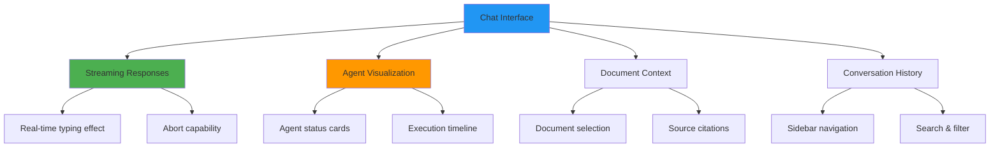

---

## User Journey

### Complete Chat Flow

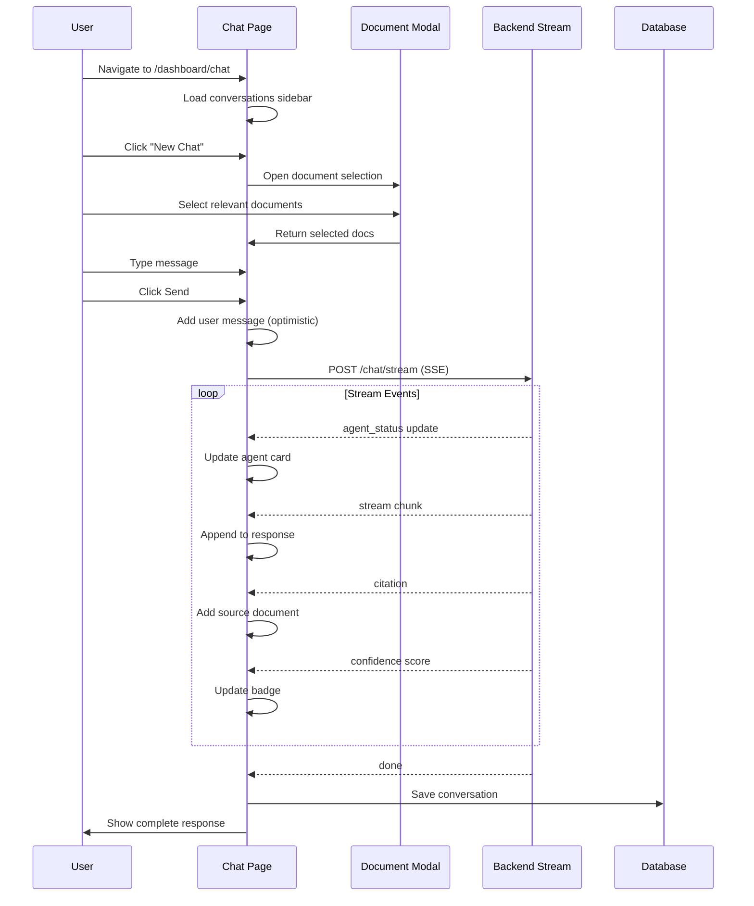

### First-Time User Experience

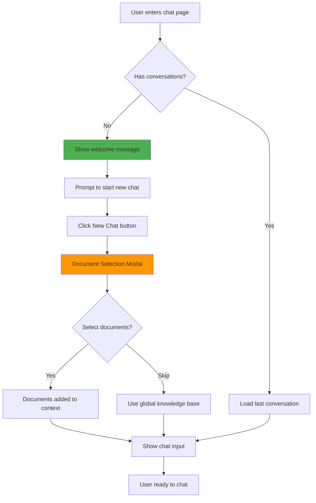

---

## Streaming Architecture

### Server-Sent Events (SSE) Implementation

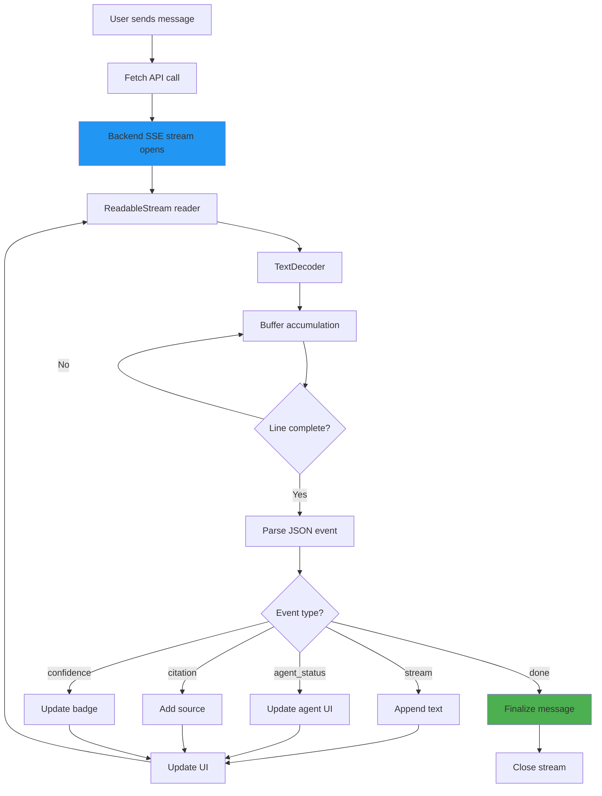

### Streaming Implementation Code

```typescript
const handleStreamingChat = async (message: string) => {
  const token = localStorage.getItem('token')

  // Open SSE connection
  const response = await fetch(`${API_URL}/api/v1/chat/stream`, {
    method: 'POST',
    headers: {
      'Content-Type': 'application/json',
      'Authorization': `Bearer ${token}`,
      'Accept': 'text/event-stream',
    },
    body: JSON.stringify({
      message,
      conversation_id: conversationId,
      selected_documents: selectedDocumentIds,
      use_grounding: useGrounding,
      provider: preferredLLM,
    }),
  })

  const reader = response.body?.getReader()
  const decoder = new TextDecoder()

  let buffer = ''
  let currentMessage = ''

  while (true) {
    const { done, value } = await reader.read()
    if (done) break

    // Decode chunk
    buffer += decoder.decode(value, { stream: true })

    // Process complete lines
    const lines = buffer.split('\n')
    buffer = lines.pop() || ''

    for (const line of lines) {
      if (line.startsWith('data: ')) {
        const event = JSON.parse(line.slice(6))
        handleStreamEvent(event)
      }
    }
  }
}
```

### Event Types

| Event Type | Purpose | Data Structure | UI Update |
|------------|---------|----------------|-----------|
| `stream` | Text chunks | `{ type, content }` | Append to message |
| `agent_status` | Agent state | `{ agent_name, status, message }` | Update agent card |
| `citation` | Source document | `{ document_id, similarity }` | Add citation chip |
| `confidence` | Confidence score | `{ score, level }` | Update confidence badge |
| `metadata` | Message metadata | `{ llm_provider, tokens }` | Store in state |
| `done` | Stream complete | `{ conversation_id, message_id }` | Finalize & save |

---

## Agent Orchestration

### Multi-Agent System Visualization

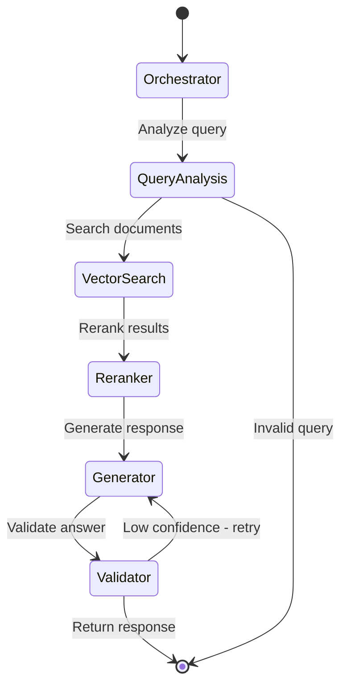

### Agent Status Display

Each agent is represented by a card showing:

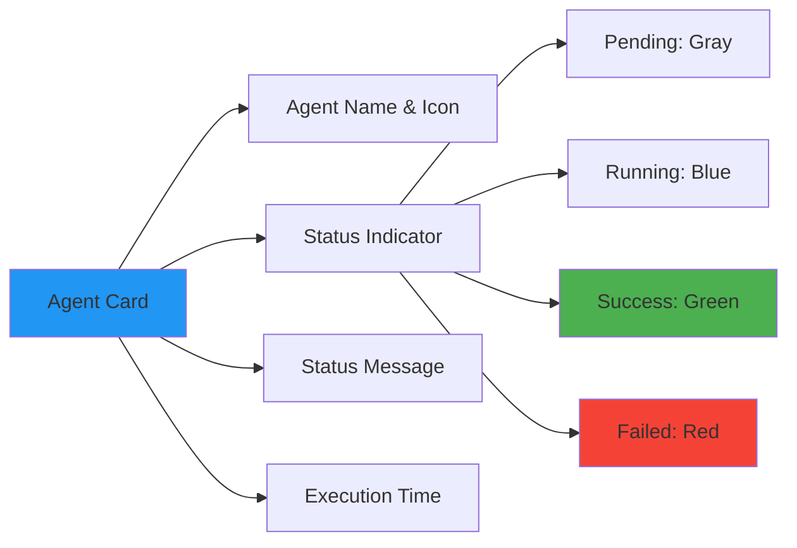

**Agent Roles:**

1. **Orchestrator** - Coordinates workflow
2. **Query Analyzer** - Parses user intent
3. **Document Retriever** - Searches vector store
4. **Reranker** - Scores relevance
5. **Generator** - Creates response
6. **Validator** - Checks quality

### Agent Status Updates

```typescript
// Handle agent status events
const handleAgentStatus = (event: AgentStatusEvent) => {
  setAgentStatuses(prev => ({
    ...prev,
    [event.agent_name]: {
      status: event.status,  // 'pending' | 'running' | 'success' | 'failed'
      message: event.message,
      timestamp: new Date(),
    }
  }))
}

// Render agent cards
<Box sx={{ display: 'flex', gap: 2, overflow: 'auto' }}>
  {agents.map(agent => (
    <Card key={agent.name}>
      <CardContent>
        <Box sx={{ display: 'flex', alignItems: 'center', gap: 1 }}>
          {getAgentIcon(agent.name)}
          <Typography variant="h6">{agent.name}</Typography>
        </Box>

        <Chip
          label={agentStatuses[agent.name]?.status || 'pending'}
          color={getStatusColor(agentStatuses[agent.name]?.status)}
          size="small"
        />

        <Typography variant="body2">
          {agentStatuses[agent.name]?.message}
        </Typography>
      </CardContent>
    </Card>
  ))}
</Box>
```

---

## Document Context

### Document Selection Flow

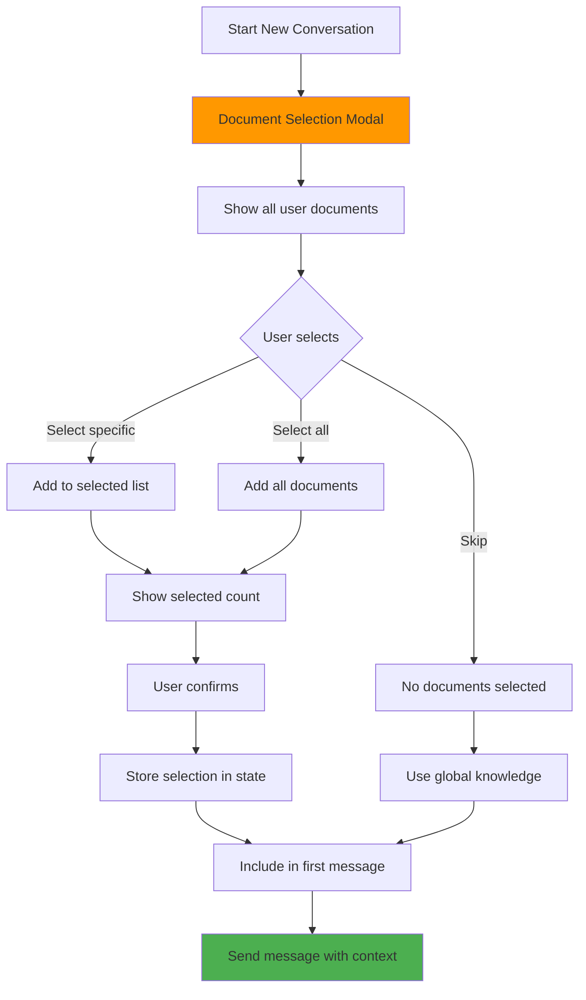

### Document Selection Modal

```typescript
<DocumentSelectionModal
  open={modalOpen}
  onClose={() => setModalOpen(false)}
  onConfirm={(selectedDocs) => {
    setSelectedDocuments(selectedDocs)
    setModalOpen(false)
  }}
/>

// Modal features:
// - Search/filter documents
// - Filter by scope (personal/global)
// - Select all/none
// - Show file type and size
// - Preview document summary
```

### Source Citations

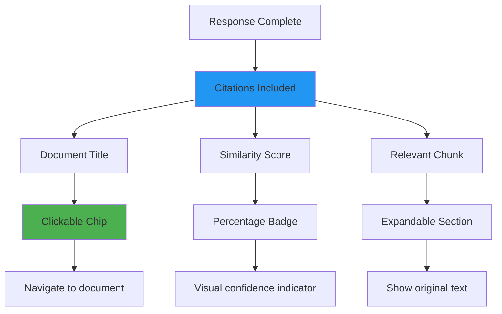

**Citation Display:**

```typescript
<Box sx={{ mt: 2 }}>
  <Typography variant="caption" color="text.secondary">
    Sources:
  </Typography>

  <Box sx={{ display: 'flex', gap: 1, flexWrap: 'wrap', mt: 1 }}>
    {message.sources?.map(source => (
      <Chip
        key={source.id}
        icon={<FileTextIcon />}
        label={`${source.filename} (${(source.similarity * 100).toFixed(1)}%)`}
        size="small"
        clickable
        onClick={() => viewDocument(source.id)}
      />
    ))}
  </Box>
</Box>
```

---

## Conversation Management

### Sidebar Structure

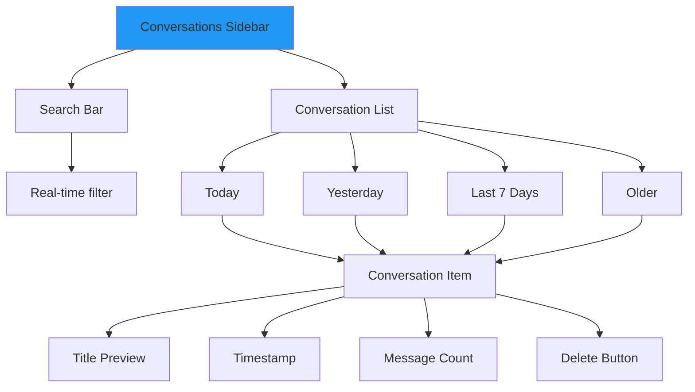

### Conversation Actions

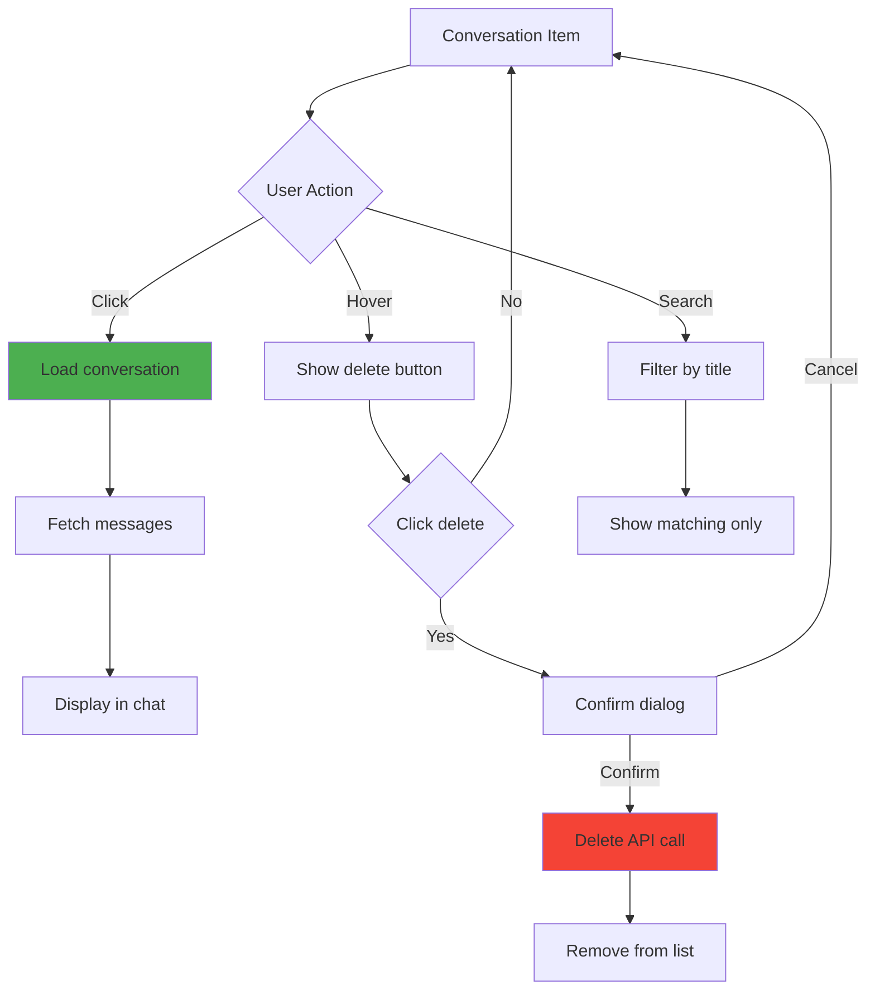

### New Conversation Flow

```typescript
const startNewConversation = () => {
  // Reset state
  setConversationId(null)
  setMessages([])
  setSelectedDocuments([])

  // Open document selection
  setDocumentModalOpen(true)
}

// After first message sent:
const handleFirstMessage = async (message: string) => {
  const response = await chatAPI.sendMessage({
    message,
    selected_documents: selectedDocuments.map(d => d.id),
  })

  // Backend creates new conversation
  setConversationId(response.data.conversation_id)

  // Refresh sidebar
  fetchConversations()
}
```

---

## Implementation Details

### Component State Structure

```typescript
interface ChatPageState {
  // Conversation data
  conversationId: string | null
  conversations: Conversation[]
  messages: Message[]

  // UI state
  inputMessage: string
  isStreaming: boolean
  streamController: AbortController | null

  // Document context
  selectedDocuments: Document[]
  documentModalOpen: boolean

  // Agent visualization
  agentStatuses: Record<string, AgentStatus>

  // Settings
  useGrounding: boolean
  preferredLLM: 'custom' | 'ollama'

  // Sidebar
  sidebarOpen: boolean
  searchQuery: string
}
```

### Message Structure

```typescript
interface Message {
  id: string
  conversation_id: string
  role: 'user' | 'assistant'
  content: string

  // Metadata
  timestamp: string
  tokens_used?: number
  llm_provider?: string

  // Citations
  sources?: {
    document_id: string
    filename: string
    similarity: number
    chunk_text: string
  }[]

  // Confidence
  confidence_score?: number
  confidence_level?: 'high' | 'medium' | 'low'
  low_confidence_warning?: string

  // Agent data
  agent_logs?: {
    agent_name: string
    status: string
    execution_time: number
  }[]
}
```

---

## Key Features

### 1. Streaming Response Display

```typescript
// Accumulate streaming text
const [streamingContent, setStreamingContent] = useState('')

// On stream event
case 'stream':
  setStreamingContent(prev => prev + event.content)

// Render with typing effect
<Box sx={{ whiteSpace: 'pre-wrap' }}>
  <ReactMarkdown>{streamingContent}</ReactMarkdown>
  <Box component="span" className="blinking-cursor">|</Box>
</Box>
```

### 2. Abort Streaming

```typescript
const [abortController, setAbortController] = useState<AbortController | null>(null)

const startStreaming = () => {
  const controller = new AbortController()
  setAbortController(controller)

  fetch(url, { signal: controller.signal })
}

const stopStreaming = () => {
  abortController?.abort()
  setIsStreaming(false)
  showSnackbar('Response stopped', 'info')
}

// UI
{isStreaming && (
  <Button onClick={stopStreaming} color="error">
    Stop Generating
  </Button>
)}
```

### 3. Confidence Indicators

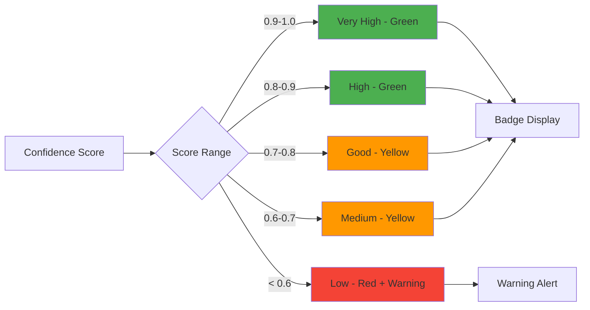

### 4. Provider Switching

```typescript
<FormControl>
  <InputLabel>LLM Provider</InputLabel>
  <Select
    value={preferredLLM}
    onChange={(e) => setPreferredLLM(e.target.value)}
  >
    <MenuItem value="custom">Custom API</MenuItem>
    <MenuItem value="ollama">Ollama Local</MenuItem>
  </Select>
</FormControl>
```

### 5. Grounding Toggle

```typescript
<FormControlLabel
  control={
    <Checkbox
      checked={useGrounding}
      onChange={(e) => setUseGrounding(e.target.checked)}
    />
  }
  label="Enable Answer Grounding Verification"
/>

// When enabled, backend validates answers against sources
// Adds grounding_confidence score to response
```

---

## Best Practices

### ✅ Do's

1. **Clean up streams on unmount**
```typescript
useEffect(() => {
  return () => {
    abortController?.abort()
  }
}, [])
```

2. **Show loading states during streaming**
```typescript
{isStreaming && <LinearProgress />}
```

3. **Handle stream errors gracefully**
```typescript
try {
  await streamResponse()
} catch (error) {
  if (error.name === 'AbortError') {
    showSnackbar('Stopped by user', 'info')
  } else {
    showSnackbar('Stream error', 'error')
  }
}
```

4. **Optimize message rendering**
```typescript
const MessageList = React.memo(({ messages }) => (
  // Only re-render when messages change
))
```

### ❌ Don'ts

- Don't forget to close ReadableStream readers
- Don't block UI during streaming
- Don't lose message context on re-render
- Don't allow multiple simultaneous streams

---

## Troubleshooting

| Issue | Cause | Solution |
|-------|-------|----------|
| Stream not starting | CORS or auth error | Check token and CORS headers |
| Partial messages | Buffer not flushed | Process remaining buffer after done |
| Memory leak | Reader not closed | Close reader in finally block |
| Agent status not updating | Event parsing error | Validate JSON structure |

---

## Next Steps

- **[Documents Feature](./DOCUMENTS.md)** - Learn about document management
- **[Explainability Feature](./EXPLAINABILITY.md)** - Understand AI transparency
- **[API Integration Guide](../guides/API_INTEGRATION.md)** - Deep dive into SSE

---

**Last Updated:** December 4, 2025
