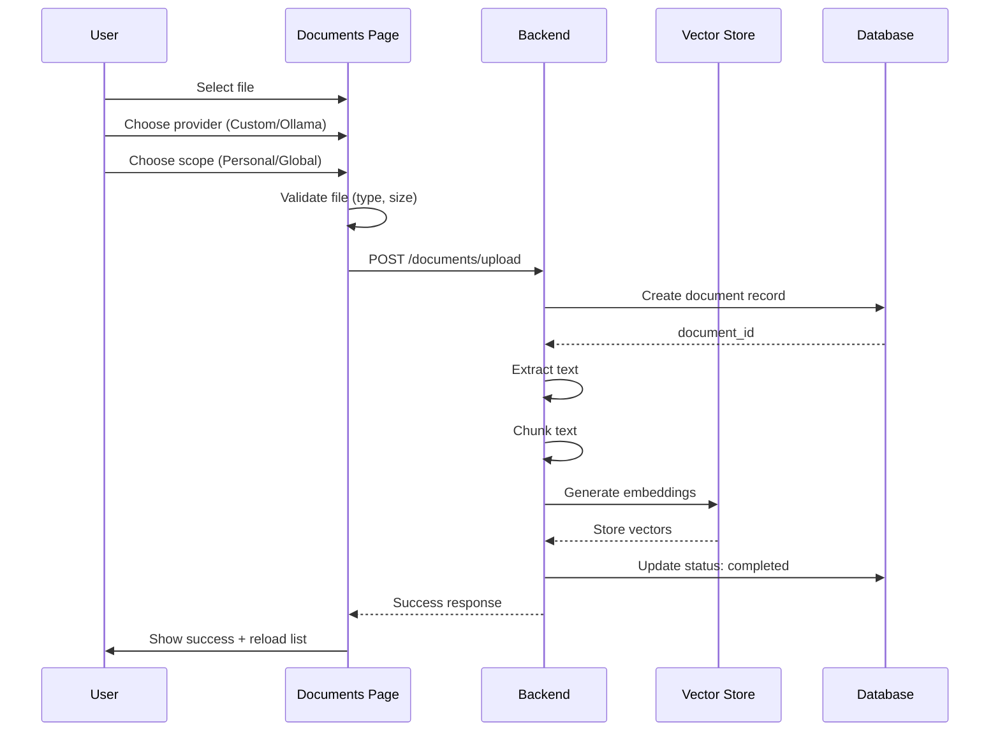
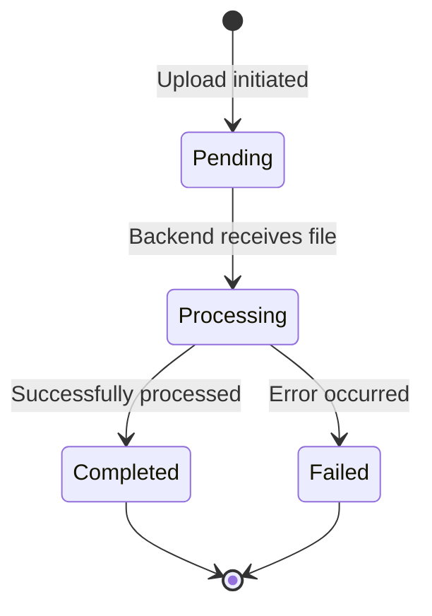
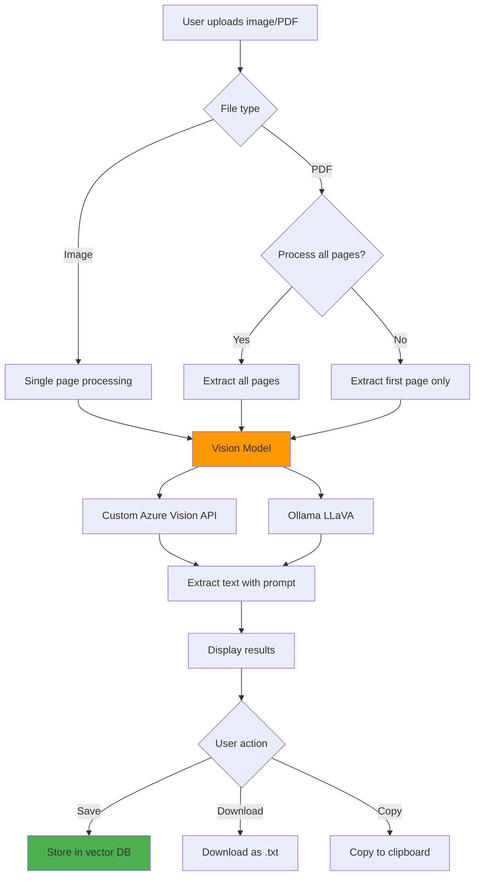
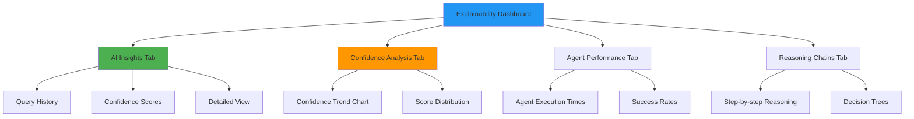
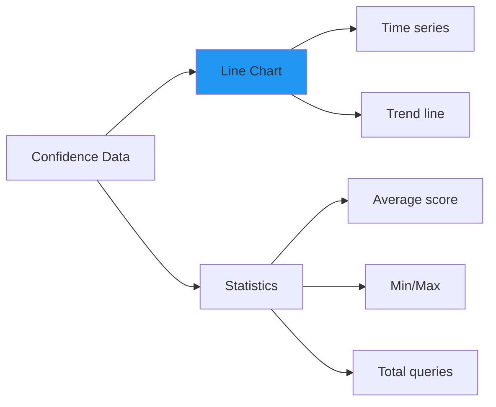
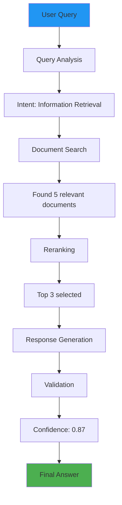
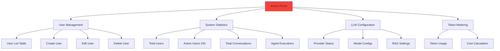
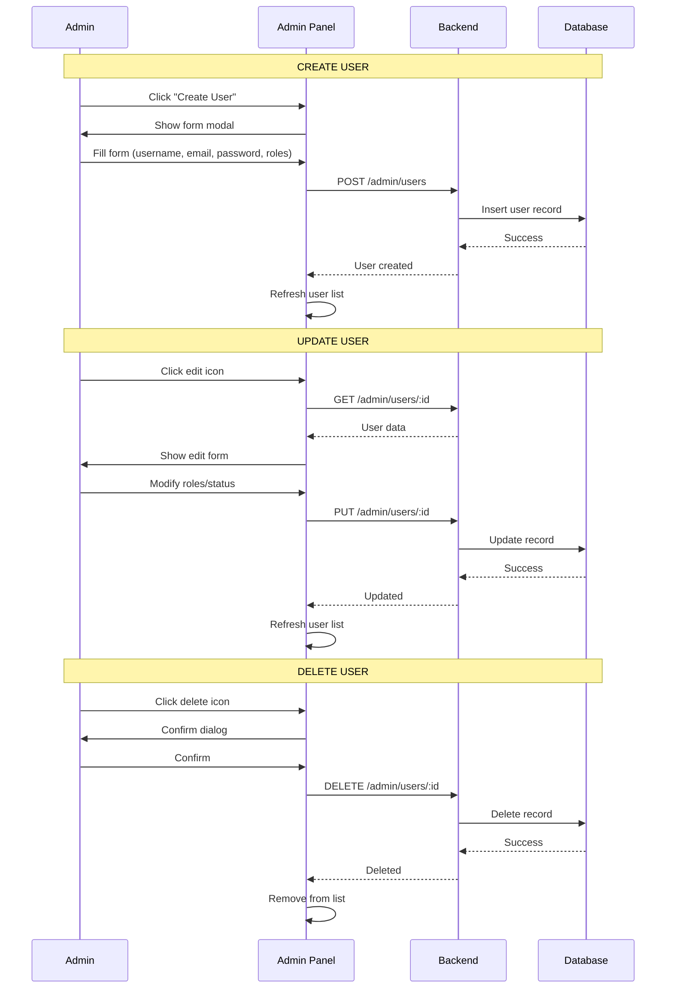
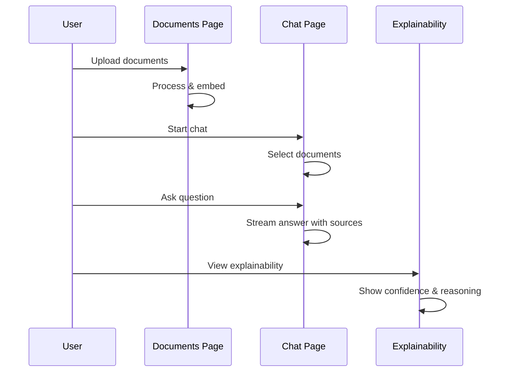
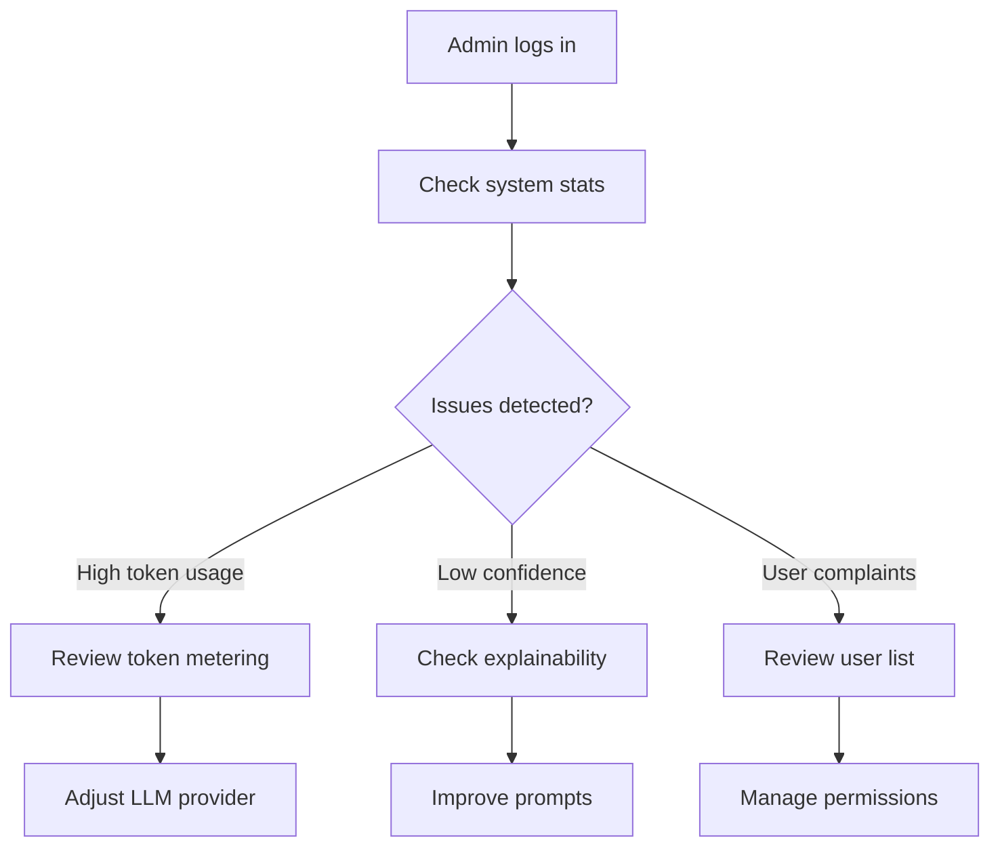

# Comprehensive Features Documentation

> **Complete guide to all major application features**

This document consolidates documentation for all major features in the application. For detailed implementation guides, refer to the individual feature files.

---

## 📄 Document Management

**Route:** `/dashboard/documents`
**Permissions:** `documents:read` (view), `documents:create` (upload), `documents:delete` (delete)

### Upload Flow



### Document States



### Key Features

- **Multi-format Support:** PDF, TXT, CSV, DOCX
- **Scope System:** Personal (user-only) or Global (admin, all users)
- **Provider Selection:** Custom API or Ollama for embeddings
- **Processing Status:** Real-time status indicators
- **Statistics Cards:** Total docs, personal/global split, chunks, total size
- **Search & Filter:** Find documents by name
- **Bulk Operations:** Select and delete multiple

### Implementation

```typescript
// Upload document
const handleUpload = async (file: File) => {
  const formData = new FormData()
  formData.append('file', file)
  formData.append('provider', selectedProvider)

  try {
    const endpoint = scope === 'global' && hasRole('admin')
      ? documentsAPI.uploadGlobal
      : documentsAPI.upload

    const response = await endpoint(file, selectedProvider)
    showSnackbar('Document uploaded successfully!', 'success')
    fetchDocuments()  // Reload list
  } catch (error) {
    showSnackbar(error.response?.data?.detail || 'Upload failed', 'error')
  }
}
```

---

## 🔍 OCR Processing

**Route:** `/dashboard/ocr`
**Permissions:** `documents:create` (to save extracted text)

### OCR Pipeline



### Vision Model Configuration

| Provider | Model | Features | Use Case |
|----------|-------|----------|----------|
| **Custom** | Azure Vision API | High accuracy, multilingual, table extraction | Production documents |
| **Ollama** | LLaVA | Local processing, privacy, free | Development, sensitive docs |

### Multi-Page Processing

```typescript
// Process all pages or first page only
const processOCR = async (file: File, processAllPages: boolean) => {
  const response = await documentsAPI.ocr(file, {
    provider: selectedProvider,
    prompt: customPrompt || 'Extract all text accurately',
    process_all_pages: processAllPages,
  })

  // Response structure:
  {
    pages: [
      { page_number: 1, text: '...', confidence: 0.95, tokens_used: 1200 },
      { page_number: 2, text: '...', confidence: 0.98, tokens_used: 1100 }
    ],
    total_tokens: 2300,
    processing_time: 3.5
  }
}
```

### Key Features

- **Supported Formats:** JPG, PNG, PDF, TIFF, BMP, WebP
- **Custom Prompts:** Guide extraction with specific instructions
- **Multi-page PDFs:** Process all pages or first only
- **Confidence Scores:** Per-page extraction confidence
- **Token Tracking:** Monitor API usage
- **Save Options:** Store in vector DB or download
- **Preview:** View uploaded image before processing

---

## 📊 Explainability Dashboard

**Route:** `/dashboard/explainability`
**Permissions:** `explain:view`

### Dashboard Architecture



### Tab 1: AI Insights

Shows all chat queries with explainability data:

- Query text and response
- Confidence score with color-coded badge
- Timestamp and provider
- Low confidence warnings
- Expandable detailed view

### Tab 2: Confidence Analysis



**Recharts Implementation:**

```typescript
<ResponsiveContainer width="100%" height={300}>
  <LineChart data={confidenceData}>
    <CartesianGrid strokeDasharray="3 3" />
    <XAxis dataKey="timestamp" />
    <YAxis domain={[0, 1]} />
    <Tooltip />
    <Legend />
    <Line
      type="monotone"
      dataKey="confidence_score"
      stroke="#2196f3"
      strokeWidth={2}
    />
  </LineChart>
</ResponsiveContainer>
```

### Tab 3: Agent Performance

Bar chart showing execution metrics per agent:

- Orchestrator, Query Analyzer, Retriever, Reranker, Generator, Validator
- Average execution time in milliseconds
- Success vs failure rates
- Interactive tooltips

### Tab 4: Reasoning Chains

Step-by-step visualization of AI decision-making:



**Features:**
- Expandable step cards
- Execution time per step
- Input/output data
- Confidence at each stage
- Grounding evidence

---

## 👥 Admin Panel

**Route:** `/dashboard/admin`
**Permissions:** `admin:access` (admin role required)

### Admin Panel Structure



### User Management CRUD



### User Table Features

- **DataGrid Component:** Sortable, filterable columns
- **Columns:** ID, Username, Email, Full Name, Roles, Status, Last Login, Actions
- **Role Chips:** Color-coded badges (Admin=red, Analyst=orange, Viewer=green)
- **Status Toggle:** Active/Inactive switch
- **Actions:** Edit, Delete buttons
- **Export:** Download user list as CSV

### System Statistics Cards

```typescript
<Grid container spacing={3}>
  <Grid item xs={12} sm={6} md={3}>
    <StatsCard
      title="Total Users"
      value={stats.total_users}
      icon={<PeopleIcon />}
      color="primary"
    />
  </Grid>

  <Grid item xs={12} sm={6} md={3}>
    <StatsCard
      title="Active Users (24h)"
      value={stats.active_users_24h}
      icon={<PersonIcon />}
      color="success"
    />
  </Grid>

  <Grid item xs={12} sm={6} md={3}>
    <StatsCard
      title="Total Conversations"
      value={stats.total_conversations}
      icon={<ChatIcon />}
      color="info"
    />
  </Grid>

  <Grid item xs={12} sm={6} md={3}>
    <StatsCard
      title="Agent Executions"
      value={stats.total_agent_executions}
      icon={<SmartToyIcon />}
      color="warning"
    />
  </Grid>
</Grid>
```

### Token Metering

**Real-time cost tracking:**

```typescript
{
  providers: {
    custom: {
      total_tokens: 1245600,
      total_cost: 24.91,
      queries_count: 450
    },
    ollama: {
      total_tokens: 340000,
      total_cost: 0,  // Local, free
      queries_count: 120
    }
  },
  last_7_days: { tokens: 125000, cost: 2.50 },
  last_30_days: { tokens: 580000, cost: 11.60 }
}
```

### LLM Configuration Display

Read-only view of system configuration:

- **Custom Provider:** API endpoint, model name, embedding model
- **Ollama Provider:** Base URL, available models
- **Vision Models:** Azure Vision config, Ollama LLaVA
- **RAG Settings:** Chunk size, overlap, similarity threshold, top-k
- **Explainability:** Logging level, confidence thresholds

---

## 🛠️ Utilities Page

**Route:** `/dashboard/utilities`
**Purpose:** Demo/testing interface for UI components

### Tab Structure

1. **Tables Tab:** DataGrid demos with CRUD operations, CSV export
2. **Forms Tab:** Sample form with validation
3. **Charts Tab:** Line, Bar, Pie chart examples using Recharts
4. **PII Scrubbing Tab:** Text anonymization utility

### PII Scrubbing Feature

```mermaid
flowchart LR
    A[User inputs text] --> B[API Call]
    B --> C[/utilities/scrub-pii]
    C --> D[Backend detects PII]
    D --> E[Replace with placeholders]
    E --> F[Return scrubbed text]
    F --> G[Display result]

    D --> H[Detection count]
    H --> G

    style C fill:#ff9800
    style E fill:#4caf50
```

**Example:**
```
Input: "John Smith's email is john@example.com and SSN is 123-45-6789"
Output: "PERSON_1's email is EMAIL_1 and SSN is SSN_1"
Detections: 3 (1 person, 1 email, 1 SSN)
```

---

## Feature Comparison Matrix

| Feature | Permission Required | Admin Only | Supports Streaming | Uses Vector Store |
|---------|---------------------|------------|-------------------|-------------------|
| **Chat** | `chat:use` | No | Yes | Yes |
| **Documents** | `documents:read/create` | No (Global: Yes) | No | Yes |
| **OCR** | `documents:create` | No | No | Optional |
| **Explainability** | `explain:view` | No | No | No |
| **Admin Panel** | `admin:access` | Yes | No | No |
| **Utilities** | None (authenticated) | No | No | No |

---

## Cross-Feature Workflows

### Complete RAG Workflow



### Admin Monitoring Workflow



---

## Next Steps

- **[Components Guide](../guides/COMPONENTS.md)** - Reusable UI components
- **[Development Guide](../guides/DEVELOPMENT_GUIDE.md)** - Add new features
- **[API Integration](../guides/API_INTEGRATION.md)** - Connect features to backend

---

**Last Updated:** December 4, 2025
