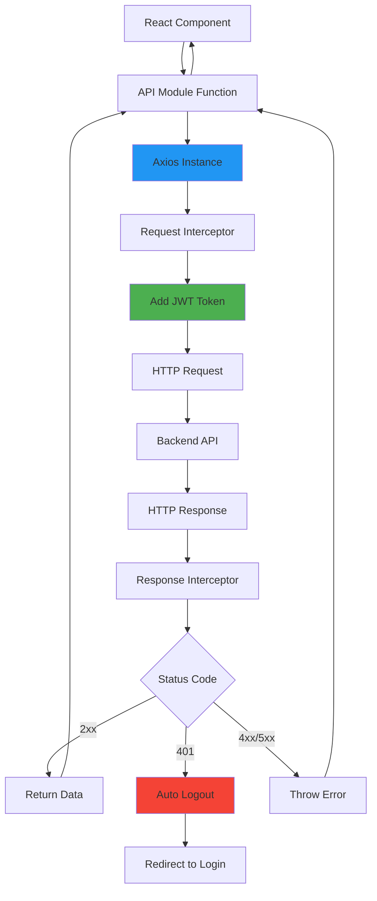
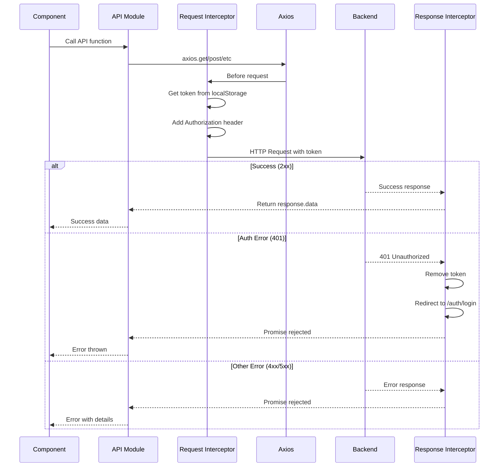
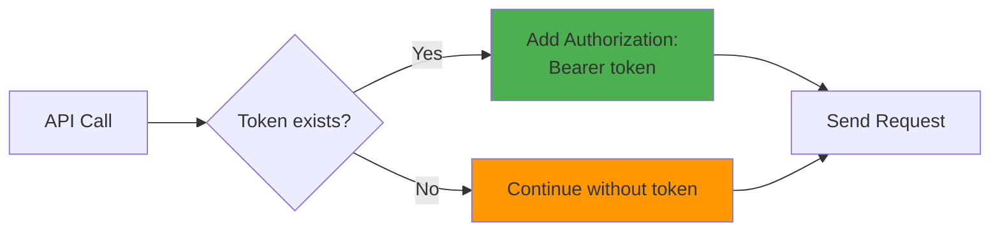
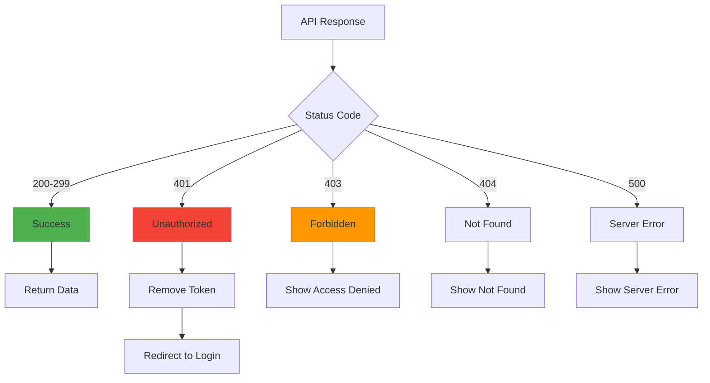
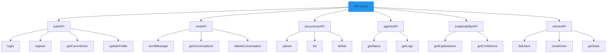
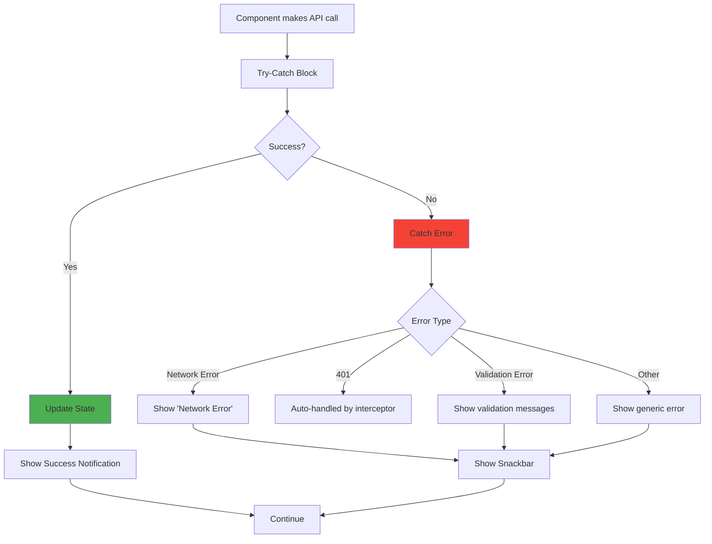
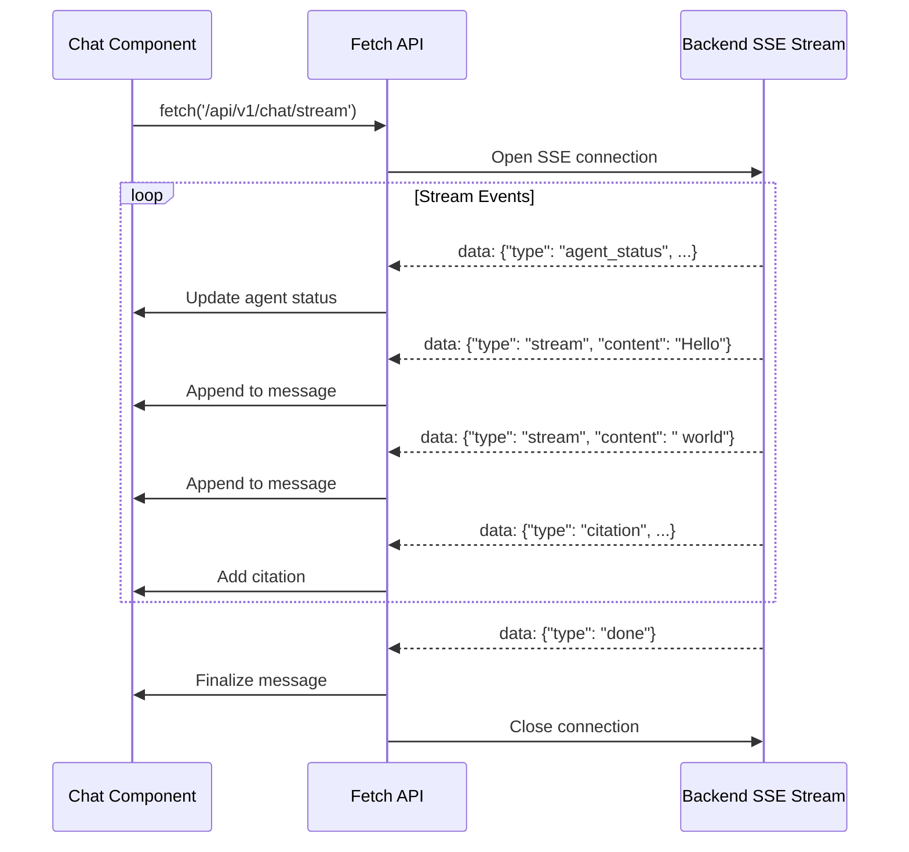
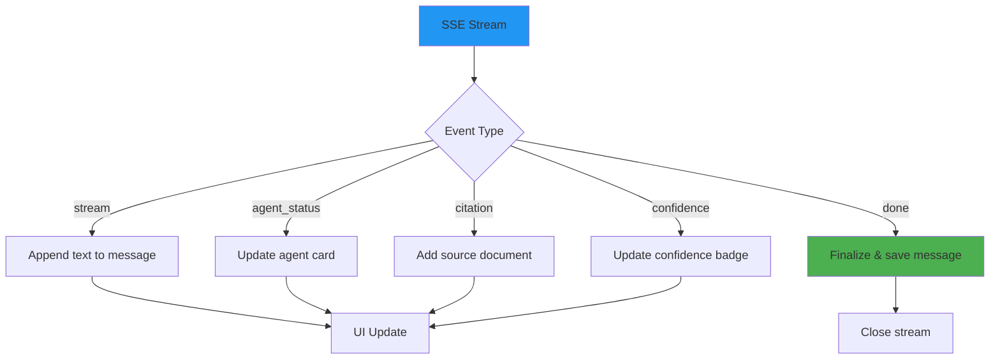

# API Integration Guide

> **Complete guide to HTTP client configuration, API calls, and error handling**

## 📋 Table of Contents

- [Overview](#overview)
- [API Client Setup](#api-client-setup)
- [Request/Response Flow](#requestresponse-flow)
- [API Modules](#api-modules)
- [Error Handling](#error-handling)
- [Streaming API](#streaming-api)
- [Best Practices](#best-practices)

---

## Overview

The frontend communicates with the FastAPI backend through a centralized Axios client configured with interceptors for authentication, error handling, and request/response transformation.

### Key Architecture



**File:** `frontend/lib/api.ts`

---

## API Client Setup

### Base Configuration

```typescript
import axios from 'axios'

const API_BASE_URL = process.env.NEXT_PUBLIC_API_URL || 'http://localhost:8000'

const apiClient = axios.create({
  baseURL: API_BASE_URL,
  headers: {
    'Content-Type': 'application/json',
  },
})
```

### Environment Variables

```bash
# .env.local
NEXT_PUBLIC_API_URL=http://localhost:8000

# Production
NEXT_PUBLIC_API_URL=https://api.yourdomain.com
```

### Interceptor Flow Diagram



---

## Request/Response Flow

### Request Interceptor

**Purpose:** Automatically inject JWT token into all requests

```typescript
apiClient.interceptors.request.use(
  (config) => {
    // Get token from localStorage
    const token = localStorage.getItem('token')

    // Add Authorization header if token exists
    if (token) {
      config.headers.Authorization = `Bearer ${token}`
    }

    return config
  },
  (error) => {
    return Promise.reject(error)
  }
)
```

**Visual Flow:**



### Response Interceptor

**Purpose:** Handle authentication errors globally

```typescript
apiClient.interceptors.response.use(
  (response) => {
    // Pass through successful responses
    return response
  },
  (error) => {
    // Handle 401 Unauthorized
    if (error.response?.status === 401) {
      // Clear authentication
      localStorage.removeItem('token')

      // Redirect to login
      window.location.href = '/auth/login'
    }

    return Promise.reject(error)
  }
)
```

**Error Handling Flow:**



---

## API Modules

The API client is organized into logical modules for different feature areas:



### 1. Authentication API

```typescript
export const authAPI = {
  // POST /api/v1/auth/login
  login: (username: string, password: string) => {
    return apiClient.post('/api/v1/auth/login',
      new URLSearchParams({ username, password }),
      { headers: { 'Content-Type': 'application/x-www-form-urlencoded' } }
    )
  },

  // POST /api/v1/auth/register
  register: (data: RegisterData) => {
    return apiClient.post('/api/v1/auth/register', data)
  },

  // GET /api/v1/auth/me
  getCurrentUser: () => {
    return apiClient.get('/api/v1/auth/me')
  },

  // PUT /api/v1/auth/profile
  updateProfile: (data: ProfileData) => {
    return apiClient.put('/api/v1/auth/profile', data)
  },

  // POST /api/v1/auth/change-password
  changePassword: (oldPassword: string, newPassword: string) => {
    return apiClient.post('/api/v1/auth/change-password', {
      old_password: oldPassword,
      new_password: newPassword,
    })
  },
}
```

### 2. Chat API

```typescript
export const chatAPI = {
  // POST /api/v1/chat
  sendMessage: (data: {
    message: string
    conversation_id?: string
    selected_documents?: string[]
  }) => {
    return apiClient.post('/api/v1/chat', data)
  },

  // GET /api/v1/conversations
  getConversations: () => {
    return apiClient.get('/api/v1/conversations')
  },

  // GET /api/v1/conversations/{id}/messages
  getMessages: (conversationId: string) => {
    return apiClient.get(`/api/v1/conversations/${conversationId}/messages`)
  },

  // DELETE /api/v1/conversations/{id}
  deleteConversation: (conversationId: string) => {
    return apiClient.delete(`/api/v1/conversations/${conversationId}`)
  },
}
```

### 3. Documents API

```typescript
export const documentsAPI = {
  // POST /api/v1/documents/upload
  upload: (file: File, provider: string = 'custom') => {
    const formData = new FormData()
    formData.append('file', file)
    formData.append('provider', provider)

    return apiClient.post('/api/v1/documents/upload', formData, {
      headers: { 'Content-Type': 'multipart/form-data' },
    })
  },

  // POST /api/v1/documents/upload-global (admin only)
  uploadGlobal: (file: File, provider: string = 'custom') => {
    const formData = new FormData()
    formData.append('file', file)
    formData.append('provider', provider)

    return apiClient.post('/api/v1/documents/upload-global', formData, {
      headers: { 'Content-Type': 'multipart/form-data' },
    })
  },

  // GET /api/v1/documents
  list: () => {
    return apiClient.get('/api/v1/documents')
  },

  // GET /api/v1/documents/{id}
  get: (id: string) => {
    return apiClient.get(`/api/v1/documents/${id}`)
  },

  // DELETE /api/v1/documents/{id}
  delete: (id: string) => {
    return apiClient.delete(`/api/v1/documents/${id}`)
  },

  // POST /api/v1/documents/ocr
  ocr: (file: File, options: OCROptions) => {
    const formData = new FormData()
    formData.append('file', file)
    if (options.prompt) formData.append('prompt', options.prompt)
    if (options.provider) formData.append('provider', options.provider)
    if (options.process_all_pages !== undefined) {
      formData.append('process_all_pages', String(options.process_all_pages))
    }

    return apiClient.post('/api/v1/documents/ocr', formData, {
      headers: { 'Content-Type': 'multipart/form-data' },
    })
  },
}
```

### 4. Admin API

```typescript
export const adminAPI = {
  // GET /api/v1/admin/users
  listUsers: () => {
    return apiClient.get('/api/v1/admin/users')
  },

  // GET /api/v1/admin/users/{id}
  getUser: (id: number) => {
    return apiClient.get(`/api/v1/admin/users/${id}`)
  },

  // POST /api/v1/admin/users
  createUser: (data: CreateUserData) => {
    return apiClient.post('/api/v1/admin/users', data)
  },

  // PUT /api/v1/admin/users/{id}
  updateUser: (id: number, data: UpdateUserData) => {
    return apiClient.put(`/api/v1/admin/users/${id}`, data)
  },

  // DELETE /api/v1/admin/users/{id}
  deleteUser: (id: number) => {
    return apiClient.delete(`/api/v1/admin/users/${id}`)
  },

  // GET /api/v1/admin/stats
  getStats: () => {
    return apiClient.get('/api/v1/admin/stats')
  },

  // GET /api/v1/admin/llm-config
  getLLMConfig: () => {
    return apiClient.get('/api/v1/admin/llm-config')
  },
}
```

---

## Error Handling

### Error Response Structure

```typescript
interface APIError {
  response?: {
    status: number
    data: {
      detail: string | { msg: string }[]
      message?: string
    }
  }
  message: string
}
```

### Component-Level Error Handling



### Error Handling Pattern

```typescript
import { useSnackbar } from '@/components/SnackbarProvider'

function MyComponent() {
  const { showSnackbar } = useSnackbar()
  const [loading, setLoading] = useState(false)

  const handleAction = async () => {
    setLoading(true)

    try {
      // Make API call
      const response = await documentsAPI.upload(file)

      // Success
      showSnackbar('Document uploaded successfully!', 'success')

      // Update UI
      setDocuments([...documents, response.data])

    } catch (error: any) {
      // Extract error message
      const errorMessage = error.response?.data?.detail
        || error.message
        || 'An error occurred'

      // Show error notification
      showSnackbar(errorMessage, 'error')

      // Optional: Log for debugging
      console.error('Upload error:', error)

    } finally {
      // Always reset loading state
      setLoading(false)
    }
  }

  return (
    <Button
      onClick={handleAction}
      disabled={loading}
    >
      {loading ? 'Uploading...' : 'Upload'}
    </Button>
  )
}
```

### Error Types and Handling

| Status Code | Error Type | Handled By | User Message |
|-------------|------------|------------|--------------|
| 401 | Unauthorized | Response Interceptor | Auto-logout + redirect |
| 403 | Forbidden | Component | "You don't have permission" |
| 404 | Not Found | Component | "Resource not found" |
| 422 | Validation Error | Component | Specific field errors |
| 500 | Server Error | Component | "Server error occurred" |
| Network Error | No Response | Component | "Network error - check connection" |

### Validation Error Handling

```typescript
// Backend returns validation errors in this format:
{
  "detail": [
    {
      "loc": ["body", "email"],
      "msg": "Invalid email format",
      "type": "value_error"
    }
  ]
}

// Frontend parsing:
const parseValidationErrors = (error: any): string => {
  const details = error.response?.data?.detail

  if (Array.isArray(details)) {
    return details.map(e => e.msg).join(', ')
  }

  return details || 'Validation error'
}
```

---

## Streaming API

### Chat Streaming Architecture

For real-time chat responses, the application uses **Server-Sent Events (SSE)** instead of Axios:



### Streaming Implementation

```typescript
const handleStreamingChat = async (message: string) => {
  const token = localStorage.getItem('token')

  const response = await fetch(`${API_BASE_URL}/api/v1/chat/stream`, {
    method: 'POST',
    headers: {
      'Content-Type': 'application/json',
      'Authorization': `Bearer ${token}`,
      'Accept': 'text/event-stream',
    },
    body: JSON.stringify({
      message,
      conversation_id: conversationId,
      selected_documents: selectedDocs,
    }),
  })

  if (!response.ok) {
    throw new Error('Streaming failed')
  }

  const reader = response.body?.getReader()
  const decoder = new TextDecoder()

  let buffer = ''

  while (true) {
    const { done, value } = await reader.read()

    if (done) break

    buffer += decoder.decode(value, { stream: true })

    // Process line by line
    const lines = buffer.split('\n')
    buffer = lines.pop() || ''

    for (const line of lines) {
      if (line.startsWith('data: ')) {
        const data = JSON.parse(line.slice(6))

        // Handle different event types
        switch (data.type) {
          case 'stream':
            // Append to message content
            setCurrentMessage(prev => prev + data.content)
            break

          case 'agent_status':
            // Update agent visualization
            updateAgentStatus(data)
            break

          case 'citation':
            // Add source citation
            addCitation(data)
            break

          case 'done':
            // Finalize message
            finalizeMessage()
            break
        }
      }
    }
  }
}
```

### Streaming Event Types



---

## Best Practices

### 1. Consistent Error Handling

```typescript
// ✅ Good: Consistent pattern
try {
  const response = await api.call()
  showSnackbar('Success!', 'success')
  return response.data
} catch (error: any) {
  const msg = error.response?.data?.detail || 'Error occurred'
  showSnackbar(msg, 'error')
  throw error
}

// ❌ Bad: Inconsistent handling
api.call().then(r => console.log(r)).catch(e => alert('Error'))
```

### 2. Loading States

```typescript
// ✅ Good: Track loading state
const [loading, setLoading] = useState(false)

const handleAction = async () => {
  setLoading(true)
  try {
    await api.call()
  } finally {
    setLoading(false)  // Always reset
  }
}
```

### 3. Abort Controller for Cleanup

```typescript
// ✅ Good: Cancel requests on unmount
useEffect(() => {
  const controller = new AbortController()

  fetchData(controller.signal)

  return () => controller.abort()
}, [])
```

### 4. Type Safety

```typescript
// ✅ Good: Define response types
interface Document {
  id: string
  filename: string
  status: 'pending' | 'completed' | 'failed'
}

const response = await documentsAPI.list()
const documents: Document[] = response.data
```

### 5. Centralized API Calls

```typescript
// ✅ Good: Use API modules
import { documentsAPI } from '@/lib/api'
await documentsAPI.upload(file)

// ❌ Bad: Direct axios calls scattered
import axios from 'axios'
await axios.post('http://localhost:8000/api/v1/documents/upload', formData)
```

### 6. Environment-Based URLs

```typescript
// ✅ Good: Use environment variables
const API_URL = process.env.NEXT_PUBLIC_API_URL

// ❌ Bad: Hardcoded URLs
const API_URL = 'http://localhost:8000'
```

---

## Testing API Integration

### Manual Testing Checklist

- [ ] Test with backend running
- [ ] Test with backend stopped (network errors)
- [ ] Test 401 unauthorized (expired token)
- [ ] Test validation errors (422)
- [ ] Test file uploads with large files
- [ ] Test streaming chat interruption
- [ ] Test concurrent requests
- [ ] Test with slow network (throttling)

### Debug API Calls

```typescript
// Add request logging for debugging
apiClient.interceptors.request.use(config => {
  console.log('[API Request]', config.method?.toUpperCase(), config.url)
  return config
})

apiClient.interceptors.response.use(
  response => {
    console.log('[API Response]', response.status, response.config.url)
    return response
  },
  error => {
    console.error('[API Error]', error.response?.status, error.config?.url)
    return Promise.reject(error)
  }
)
```

---

## Next Steps

- **[Authentication Guide](./AUTHENTICATION.md)** - Understand JWT integration
- **[State Management](./STATE_MANAGEMENT.md)** - Learn how API data flows through the app
- **[Development Guide](./DEVELOPMENT_GUIDE.md)** - Add new API endpoints

---

**Last Updated:** December 4, 2025
