# Authentication System Guide

> **Complete guide to authentication, authorization, and security in the frontend application**

## 📋 Table of Contents

- [Overview](#overview)
- [Authentication Flow](#authentication-flow)
- [Token Management](#token-management)
- [Authorization System](#authorization-system)
- [Route Protection](#route-protection)
- [Implementation Details](#implementation-details)
- [Security Considerations](#security-considerations)

---

## Overview

The application uses **JWT (JSON Web Token)** based authentication with role-based access control (RBAC) and permission-based authorization. Authentication state is managed globally through React Context and persisted in browser localStorage.

### Key Components

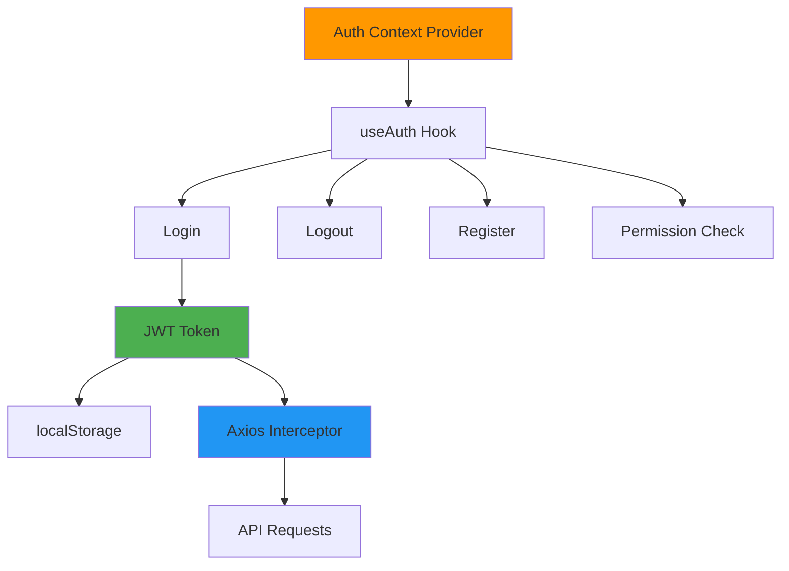

---

## Authentication Flow

### Complete Login Flow

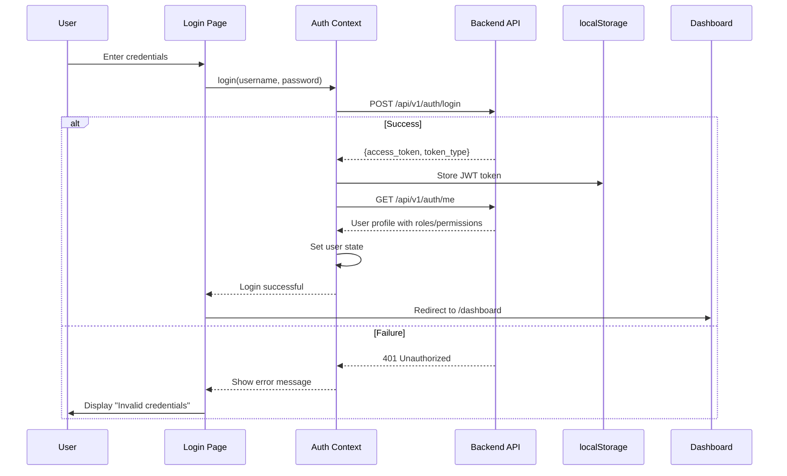

### Registration Flow

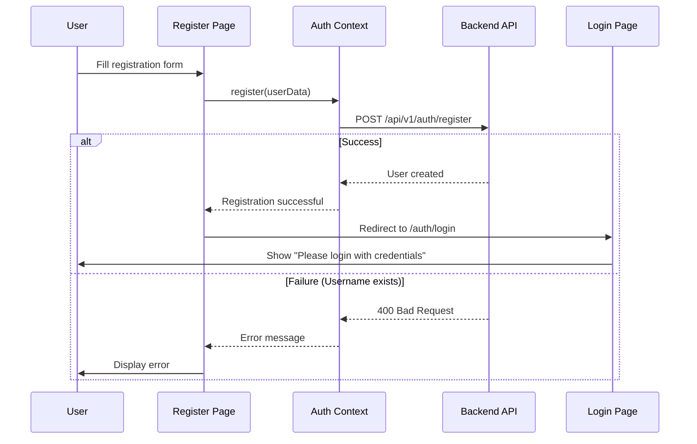

### Logout Flow

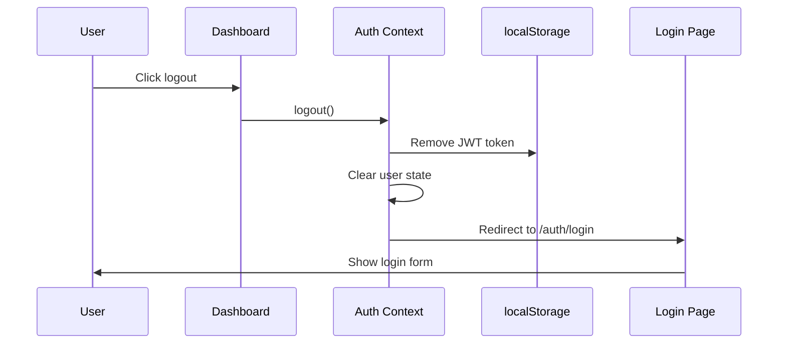

---

## Token Management

### Token Storage

**Location:** Browser `localStorage`
**Key:** `token`
**Format:** JWT (JSON Web Token)

```typescript
// Token structure (decoded)
{
  "sub": "username",           // Subject (username)
  "exp": 1733356800,          // Expiration timestamp
  "iat": 1733270400,          // Issued at timestamp
  "user_id": 123,             // User ID
  "roles": ["admin"],         // User roles
  "permissions": [            // User permissions
    "chat:use",
    "documents:create"
  ]
}
```

### Token Lifecycle

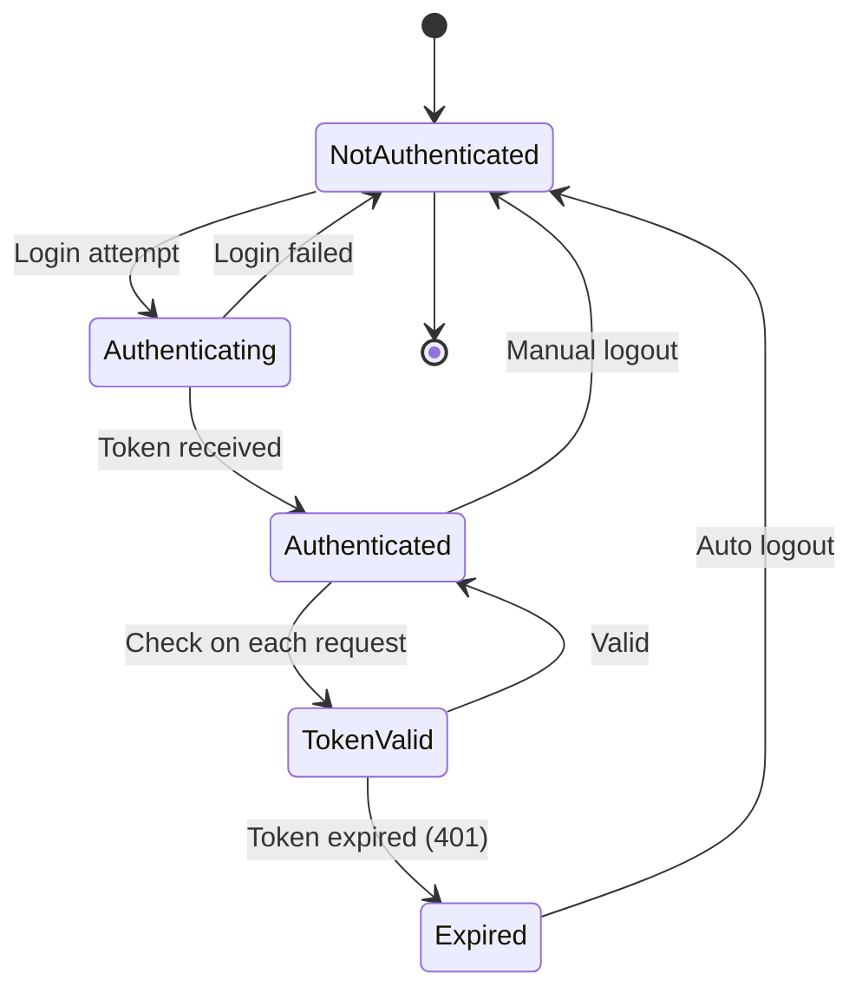

### Automatic Token Injection

Axios interceptor automatically adds JWT token to all API requests:

```typescript
// In lib/api.ts
apiClient.interceptors.request.use(
  (config) => {
    const token = localStorage.getItem('token')
    if (token) {
      config.headers.Authorization = `Bearer ${token}`
    }
    return config
  },
  (error) => Promise.reject(error)
)
```

### Token Expiration Handling

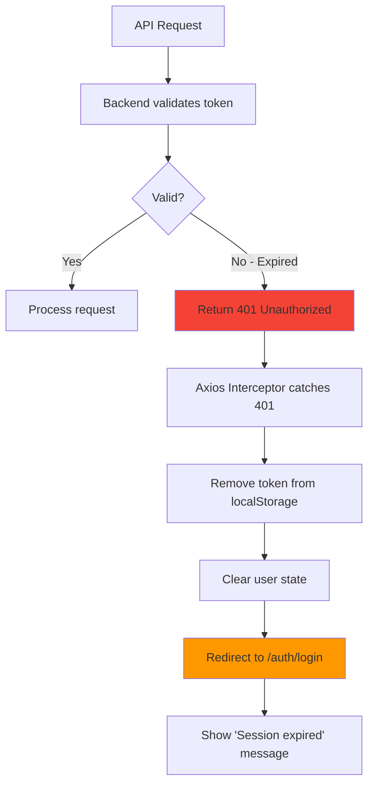

**Implementation:**

```typescript
// Response interceptor for 401 errors
apiClient.interceptors.response.use(
  (response) => response,
  (error) => {
    if (error.response?.status === 401) {
      localStorage.removeItem('token')
      window.location.href = '/auth/login'
    }
    return Promise.reject(error)
  }
)
```

---

## Authorization System

### Role-Based Access Control (RBAC)

The application implements a three-tier role system:

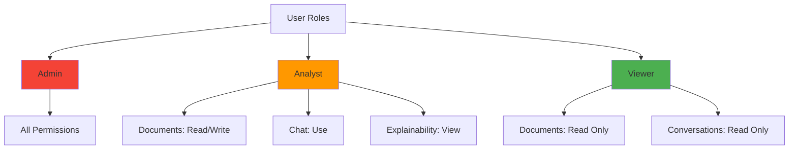

### Permission Matrix

| Permission | Admin | Analyst | Viewer | Description |
|------------|:-----:|:-------:|:------:|-------------|
| `chat:use` | ✅ | ✅ | ❌ | Access chat interface |
| `documents:read` | ✅ | ✅ | ✅ | View documents |
| `documents:create` | ✅ | ✅ | ❌ | Upload documents |
| `documents:delete` | ✅ | ✅ | ❌ | Delete documents |
| `documents:upload_global` | ✅ | ❌ | ❌ | Upload to global scope |
| `explain:view` | ✅ | ✅ | ❌ | View explainability |
| `admin:access` | ✅ | ❌ | ❌ | Access admin panel |
| `users:manage` | ✅ | ❌ | ❌ | CRUD user operations |
| `system:configure` | ✅ | ❌ | ❌ | System settings |

### Permission Check Flow

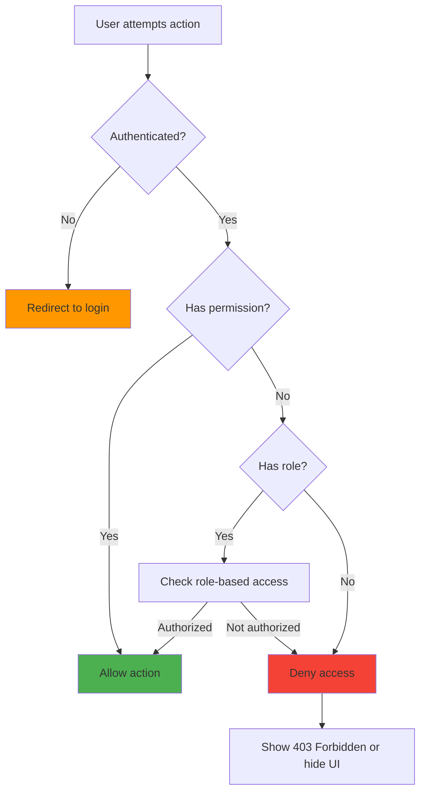

### User Profile Structure

```typescript
interface User {
  id: number
  username: string
  email: string
  full_name: string
  is_active: boolean

  // Authorization
  roles: string[]                    // ['admin', 'analyst']
  permissions: string[]              // ['chat:use', 'documents:create']

  // Preferences
  preferred_llm: 'custom' | 'ollama'
  explainability_level: 'basic' | 'detailed' | 'debug'

  // Metadata
  created_at: string
  last_login: string
}
```

---

## Route Protection

### Protected Route Pattern

All routes under `/dashboard` are protected and require authentication:

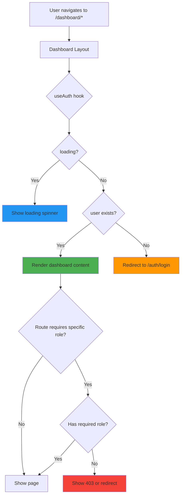

### Implementation in Dashboard Layout

**File:** `frontend/app/dashboard/layout.tsx`

```typescript
'use client'

import { useAuth } from '@/lib/auth-context'
import { redirect } from 'next/navigation'

export default function DashboardLayout({ children }) {
  const { user, loading } = useAuth()

  // Show loading state
  if (loading) {
    return <CircularProgress />
  }

  // Redirect if not authenticated
  if (!user) {
    redirect('/auth/login')
  }

  return (
    <Box>
      {/* Sidebar navigation */}
      <Drawer>
        <NavigationMenu user={user} />
      </Drawer>

      {/* Main content */}
      <Box component="main">
        {children}
      </Box>
    </Box>
  )
}
```

### Admin Route Protection

Admin-only routes implement an additional check:

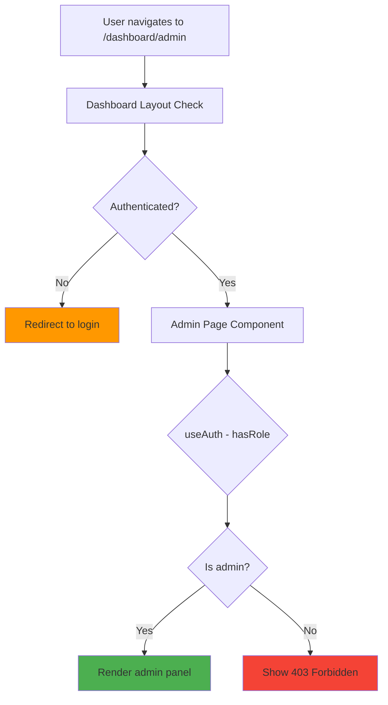

**Implementation:**

```typescript
// In /dashboard/admin/page.tsx
export default function AdminPage() {
  const { user, hasRole } = useAuth()

  if (!hasRole('admin')) {
    return (
      <Box>
        <Alert severity="error">
          Access Denied: Admin privileges required
        </Alert>
      </Box>
    )
  }

  return <AdminPanelContent />
}
```

### Feature-Level Protection

Individual features can be conditionally rendered based on permissions:

```typescript
// Example: Upload button only for users with create permission
const { hasPermission } = useAuth()

{hasPermission('documents:create') && (
  <Button
    variant="contained"
    onClick={handleUpload}
  >
    Upload Document
  </Button>
)}
```

---

## Implementation Details

### Auth Context Provider

**File:** `frontend/lib/auth-context.tsx`

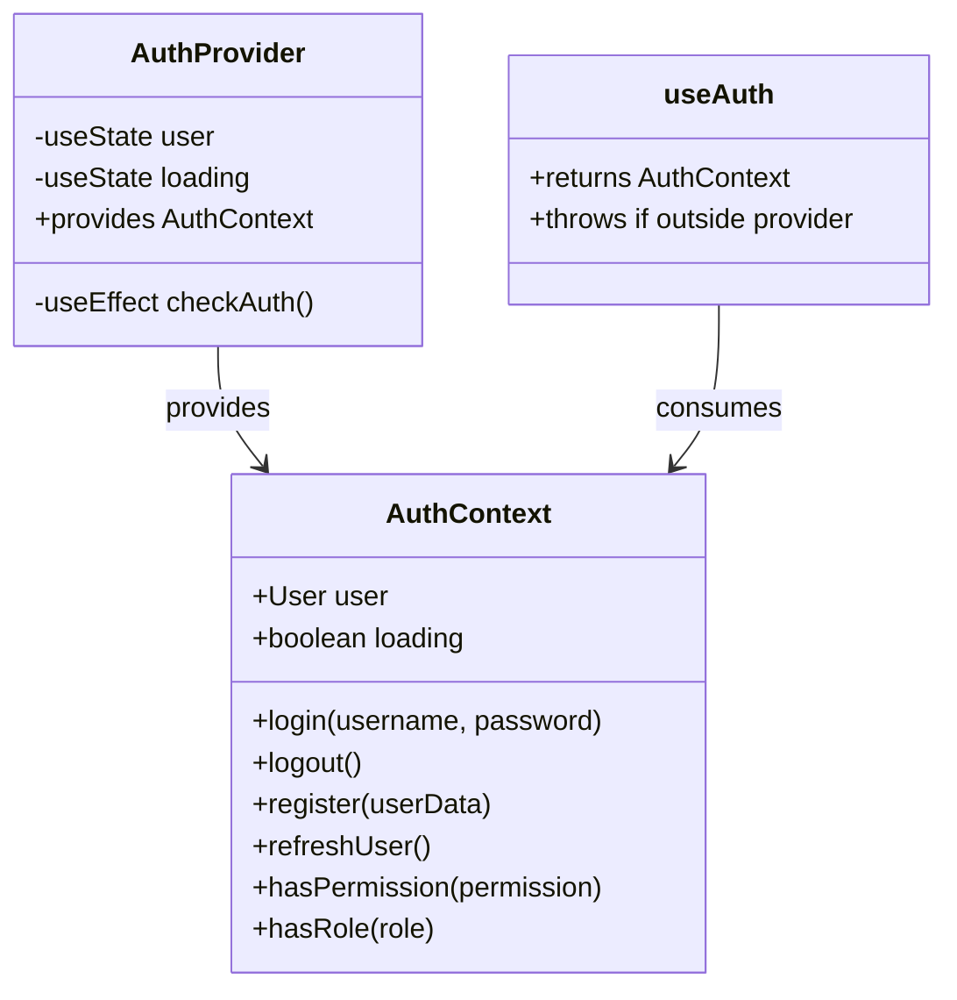

### Key Methods

#### 1. Login Method

```typescript
const login = async (username: string, password: string) => {
  try {
    // 1. Get access token
    const response = await authAPI.login(username, password)
    const { access_token } = response.data

    // 2. Store token
    localStorage.setItem('token', access_token)

    // 3. Fetch user profile
    const userResponse = await authAPI.getCurrentUser()
    setUser(userResponse.data)

    // 4. Success!
    return true
  } catch (error) {
    console.error('Login failed:', error)
    throw error
  }
}
```

#### 2. Auto-Check on Mount

```typescript
useEffect(() => {
  const checkAuth = async () => {
    const token = localStorage.getItem('token')

    if (!token) {
      setLoading(false)
      return
    }

    try {
      // Validate token by fetching user
      const response = await authAPI.getCurrentUser()
      setUser(response.data)
    } catch (error) {
      // Token invalid - clean up
      localStorage.removeItem('token')
      setUser(null)
    } finally {
      setLoading(false)
    }
  }

  checkAuth()
}, [])
```

#### 3. Permission Helpers

```typescript
const hasPermission = (permission: string): boolean => {
  return user?.permissions.includes(permission) ?? false
}

const hasRole = (role: string): boolean => {
  return user?.roles.includes(role) ?? false
}
```

### Usage in Components

```typescript
import { useAuth } from '@/lib/auth-context'

function MyComponent() {
  const { user, login, logout, hasPermission, hasRole } = useAuth()

  // Check authentication
  if (!user) {
    return <LoginPrompt />
  }

  // Check permission
  const canUpload = hasPermission('documents:create')

  // Check role
  const isAdmin = hasRole('admin')

  return (
    <Box>
      <Typography>Welcome, {user.full_name}</Typography>

      {canUpload && <UploadButton />}
      {isAdmin && <AdminControls />}

      <Button onClick={logout}>Logout</Button>
    </Box>
  )
}
```

---

## Security Considerations

### Current Implementation

#### ✅ Implemented Security Measures

1. **JWT Token Authentication**
   - Industry-standard token format
   - Expiration timestamps
   - Backend signature verification

2. **Automatic Token Refresh**
   - Token included in all API requests
   - 401 errors trigger auto-logout

3. **Protected Routes**
   - Authentication check before rendering
   - Automatic redirect to login

4. **Role-Based Access Control**
   - Granular permissions system
   - UI conditionally rendered based on permissions

5. **HTTPS in Production**
   - Encrypted data transmission
   - Prevents token interception

### ⚠️ Security Considerations

#### 1. Token Storage in localStorage

**Current Risk:**
- Vulnerable to XSS (Cross-Site Scripting) attacks
- JavaScript can access localStorage

**Recommended Improvement:**
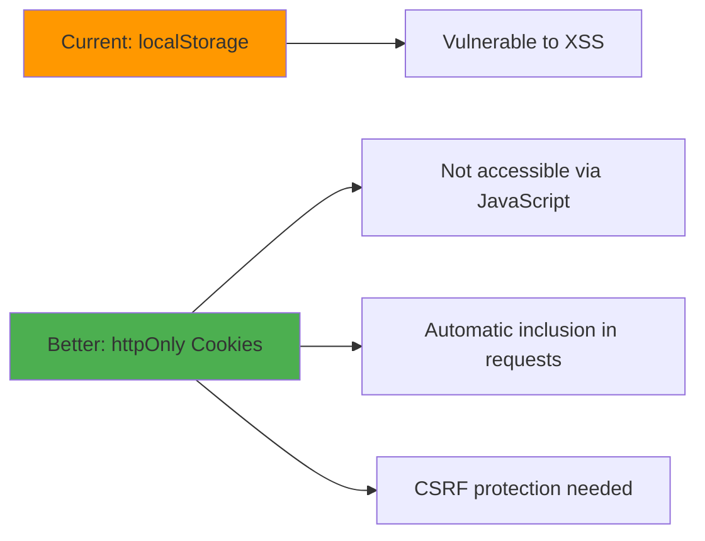

**Migration Path:**
1. Move token to httpOnly cookie (backend sets it)
2. Implement CSRF token protection
3. Remove `localStorage.getItem('token')` calls
4. Backend automatically reads cookie

#### 2. Token Expiration

**Current:** Tokens expire, but no refresh token mechanism

**Recommendation:** Implement refresh tokens

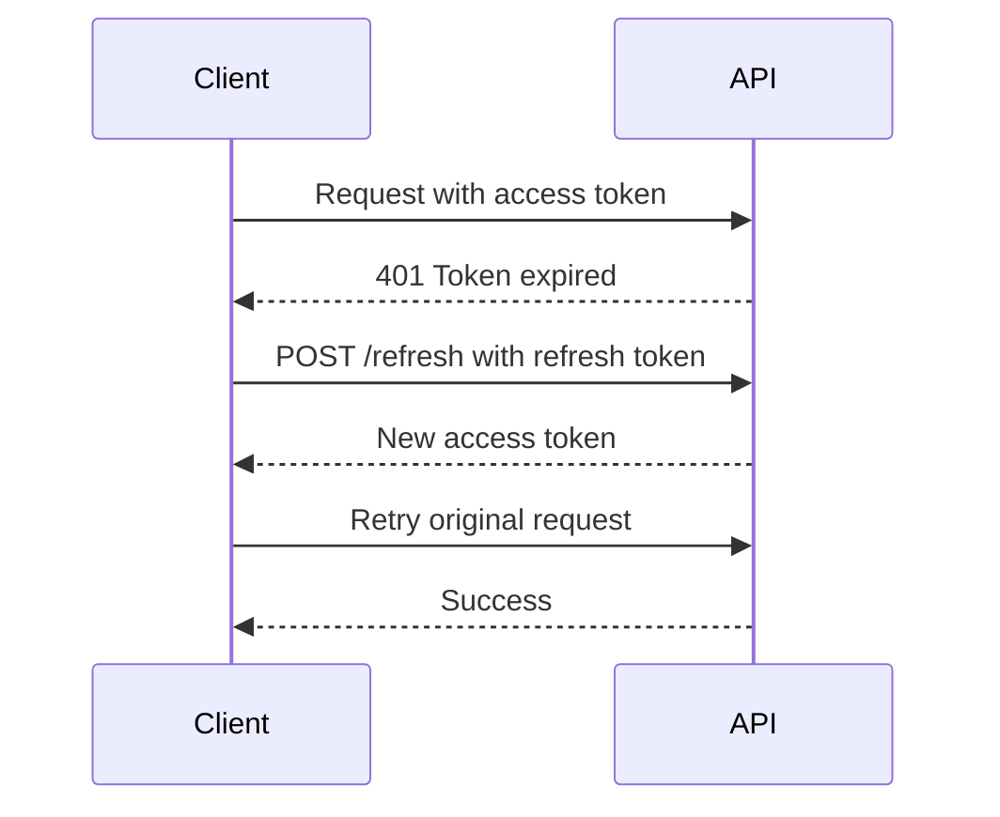

#### 3. Password Security

**Current:** Passwords sent as plain text in HTTPS

**Backend Responsibility:** (Already implemented)
- Passwords hashed with bcrypt
- Salt added for each password
- Never stored in plain text

#### 4. CSRF Protection

**Current:** Not explicitly implemented for state-changing requests

**Recommended:**
```typescript
// Add CSRF token to API client
apiClient.defaults.headers.common['X-CSRF-Token'] = getCsrfToken()
```

#### 5. Content Security Policy (CSP)

**Recommendation:** Add CSP headers in `next.config.js`

```javascript
module.exports = {
  async headers() {
    return [
      {
        source: '/:path*',
        headers: [
          {
            key: 'Content-Security-Policy',
            value: "default-src 'self'; script-src 'self' 'unsafe-eval'"
          }
        ]
      }
    ]
  }
}
```

### Security Checklist for Production

- [ ] Move tokens to httpOnly cookies
- [ ] Implement CSRF protection
- [ ] Add rate limiting for auth endpoints
- [ ] Implement account lockout after failed attempts
- [ ] Add 2FA/MFA support
- [ ] Enable Content Security Policy
- [ ] Regular security audits
- [ ] Implement session timeout warnings
- [ ] Add audit logging for security events
- [ ] Scan dependencies for vulnerabilities

---

## Common Scenarios

### Scenario 1: User First Login

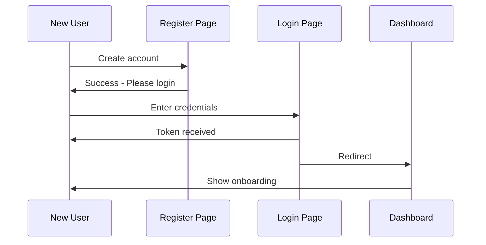

### Scenario 2: Session Expiration During Use

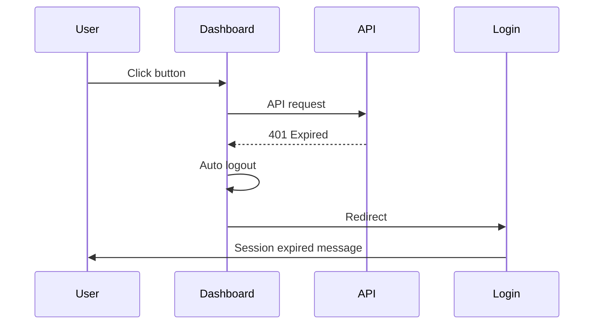

### Scenario 3: Permission Denied

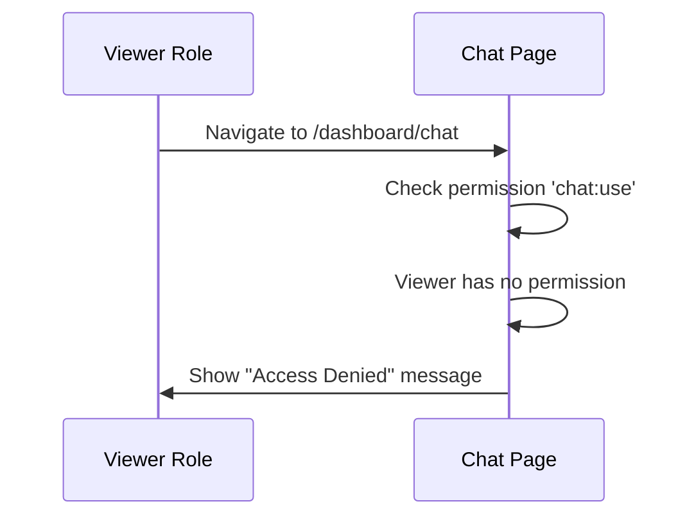

---

## Troubleshooting

### Issue: "Session expired" on every page refresh

**Cause:** Token not being retrieved from localStorage

**Solution:**
```typescript
// Check browser console
console.log(localStorage.getItem('token'))

// If null, re-login required
// If exists but fails, token may be corrupted - clear it:
localStorage.removeItem('token')
```

### Issue: User logged in but redirects to login

**Cause:** Auth context loading state or async timing

**Solution:**
```typescript
// Ensure loading is properly handled
if (loading) return <CircularProgress />
if (!user) redirect('/auth/login')
```

### Issue: Permission denied despite having role

**Cause:** Backend permissions not synced with frontend expectations

**Solution:**
```typescript
// Debug user permissions
const { user } = useAuth()
console.log('User permissions:', user?.permissions)
console.log('User roles:', user?.roles)

// Refresh user profile
const { refreshUser } = useAuth()
await refreshUser()
```

---

## Next Steps

- **[API Integration Guide](./API_INTEGRATION.md)** - Learn how auth integrates with API calls
- **[Development Guide](./DEVELOPMENT_GUIDE.md)** - Implement auth in new features
- **[State Management](./STATE_MANAGEMENT.md)** - Understand auth context in the state system

---

**Last Updated:** December 4, 2025
