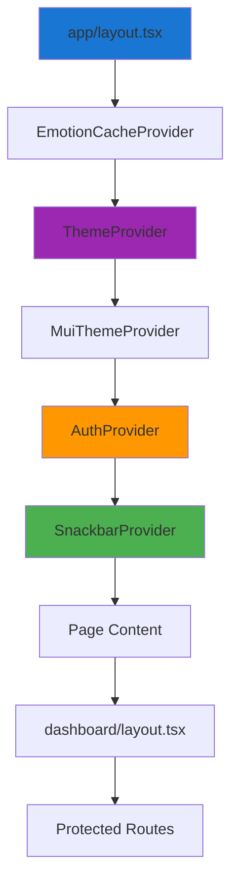

# Components & Utilities Guide

> **Complete reference for reusable components and utility functions**

## 📋 Table of Contents

- [Component Architecture](#component-architecture)
- [Global Providers](#global-providers)
- [Reusable Components](#reusable-components)
- [Utility Functions](#utility-functions)
- [Hooks](#hooks)

---

## Component Architecture

### Provider Hierarchy



**Why This Order?**
1. **EmotionCache** - Must be outermost for SSR styles
2. **ThemeProvider** - Provides theme mode state
3. **MuiThemeProvider** - Applies MUI theme based on mode
4. **AuthProvider** - Manages authentication globally
5. **SnackbarProvider** - Provides notification system
6. **Page Content** - Your app components

---

## Global Providers

### 1. ThemeProvider

**File:** `frontend/lib/theme-context.tsx`

```typescript
interface ThemeContextType {
  mode: 'light' | 'dark' | 'system'
  setMode: (mode: 'light' | 'dark' | 'system') => void
  resolvedTheme: 'light' | 'dark'
}

// Usage
import { useTheme } from '@/lib/theme-context'

function MyComponent() {
  const { mode, setMode, resolvedTheme } = useTheme()

  return (
    <Box>
      Current theme: {resolvedTheme}
      <Button onClick={() => setMode('dark')}>Dark Mode</Button>
    </Box>
  )
}
```

**Features:**
- Persists preference in localStorage
- System preference detection
- Smooth theme transitions
- No flash of unstyled content (FOUC)

### 2. AuthProvider

**File:** `frontend/lib/auth-context.tsx`

```typescript
interface AuthContextType {
  user: User | null
  loading: boolean
  login: (username: string, password: string) => Promise<void>
  logout: () => void
  register: (data: RegisterData) => Promise<void>
  refreshUser: () => Promise<void>
  hasPermission: (permission: string) => boolean
  hasRole: (role: string) => boolean
}

// Usage
import { useAuth } from '@/lib/auth-context'

function MyComponent() {
  const { user, hasPermission, logout } = useAuth()

  if (!user) return <LoginPrompt />

  return (
    <Box>
      <Typography>Welcome, {user.full_name}</Typography>

      {hasPermission('documents:create') && (
        <Button>Upload Document</Button>
      )}

      <Button onClick={logout}>Logout</Button>
    </Box>
  )
}
```

**Features:**
- Auto-check authentication on mount
- JWT token management
- Permission/role checking
- User profile refresh

### 3. SnackbarProvider

**File:** `frontend/components/SnackbarProvider.tsx`

```typescript
// Zustand store
interface SnackbarState {
  open: boolean
  message: string
  severity: 'success' | 'error' | 'warning' | 'info'
  showSnackbar: (message: string, severity: string) => void
  hideSnackbar: () => void
}

// Usage
import { useSnackbar } from '@/components/SnackbarProvider'

function MyComponent() {
  const { showSnackbar } = useSnackbar()

  const handleAction = async () => {
    try {
      await api.call()
      showSnackbar('Success!', 'success')
    } catch (error) {
      showSnackbar('Error occurred', 'error')
    }
  }

  return <Button onClick={handleAction}>Do Something</Button>
}
```

**Features:**
- Global notification system
- 4 severity levels with colors
- Auto-dismiss after 6 seconds
- Bottom-right positioning
- Material-UI Alert component

---

## Reusable Components

### 1. ThemeToggle

**File:** `frontend/components/ThemeToggle.tsx`

```typescript
<ThemeToggle />
```

**Features:**
- Icon button with dropdown menu
- Three options: Light, Dark, System
- Displays current mode
- Material icons (LightMode/DarkMode)

**Props:** None (uses ThemeContext)

**Visual:**
```
┌─────────────────┐
│  🌙 Dark Mode ▼ │ ← Click opens menu
└─────────────────┘
        │
        ├─ ☀️  Light
        ├─ 🌙 Dark    ← Current selection
        └─ 💻 System
```

### 2. DocumentSelectionModal

**File:** `frontend/components/DocumentSelectionModal.tsx`

```typescript
<DocumentSelectionModal
  open={isOpen}
  onClose={() => setIsOpen(false)}
  onConfirm={(selectedDocs) => {
    console.log('Selected:', selectedDocs)
    setIsOpen(false)
  }}
/>
```

**Props:**
```typescript
interface DocumentSelectionModalProps {
  open: boolean
  onClose: () => void
  onConfirm: (documents: Document[]) => void
}
```

**Features:**
- Fetches all user documents
- Search/filter by filename
- Scope badges (Personal/Global)
- Select all/none functionality
- File type icons
- Checkboxes for multi-select
- Responsive grid layout

**Layout:**
```
┌───────────────────────────────────────┐
│ Select Documents                    × │
├───────────────────────────────────────┤
│ 🔍 Search documents...                │
├───────────────────────────────────────┤
│ ☑ Select All        Deselect All     │
├───────────────────────────────────────┤
│ ☑ 📄 document1.pdf    [Personal]     │
│ ☐ 📄 document2.txt    [Global]       │
│ ☑ 📊 data.csv         [Personal]     │
├───────────────────────────────────────┤
│            [Cancel]  [Confirm]        │
└───────────────────────────────────────┘
```

### 3. AnimatedStats

**File:** `frontend/components/AnimatedStats.tsx`

```typescript
<AnimatedStats />
```

**Features:**
- CountUp animation on scroll
- Loads data from `data/stats.json`
- Icon mapping system
- Gradient background section
- Responsive grid (1 col mobile, 4 col desktop)

**Stats Structure:**
```json
[
  {
    "icon": "Users",
    "value": 10000,
    "suffix": "+",
    "label": "Active Users"
  },
  {
    "icon": "MessageSquare",
    "value": 500000,
    "suffix": "+",
    "label": "Conversations"
  }
]
```

**Visual Effect:**
```
Number animates from 0 → 10,000 when scrolled into view
```

---

## Utility Functions

**File:** `frontend/lib/utils.ts`

### 1. formatDate

```typescript
formatDate(date: string | Date): string

// Examples
formatDate('2024-12-04T10:30:00Z')  // "Dec 4, 2024, 10:30 AM"
formatDate(new Date())               // "Dec 4, 2024, 3:45 PM"
```

**Options:**
```typescript
{
  year: 'numeric',
  month: 'short',
  day: 'numeric',
  hour: 'numeric',
  minute: '2-digit',
  hour12: true
}
```

### 2. formatFileSize

```typescript
formatFileSize(bytes: number): string

// Examples
formatFileSize(1024)         // "1.0 KB"
formatFileSize(1048576)      // "1.0 MB"
formatFileSize(1073741824)   // "1.0 GB"
formatFileSize(500)          // "500 B"
```

**Implementation:**
```typescript
export function formatFileSize(bytes: number): string {
  if (bytes === 0) return '0 B'

  const k = 1024
  const sizes = ['B', 'KB', 'MB', 'GB', 'TB']
  const i = Math.floor(Math.log(bytes) / Math.log(k))

  return `${(bytes / Math.pow(k, i)).toFixed(1)} ${sizes[i]}`
}
```

### 3. getConfidenceColor

```typescript
getConfidenceColor(score: number): 'success' | 'warning' | 'error'

// Examples
getConfidenceColor(0.95)  // "success" (green)
getConfidenceColor(0.75)  // "warning" (yellow)
getConfidenceColor(0.45)  // "error" (red)
```

**Thresholds:**
- ≥ 0.7 → `'success'` (green)
- 0.5 - 0.7 → `'warning'` (yellow)
- < 0.5 → `'error'` (red)

### 4. getConfidenceLabel

```typescript
getConfidenceLabel(score: number): string

// Examples
getConfidenceLabel(0.95)  // "Very High"
getConfidenceLabel(0.85)  // "High"
getConfidenceLabel(0.75)  // "Good"
getConfidenceLabel(0.65)  // "Medium"
getConfidenceLabel(0.55)  // "Fair"
getConfidenceLabel(0.45)  // "Low"
```

**Scale:**
```
0.9 - 1.0  → Very High
0.8 - 0.9  → High
0.7 - 0.8  → Good
0.6 - 0.7  → Medium
0.5 - 0.6  → Fair
< 0.5      → Low
```

---

## Hooks

### Custom Hooks Usage

#### 1. useAuth

```typescript
const {
  user,           // User | null
  loading,        // boolean
  login,          // (username, password) => Promise<void>
  logout,         // () => void
  register,       // (data) => Promise<void>
  refreshUser,    // () => Promise<void>
  hasPermission,  // (permission) => boolean
  hasRole         // (role) => boolean
} = useAuth()
```

#### 2. useTheme

```typescript
const {
  mode,           // 'light' | 'dark' | 'system'
  setMode,        // (mode) => void
  resolvedTheme   // 'light' | 'dark' (actual applied theme)
} = useTheme()
```

#### 3. useSnackbar

```typescript
const {
  showSnackbar,   // (message, severity) => void
  hideSnackbar    // () => void
} = useSnackbar()
```

---

## Common Patterns

### 1. Protected Component

```typescript
function ProtectedFeature() {
  const { user, hasPermission } = useAuth()

  if (!user) {
    return <Navigate to="/auth/login" />
  }

  if (!hasPermission('feature:access')) {
    return (
      <Alert severity="error">
        You don't have permission to access this feature
      </Alert>
    )
  }

  return <FeatureContent />
}
```

### 2. Data Fetching with Loading State

```typescript
function DataComponent() {
  const [data, setData] = useState([])
  const [loading, setLoading] = useState(true)
  const { showSnackbar } = useSnackbar()

  useEffect(() => {
    const fetchData = async () => {
      try {
        const response = await api.getData()
        setData(response.data)
      } catch (error) {
        showSnackbar('Failed to load data', 'error')
      } finally {
        setLoading(false)
      }
    }

    fetchData()
  }, [])

  if (loading) return <CircularProgress />

  return <DataDisplay data={data} />
}
```

### 3. Form with Validation

```typescript
function MyForm() {
  const [formData, setFormData] = useState({ name: '', email: '' })
  const [errors, setErrors] = useState({})
  const { showSnackbar } = useSnackbar()

  const validate = () => {
    const newErrors = {}
    if (!formData.name) newErrors.name = 'Name is required'
    if (!formData.email.includes('@')) newErrors.email = 'Invalid email'
    setErrors(newErrors)
    return Object.keys(newErrors).length === 0
  }

  const handleSubmit = async (e) => {
    e.preventDefault()

    if (!validate()) return

    try {
      await api.submitForm(formData)
      showSnackbar('Form submitted!', 'success')
    } catch (error) {
      showSnackbar('Submission failed', 'error')
    }
  }

  return (
    <form onSubmit={handleSubmit}>
      <TextField
        label="Name"
        value={formData.name}
        onChange={(e) => setFormData({ ...formData, name: e.target.value })}
        error={Boolean(errors.name)}
        helperText={errors.name}
      />
      {/* ... */}
      <Button type="submit">Submit</Button>
    </form>
  )
}
```

### 4. Theme-Aware Styling

```typescript
function ThemedComponent() {
  const { resolvedTheme } = useTheme()

  return (
    <Box
      sx={{
        backgroundColor: 'background.paper',
        color: 'text.primary',
        border: '1px solid',
        borderColor: 'divider',

        // Conditional styling based on theme
        boxShadow: resolvedTheme === 'dark'
          ? '0 4px 6px rgba(0,0,0,0.3)'
          : '0 4px 6px rgba(0,0,0,0.1)'
      }}
    >
      Content
    </Box>
  )
}
```

---

## Best Practices

### ✅ Do's

1. **Use provided hooks for global state**
```typescript
// ✅ Good
const { user } = useAuth()

// ❌ Bad
const user = localStorage.getItem('user')
```

2. **Show user feedback for async actions**
```typescript
// ✅ Good
try {
  await action()
  showSnackbar('Success', 'success')
} catch {
  showSnackbar('Failed', 'error')
}
```

3. **Check permissions before rendering**
```typescript
// ✅ Good
{hasPermission('feature:use') && <Feature />}

// ❌ Bad - renders then fails
<Feature />  // Checks permission inside, then shows error
```

4. **Use utility functions for formatting**
```typescript
// ✅ Good
<Typography>{formatDate(timestamp)}</Typography>

// ❌ Bad
<Typography>{new Date(timestamp).toLocaleString()}</Typography>
```

### ❌ Don'ts

- Don't call hooks conditionally
- Don't bypass context providers
- Don't duplicate utility functions
- Don't forget to clean up effects

---

## Next Steps

- **[Development Guide](./DEVELOPMENT_GUIDE.md)** - Use these components in practice
- **[API Integration](./API_INTEGRATION.md)** - Connect components to backend
- **[Theming Guide](./THEMING_STYLING.md)** - Style your components

---

**Last Updated:** December 4, 2025
