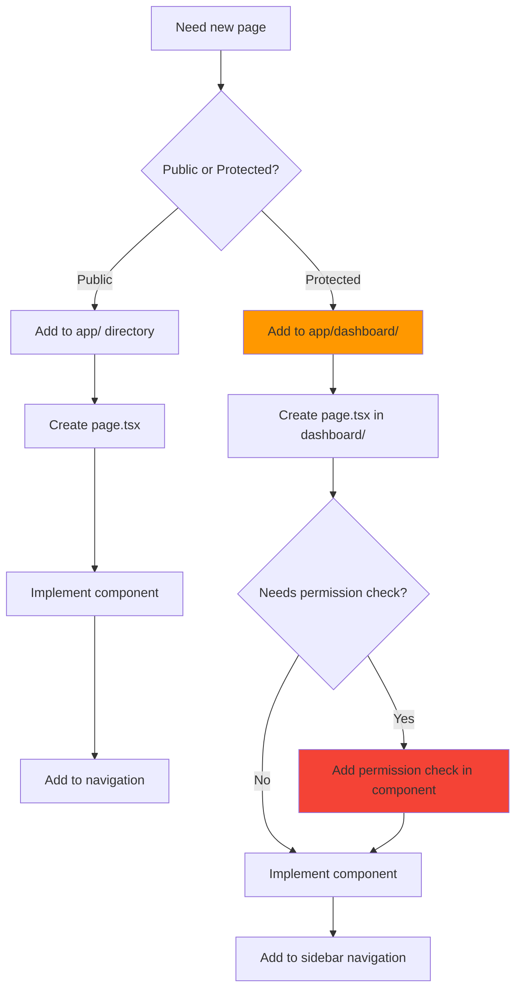
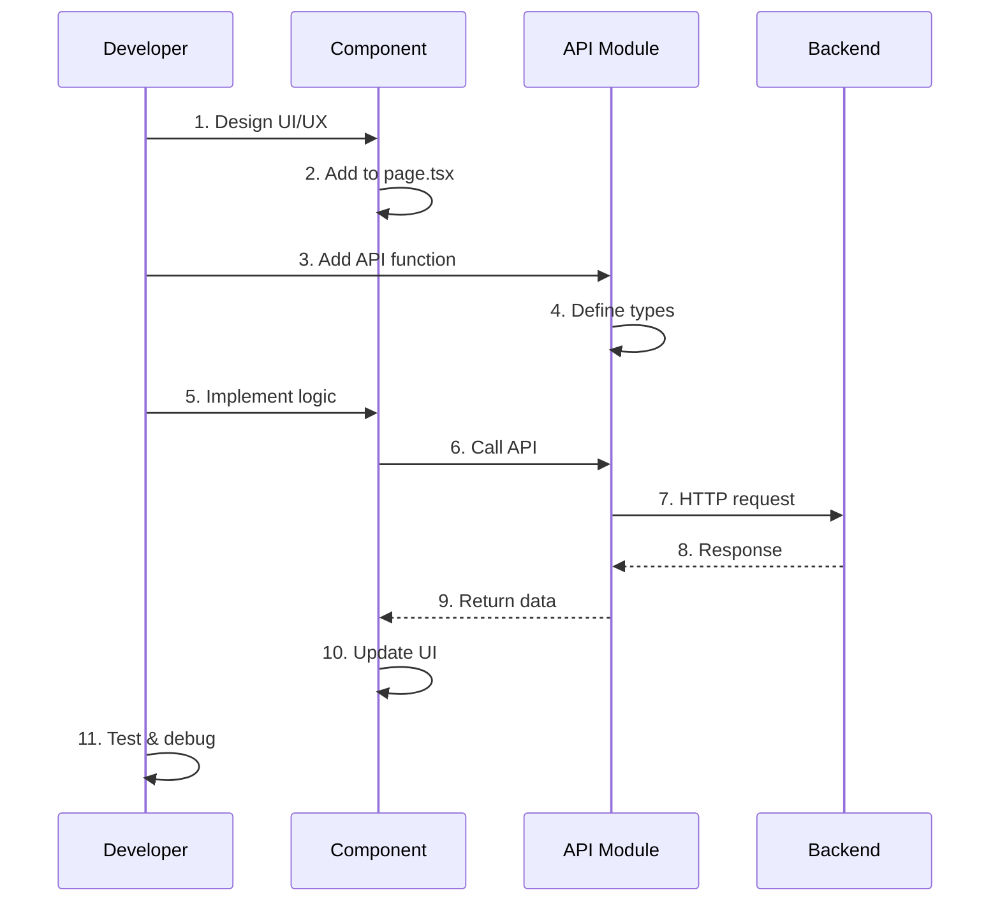
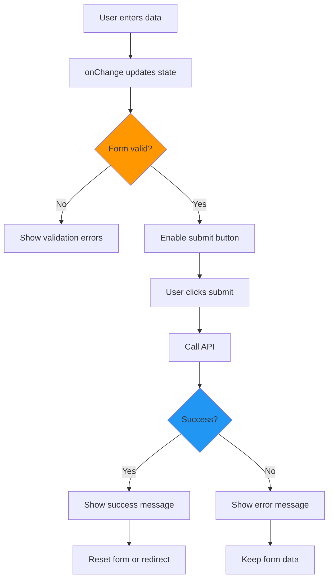
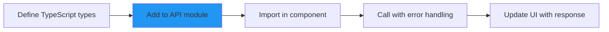
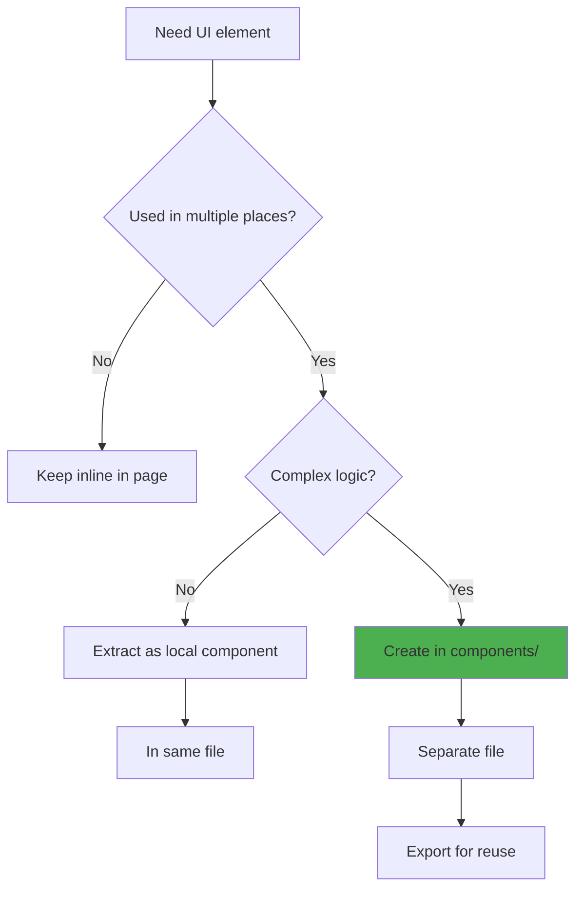
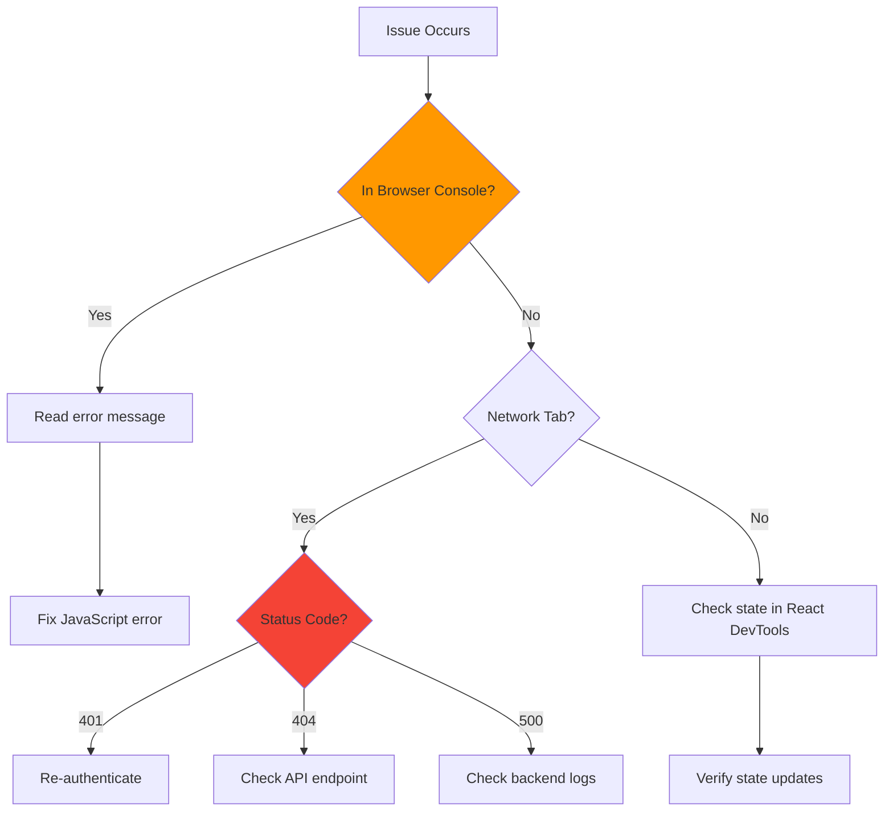

# Development Guide

> **Step-by-step guide to extending and modifying the frontend application**

## 📋 Table of Contents

- [Getting Started](#getting-started)
- [Adding New Pages](#adding-new-pages)
- [Adding New Features](#adding-new-features)
- [Working with Forms](#working-with-forms)
- [Implementing API Endpoints](#implementing-api-endpoints)
- [Adding Components](#adding-components)
- [Common Tasks](#common-tasks)
- [Troubleshooting](#troubleshooting)

---

## Getting Started

### Development Environment Setup

```bash
# Clone and navigate
cd frontend

# Install dependencies
npm install

# Start development server
npm run dev

# Open browser
open http://localhost:3000
```

### Project Commands

```bash
npm run dev          # Start dev server with hot reload
npm run build        # Build for production
npm start            # Start production server
npm run lint         # Run ESLint
npx tsc --noEmit     # Type check without building
```

---

## Adding New Pages

### Decision Tree



### Example: Adding a New Dashboard Page

**1. Create the page file**

```bash
# Create new page
mkdir -p app/dashboard/analytics
touch app/dashboard/analytics/page.tsx
```

**2. Implement the page component**

```typescript
// app/dashboard/analytics/page.tsx
'use client'

import { useState, useEffect } from 'react'
import { useAuth } from '@/lib/auth-context'
import { Box, Typography, Card, CardContent } from '@mui/material'

export default function AnalyticsPage() {
  const { user, hasPermission } = useAuth()
  const [data, setData] = useState(null)

  // Permission check
  if (!hasPermission('analytics:view')) {
    return (
      <Box sx={{ p: 3 }}>
        <Typography color="error">
          Access Denied: You need analytics:view permission
        </Typography>
      </Box>
    )
  }

  useEffect(() => {
    // Fetch data
    fetchAnalytics()
  }, [])

  const fetchAnalytics = async () => {
    try {
      const response = await api.getAnalytics()
      setData(response.data)
    } catch (error) {
      console.error('Failed to fetch analytics:', error)
    }
  }

  return (
    <Box sx={{ p: 3 }}>
      <Typography variant="h4" gutterBottom>
        Analytics Dashboard
      </Typography>

      <Card>
        <CardContent>
          {/* Your content here */}
        </CardContent>
      </Card>
    </Box>
  )
}
```

**3. Add to navigation**

```typescript
// In dashboard/layout.tsx - Add to navigation menu
const menuItems = [
  { label: 'Dashboard', path: '/dashboard', icon: <HomeIcon /> },
  { label: 'Chat', path: '/dashboard/chat', icon: <ChatIcon /> },
  { label: 'Documents', path: '/dashboard/documents', icon: <FolderIcon /> },
  { label: 'Analytics', path: '/dashboard/analytics', icon: <BarChartIcon /> }, // New!
  // ...
]
```

**4. Test the page**

- Navigate to `http://localhost:3000/dashboard/analytics`
- Verify permission checking works
- Test data loading and error states

---

## Adding New Features

### Feature Implementation Workflow



### Example: Adding Export Feature

**Step 1: Add UI Button**

```typescript
// In your component
<Button
  variant="contained"
  startIcon={<DownloadIcon />}
  onClick={handleExport}
  disabled={loading}
>
  Export Data
</Button>
```

**Step 2: Add API Function**

```typescript
// In lib/api.ts
export const dataAPI = {
  // ... existing functions

  exportData: (format: 'csv' | 'json') => {
    return apiClient.get(`/api/v1/data/export?format=${format}`, {
      responseType: 'blob'  // Important for file downloads
    })
  }
}
```

**Step 3: Implement Handler**

```typescript
const [loading, setLoading] = useState(false)
const { showSnackbar } = useSnackbar()

const handleExport = async () => {
  setLoading(true)

  try {
    const response = await dataAPI.exportData('csv')

    // Create download link
    const url = window.URL.createObjectURL(new Blob([response.data]))
    const link = document.createElement('a')
    link.href = url
    link.setAttribute('download', 'data-export.csv')
    document.body.appendChild(link)
    link.click()
    link.remove()

    showSnackbar('Export successful!', 'success')
  } catch (error) {
    showSnackbar('Export failed', 'error')
  } finally {
    setLoading(false)
  }
}
```

---

## Working with Forms

### Form Pattern



### Complete Form Example

```typescript
function UserForm() {
  const [formData, setFormData] = useState({
    username: '',
    email: '',
    fullName: '',
    role: 'viewer'
  })

  const [errors, setErrors] = useState({})
  const [loading, setLoading] = useState(false)
  const { showSnackbar } = useSnackbar()

  // Validation
  const validate = () => {
    const newErrors: Record<string, string> = {}

    if (!formData.username) {
      newErrors.username = 'Username is required'
    } else if (formData.username.length < 3) {
      newErrors.username = 'Username must be at least 3 characters'
    }

    if (!formData.email) {
      newErrors.email = 'Email is required'
    } else if (!/\S+@\S+\.\S+/.test(formData.email)) {
      newErrors.email = 'Email is invalid'
    }

    if (!formData.fullName) {
      newErrors.fullName = 'Full name is required'
    }

    setErrors(newErrors)
    return Object.keys(newErrors).length === 0
  }

  // Handle input change
  const handleChange = (field: string) => (
    event: React.ChangeEvent<HTMLInputElement>
  ) => {
    setFormData({ ...formData, [field]: event.target.value })
    // Clear error when user types
    if (errors[field]) {
      setErrors({ ...errors, [field]: '' })
    }
  }

  // Handle submit
  const handleSubmit = async (e: React.FormEvent) => {
    e.preventDefault()

    if (!validate()) return

    setLoading(true)

    try {
      await adminAPI.createUser(formData)
      showSnackbar('User created successfully!', 'success')

      // Reset form
      setFormData({ username: '', email: '', fullName: '', role: 'viewer' })
    } catch (error: any) {
      const message = error.response?.data?.detail || 'Failed to create user'
      showSnackbar(message, 'error')
    } finally {
      setLoading(false)
    }
  }

  return (
    <Box component="form" onSubmit={handleSubmit} sx={{ mt: 2 }}>
      <TextField
        fullWidth
        label="Username"
        value={formData.username}
        onChange={handleChange('username')}
        error={Boolean(errors.username)}
        helperText={errors.username}
        margin="normal"
        required
      />

      <TextField
        fullWidth
        label="Email"
        type="email"
        value={formData.email}
        onChange={handleChange('email')}
        error={Boolean(errors.email)}
        helperText={errors.email}
        margin="normal"
        required
      />

      <TextField
        fullWidth
        label="Full Name"
        value={formData.fullName}
        onChange={handleChange('fullName')}
        error={Boolean(errors.fullName)}
        helperText={errors.fullName}
        margin="normal"
        required
      />

      <FormControl fullWidth margin="normal">
        <InputLabel>Role</InputLabel>
        <Select
          value={formData.role}
          onChange={(e) => setFormData({ ...formData, role: e.target.value })}
        >
          <MenuItem value="viewer">Viewer</MenuItem>
          <MenuItem value="analyst">Analyst</MenuItem>
          <MenuItem value="admin">Admin</MenuItem>
        </Select>
      </FormControl>

      <Button
        type="submit"
        variant="contained"
        fullWidth
        disabled={loading}
        sx={{ mt: 2 }}
      >
        {loading ? <CircularProgress size={24} /> : 'Create User'}
      </Button>
    </Box>
  )
}
```

---

## Implementing API Endpoints

### Adding New API Function



**Step 1: Define Types**

```typescript
// types/index.ts or in component file
interface Report {
  id: string
  name: string
  created_at: string
  data: any
}

interface CreateReportData {
  name: string
  config: ReportConfig
}
```

**Step 2: Add to API Module**

```typescript
// lib/api.ts

export const reportsAPI = {
  // GET all reports
  list: () => {
    return apiClient.get<Report[]>('/api/v1/reports')
  },

  // GET single report
  get: (id: string) => {
    return apiClient.get<Report>(`/api/v1/reports/${id}`)
  },

  // POST create report
  create: (data: CreateReportData) => {
    return apiClient.post<Report>('/api/v1/reports', data)
  },

  // PUT update report
  update: (id: string, data: Partial<CreateReportData>) => {
    return apiClient.put<Report>(`/api/v1/reports/${id}`, data)
  },

  // DELETE report
  delete: (id: string) => {
    return apiClient.delete(`/api/v1/reports/${id}`)
  },

  // POST download report
  download: (id: string) => {
    return apiClient.get(`/api/v1/reports/${id}/download`, {
      responseType: 'blob'
    })
  }
}
```

**Step 3: Use in Component**

```typescript
import { reportsAPI } from '@/lib/api'

function ReportsPage() {
  const [reports, setReports] = useState<Report[]>([])
  const [loading, setLoading] = useState(true)
  const { showSnackbar } = useSnackbar()

  useEffect(() => {
    fetchReports()
  }, [])

  const fetchReports = async () => {
    try {
      const response = await reportsAPI.list()
      setReports(response.data)
    } catch (error) {
      showSnackbar('Failed to load reports', 'error')
    } finally {
      setLoading(false)
    }
  }

  const handleDelete = async (id: string) => {
    try {
      await reportsAPI.delete(id)
      showSnackbar('Report deleted', 'success')
      fetchReports()  // Reload list
    } catch (error) {
      showSnackbar('Failed to delete report', 'error')
    }
  }

  // ... rest of component
}
```

---

## Adding Components

### When to Create a Reusable Component



### Creating a Reusable Component

**Example: StatusBadge Component**

```typescript
// components/StatusBadge.tsx
import { Chip } from '@mui/material'
import { CheckCircle, Error, HourglassEmpty } from '@mui/icons-material'

interface StatusBadgeProps {
  status: 'completed' | 'pending' | 'failed'
  size?: 'small' | 'medium'
}

export function StatusBadge({ status, size = 'small' }: StatusBadgeProps) {
  const config = {
    completed: {
      label: 'Completed',
      color: 'success' as const,
      icon: <CheckCircle />
    },
    pending: {
      label: 'Pending',
      color: 'warning' as const,
      icon: <HourglassEmpty />
    },
    failed: {
      label: 'Failed',
      color: 'error' as const,
      icon: <Error />
    }
  }

  const { label, color, icon } = config[status]

  return (
    <Chip
      label={label}
      color={color}
      size={size}
      icon={icon}
    />
  )
}

// Usage in other components
import { StatusBadge } from '@/components/StatusBadge'

<StatusBadge status="completed" />
```

---

## Common Tasks

### Task 1: Add a New Permission Check

```typescript
// 1. Backend adds permission to user
// 2. Frontend checks permission

function FeatureComponent() {
  const { hasPermission } = useAuth()

  if (!hasPermission('new_feature:access')) {
    return (
      <Alert severity="warning">
        You don't have access to this feature
      </Alert>
    )
  }

  return <FeatureContent />
}

// Or conditional rendering
{hasPermission('feature:create') && (
  <Button>Create New</Button>
)}
```

### Task 2: Add Environment Variable

```bash
# 1. Add to .env.local
echo "NEXT_PUBLIC_NEW_VARIABLE=value" >> .env.local

# 2. Use in code
const value = process.env.NEXT_PUBLIC_NEW_VARIABLE

# 3. Restart dev server
npm run dev
```

**Note:** Must start with `NEXT_PUBLIC_` to be accessible in browser

### Task 3: Add Loading Skeleton

```typescript
import { Skeleton } from '@mui/material'

function Component() {
  const [loading, setLoading] = useState(true)
  const [data, setData] = useState(null)

  if (loading) {
    return (
      <Box>
        <Skeleton variant="text" width="60%" height={40} />
        <Skeleton variant="rectangular" width="100%" height={200} sx={{ mt: 2 }} />
        <Skeleton variant="text" width="80%" />
      </Box>
    )
  }

  return <DataDisplay data={data} />
}
```

### Task 4: Implement Search/Filter

```typescript
function SearchableList() {
  const [items, setItems] = useState([])
  const [searchQuery, setSearchQuery] = useState('')

  // Filtered items
  const filteredItems = useMemo(() => {
    return items.filter(item =>
      item.name.toLowerCase().includes(searchQuery.toLowerCase())
    )
  }, [items, searchQuery])

  return (
    <>
      <TextField
        placeholder="Search..."
        value={searchQuery}
        onChange={(e) => setSearchQuery(e.target.value)}
        InputProps={{
          startAdornment: <SearchIcon />
        }}
      />

      <List>
        {filteredItems.map(item => (
          <ListItem key={item.id}>{item.name}</ListItem>
        ))}
      </List>
    </>
  )
}
```

### Task 5: Add Confirmation Dialog

```typescript
function DeleteButton({ itemId, onDelete }) {
  const [dialogOpen, setDialogOpen] = useState(false)

  const handleConfirm = async () => {
    await onDelete(itemId)
    setDialogOpen(false)
  }

  return (
    <>
      <Button
        color="error"
        onClick={() => setDialogOpen(true)}
      >
        Delete
      </Button>

      <Dialog open={dialogOpen} onClose={() => setDialogOpen(false)}>
        <DialogTitle>Confirm Delete</DialogTitle>
        <DialogContent>
          <Typography>
            Are you sure you want to delete this item? This action cannot be undone.
          </Typography>
        </DialogContent>
        <DialogActions>
          <Button onClick={() => setDialogOpen(false)}>
            Cancel
          </Button>
          <Button onClick={handleConfirm} color="error" variant="contained">
            Delete
          </Button>
        </DialogActions>
      </Dialog>
    </>
  )
}
```

---

## Troubleshooting

### Common Issues & Solutions

| Issue | Possible Cause | Solution |
|-------|---------------|----------|
| **Blank page** | JavaScript error | Check browser console for errors |
| **401 errors** | Token expired | Re-login, check token in localStorage |
| **Component not re-rendering** | State not updating | Use setState callback or useEffect deps |
| **TypeScript errors** | Missing types | Run `npm install` to update type definitions |
| **Styles not applying** | sx prop syntax error | Check MUI sx prop documentation |
| **Hot reload not working** | File outside src | Restart dev server |
| **API CORS error** | Backend not allowing origin | Check backend CORS configuration |

### Debug Checklist



---

## Next Steps

- **[Components Guide](./COMPONENTS_UTILITIES.md)** - Reusable components reference
- **[API Integration](./API_INTEGRATION.md)** - API patterns
- **[Architecture Patterns](../ARCHITECTURE_PATTERNS.md)** - Best practices

---

**Last Updated:** December 4, 2025
