# State Management Guide

> **Complete guide to state management patterns, context providers, and data flow**

## 📋 Table of Contents

- [Overview](#overview)
- [State Architecture](#state-architecture)
- [Context Providers](#context-providers)
- [Local Component State](#local-component-state)
- [Data Flow Patterns](#data-flow-patterns)
- [Best Practices](#best-practices)

---

## Overview

The application uses a **minimal state management** approach with React Context for global state and local useState/useEffect for component-specific state. This avoids the complexity of additional libraries while maintaining clean data flow.

### State Layers

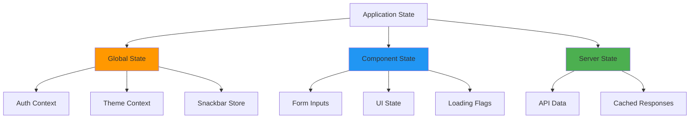

---

## State Architecture

### Provider Hierarchy

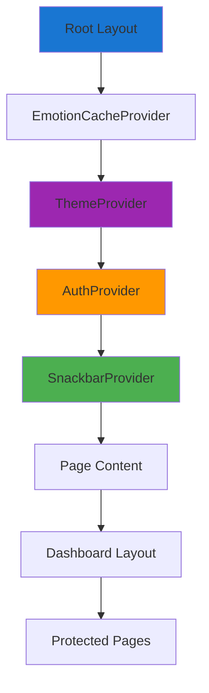

**Implementation in `app/layout.tsx`:**

```typescript
export default function RootLayout({ children }) {
  return (
    <html lang="en">
      <body>
        <EmotionCacheProvider>
          <ThemeProvider>
            <AuthProvider>
              <SnackbarProvider>
                {children}
              </SnackbarProvider>
            </AuthProvider>
          </ThemeProvider>
        </EmotionCacheProvider>
      </body>
    </html>
  )
}
```

### State Ownership

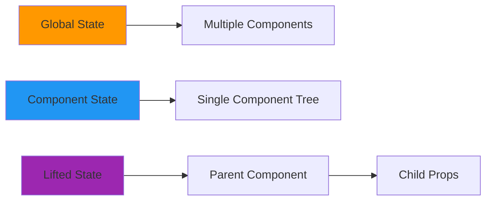

---

## Context Providers

### 1. Auth Context

**Purpose:** Manage user authentication state globally

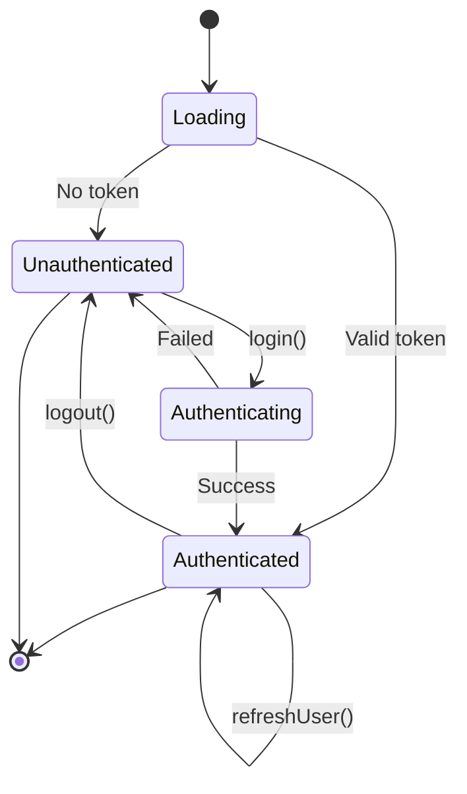

**State Structure:**

```typescript
interface AuthContextType {
  // State
  user: User | null
  loading: boolean

  // Actions
  login: (username: string, password: string) => Promise<void>
  register: (data: RegisterData) => Promise<void>
  logout: () => void
  refreshUser: () => Promise<void>

  // Utilities
  hasPermission: (permission: string) => boolean
  hasRole: (role: string) => boolean
}
```

**Data Flow:**

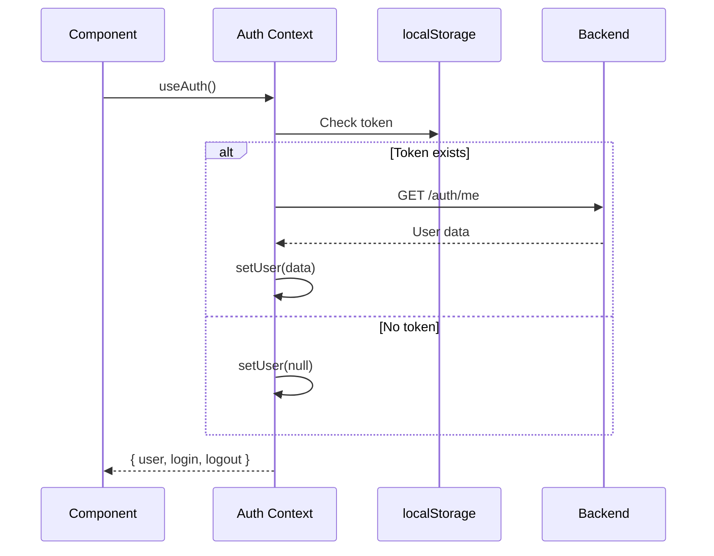

**File:** `frontend/lib/auth-context.tsx`

### 2. Theme Context

**Purpose:** Manage light/dark theme preference

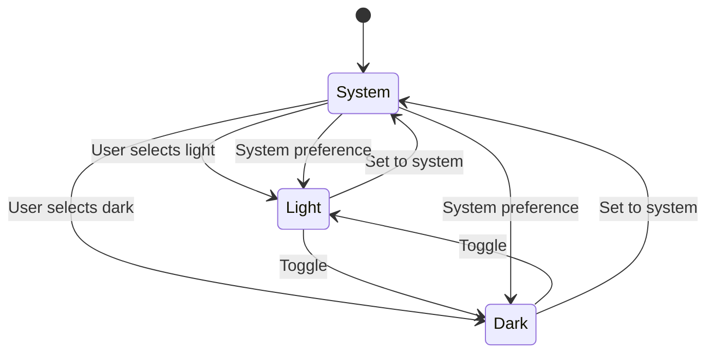

**State Structure:**

```typescript
interface ThemeContextType {
  mode: 'light' | 'dark' | 'system'
  setMode: (mode: 'light' | 'dark' | 'system') => void
  resolvedTheme: 'light' | 'dark'  // Actual applied theme
}
```

**Theme Resolution:**

```mermaid
flowchart TD
    A[Theme Mode] --> B{Mode Value}
    B -->|light| C[Use Light Theme]
    B -->|dark| D[Use Dark Theme]
    B -->|system| E[Check System Preference]

    E --> F{prefers-color-scheme}
    F -->|dark| D
    F -->|light| C

    C --> G[Apply Theme]
    D --> G

    style C fill:#fff9c4
    style D fill:#37474f
```

**File:** `frontend/lib/theme-context.tsx`

### 3. Snackbar Store (Zustand)

**Purpose:** Global notification system

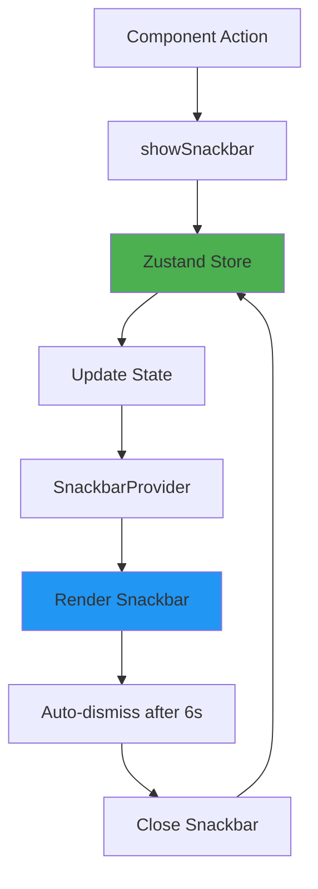

**Store Structure:**

```typescript
interface SnackbarState {
  open: boolean
  message: string
  severity: 'success' | 'error' | 'warning' | 'info'

  showSnackbar: (message: string, severity: string) => void
  hideSnackbar: () => void
}
```

**Usage Pattern:**

```typescript
import { useSnackbar } from '@/components/SnackbarProvider'

function MyComponent() {
  const { showSnackbar } = useSnackbar()

  const handleAction = async () => {
    try {
      await api.call()
      showSnackbar('Success!', 'success')
    } catch (error) {
      showSnackbar('Error occurred', 'error')
    }
  }
}
```

**File:** `frontend/components/SnackbarProvider.tsx`

---

## Local Component State

### State Patterns by Use Case

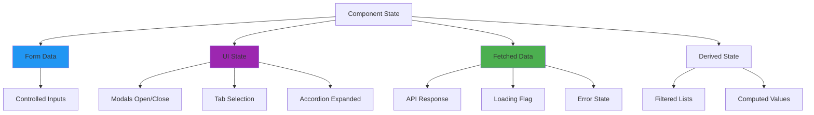

### 1. Form State

```typescript
function LoginForm() {
  const [username, setUsername] = useState('')
  const [password, setPassword] = useState('')
  const [loading, setLoading] = useState(false)
  const [error, setError] = useState('')

  const handleSubmit = async (e) => {
    e.preventDefault()
    setLoading(true)
    setError('')

    try {
      await login(username, password)
    } catch (err) {
      setError(err.message)
    } finally {
      setLoading(false)
    }
  }

  return (
    <form onSubmit={handleSubmit}>
      <TextField
        value={username}
        onChange={(e) => setUsername(e.target.value)}
      />
      {/* ... */}
    </form>
  )
}
```

### 2. Async Data Fetching

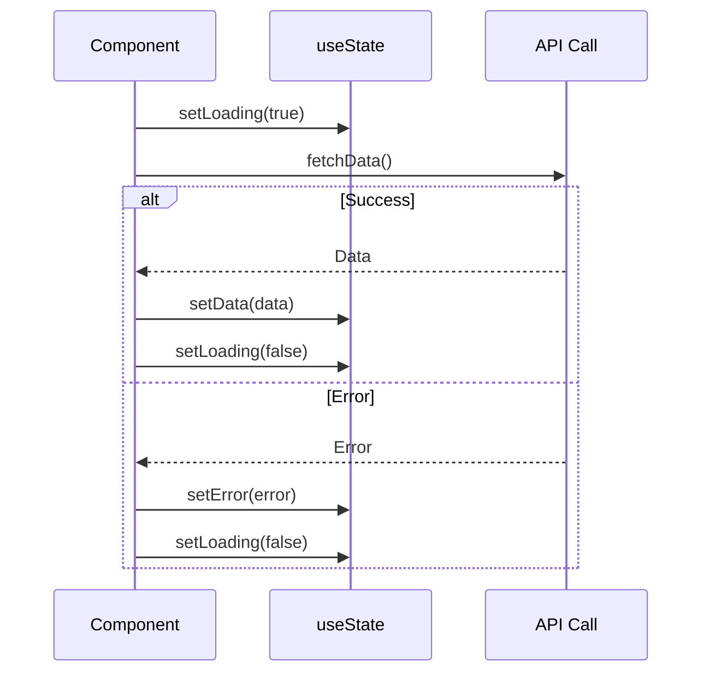

**Pattern:**

```typescript
function DataComponent() {
  const [data, setData] = useState([])
  const [loading, setLoading] = useState(true)
  const [error, setError] = useState(null)

  useEffect(() => {
    const fetchData = async () => {
      try {
        const response = await api.getData()
        setData(response.data)
      } catch (err) {
        setError(err.message)
      } finally {
        setLoading(false)
      }
    }

    fetchData()
  }, [])  // Empty deps = run once on mount

  if (loading) return <CircularProgress />
  if (error) return <Alert severity="error">{error}</Alert>

  return <DataList data={data} />
}
```

### 3. Modal State

```typescript
function ComponentWithModal() {
  const [modalOpen, setModalOpen] = useState(false)
  const [selectedItem, setSelectedItem] = useState(null)

  const handleOpenModal = (item) => {
    setSelectedItem(item)
    setModalOpen(true)
  }

  const handleCloseModal = () => {
    setModalOpen(false)
    setSelectedItem(null)
  }

  return (
    <>
      <Button onClick={() => handleOpenModal(item)}>
        Edit
      </Button>

      <Modal open={modalOpen} onClose={handleCloseModal}>
        <EditForm item={selectedItem} />
      </Modal>
    </>
  )
}
```

### 4. Derived State

```typescript
function FilteredList() {
  const [items, setItems] = useState([])
  const [searchQuery, setSearchQuery] = useState('')

  // Derived state - computed from other state
  const filteredItems = useMemo(() => {
    return items.filter(item =>
      item.name.toLowerCase().includes(searchQuery.toLowerCase())
    )
  }, [items, searchQuery])

  return (
    <>
      <TextField
        value={searchQuery}
        onChange={(e) => setSearchQuery(e.target.value)}
        placeholder="Search..."
      />

      <List>
        {filteredItems.map(item => (
          <ListItem key={item.id}>{item.name}</ListItem>
        ))}
      </List>
    </>
  )
}
```

---

## Data Flow Patterns

### Pattern 1: Top-Down Data Flow

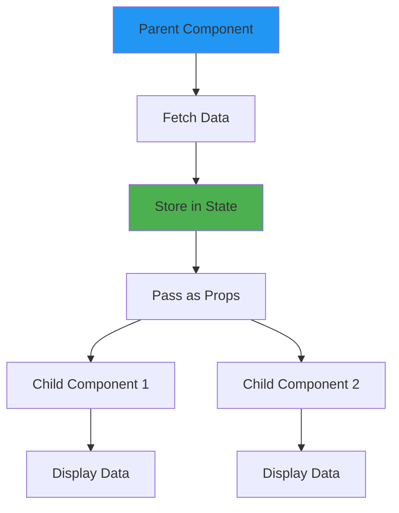

**Example:**

```typescript
// Parent
function DashboardPage() {
  const [stats, setStats] = useState(null)

  useEffect(() => {
    fetchStats().then(setStats)
  }, [])

  return (
    <>
      <StatsCard data={stats} />
      <ChartComponent data={stats} />
    </>
  )
}

// Children
function StatsCard({ data }) {
  return <Card>{data?.total}</Card>
}
```

### Pattern 2: Callback Props for Updates

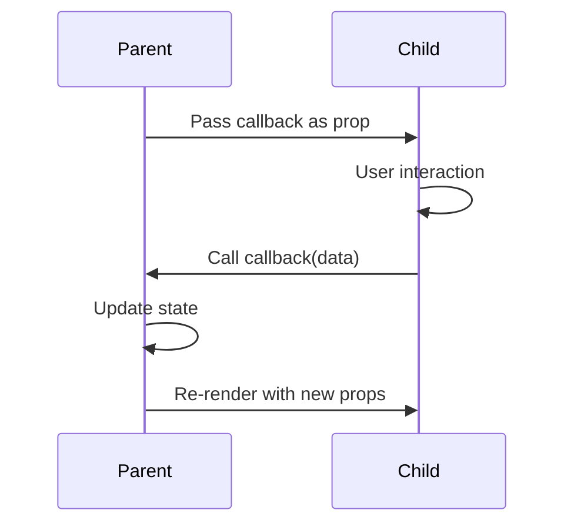

**Example:**

```typescript
// Parent
function ParentComponent() {
  const [items, setItems] = useState([])

  const handleAddItem = (newItem) => {
    setItems([...items, newItem])
  }

  return (
    <ChildForm onAdd={handleAddItem} />
  )
}

// Child
function ChildForm({ onAdd }) {
  const [input, setInput] = useState('')

  const handleSubmit = () => {
    onAdd(input)
    setInput('')
  }

  return (
    <form onSubmit={handleSubmit}>
      <input value={input} onChange={e => setInput(e.target.value)} />
      <button type="submit">Add</button>
    </form>
  )
}
```

### Pattern 3: Optimistic Updates

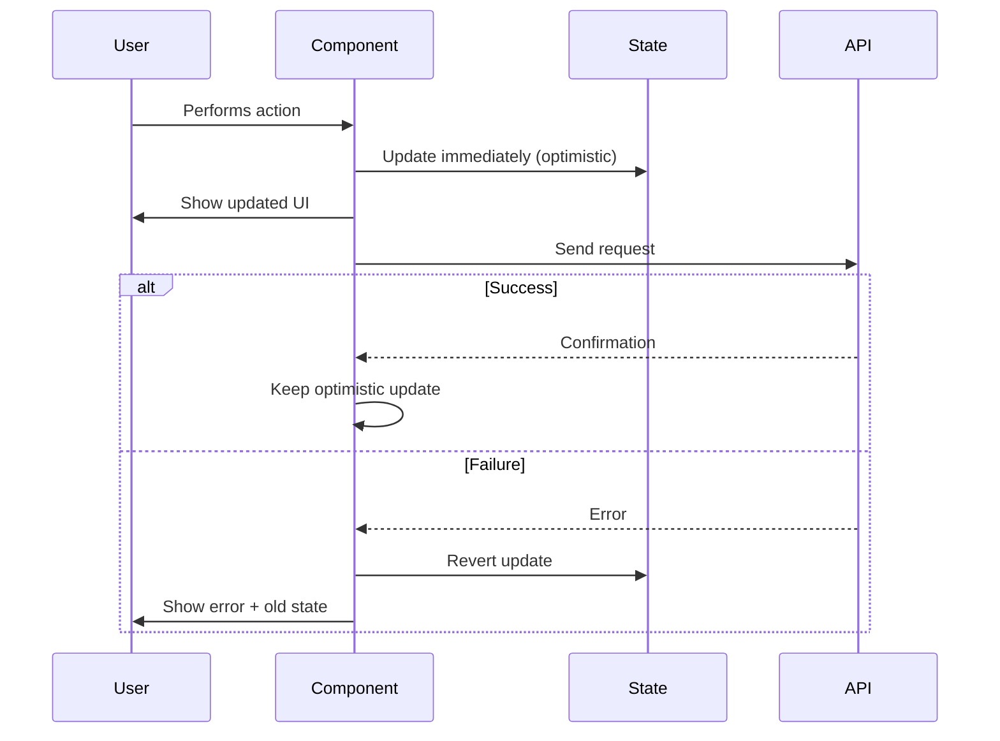

**Example:**

```typescript
function ChatInterface() {
  const [messages, setMessages] = useState([])

  const sendMessage = async (text) => {
    // Optimistic update
    const tempMessage = {
      id: 'temp-' + Date.now(),
      text,
      timestamp: new Date(),
      status: 'sending'
    }

    setMessages([...messages, tempMessage])

    try {
      const response = await api.sendMessage(text)

      // Replace temp with real message
      setMessages(prev =>
        prev.map(msg =>
          msg.id === tempMessage.id ? response.data : msg
        )
      )
    } catch (error) {
      // Remove failed message
      setMessages(prev =>
        prev.filter(msg => msg.id !== tempMessage.id)
      )
      showSnackbar('Failed to send', 'error')
    }
  }
}
```

### Pattern 4: Lifting State Up

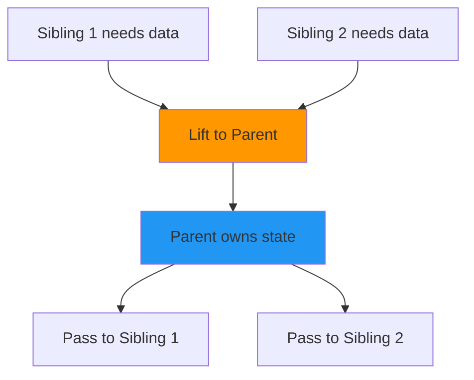

**Example:**

```typescript
// Before: State in one sibling
function Sibling1() {
  const [count, setCount] = useState(0)
  return <div>{count}</div>
}

function Sibling2() {
  // Can't access count from Sibling1!
}

// After: Lift state to parent
function Parent() {
  const [count, setCount] = useState(0)

  return (
    <>
      <Sibling1 count={count} setCount={setCount} />
      <Sibling2 count={count} />
    </>
  )
}
```

---

## Best Practices

### ✅ Do's

1. **Keep state as local as possible**
```typescript
// ✅ Good: State only where needed
function SearchBar() {
  const [query, setQuery] = useState('')
  // ...
}

// ❌ Bad: Lifting unnecessarily
function App() {
  const [searchQuery, setSearchQuery] = useState('')  // Not used by other components!
}
```

2. **Use context for truly global state**
```typescript
// ✅ Good: Auth needed everywhere
<AuthProvider>
  <App />
</AuthProvider>

// ❌ Bad: Context for component-specific state
<FormDataProvider>  // Only one form uses this
  <SingleForm />
</FormDataProvider>
```

3. **Colocate state with usage**
```typescript
// ✅ Good
function DocumentPage() {
  const [documents, setDocuments] = useState([])
  const [filter, setFilter] = useState('')
  // Both used only in this component
}
```

4. **Use derived state instead of duplicating**
```typescript
// ✅ Good: Compute on render
const filteredItems = items.filter(i => i.active)

// ❌ Bad: Duplicate state
const [items, setItems] = useState([])
const [filteredItems, setFilteredItems] = useState([])
// Now must keep in sync!
```

5. **Cleanup effects**
```typescript
// ✅ Good
useEffect(() => {
  const controller = new AbortController()
  fetchData(controller.signal)

  return () => controller.abort()  // Cleanup!
}, [])
```

### ❌ Don'ts

1. **Don't mutate state directly**
```typescript
// ❌ Bad
state.items.push(newItem)
setState(state)

// ✅ Good
setState({ ...state, items: [...state.items, newItem] })
```

2. **Don't depend on previous state incorrectly**
```typescript
// ❌ Bad
setCount(count + 1)
setCount(count + 1)  // Both use same 'count' value!

// ✅ Good
setCount(prev => prev + 1)
setCount(prev => prev + 1)  // Uses updated value
```

3. **Don't forget dependency arrays**
```typescript
// ❌ Bad
useEffect(() => {
  fetchData(id)  // 'id' is a dependency!
})  // Missing deps array

// ✅ Good
useEffect(() => {
  fetchData(id)
}, [id])
```

4. **Don't over-contextualize**
```typescript
// ❌ Bad: Everything in context
<UserContext>
  <ThemeContext>
    <NotificationContext>
      <ModalContext>
        <FormContext>
          {/* Context hell */}
        </FormContext>
      </ModalContext>
    </NotificationContext>
  </ThemeContext>
</UserContext>

// ✅ Good: Only essential global state
<AuthProvider>
  <ThemeProvider>
    {/* Everything else is local */}
  </ThemeProvider>
</AuthProvider>
```

---

## State Management Decision Tree

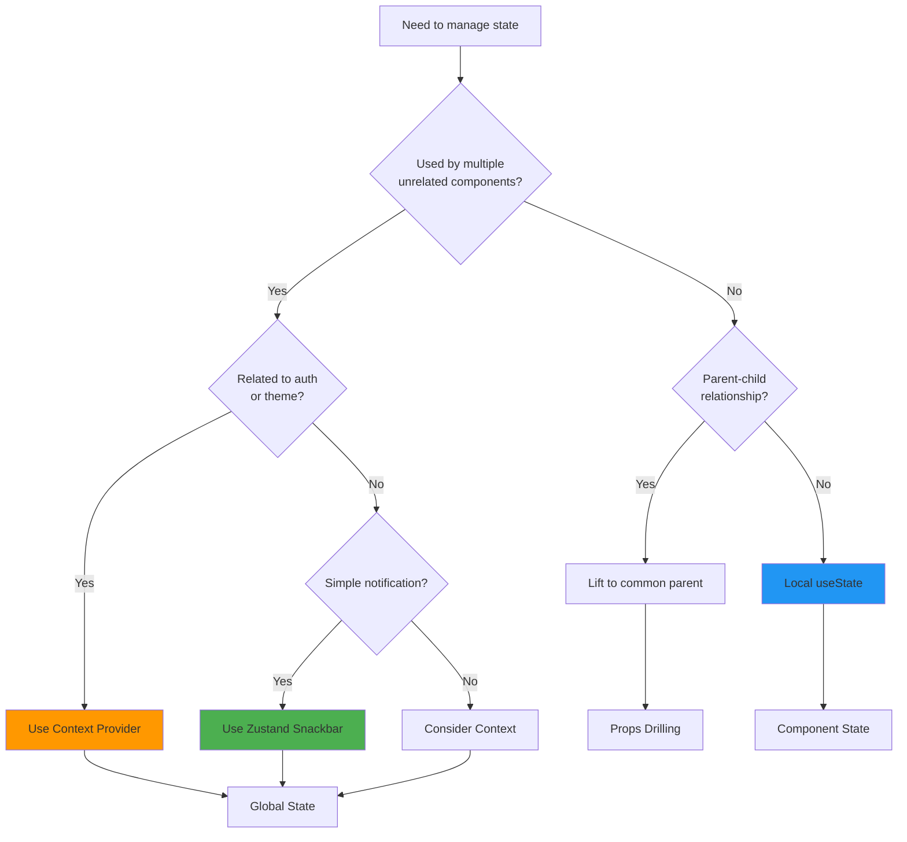

---

## Next Steps

- **[Components Guide](./COMPONENTS.md)** - Learn about reusable components
- **[API Integration](./API_INTEGRATION.md)** - Understand server state management
- **[Development Guide](./DEVELOPMENT_GUIDE.md)** - Apply these patterns in practice

---

**Last Updated:** December 4, 2025
