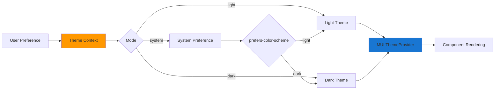
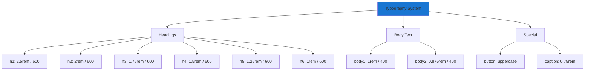
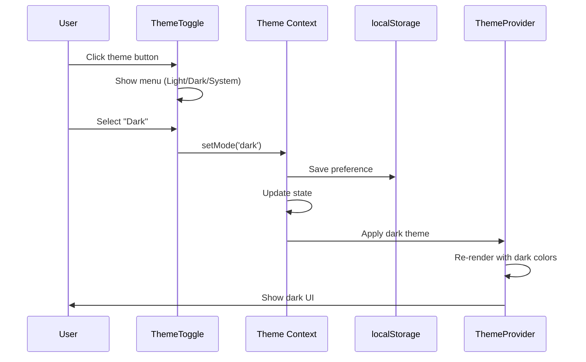
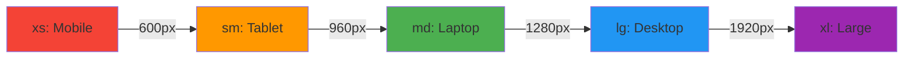

# Theming & Styling Guide

> **Complete guide to the Material-UI theme system, styling approach, and responsive design**

## 📋 Table of Contents

- [Overview](#overview)
- [Theme System](#theme-system)
- [Theme Configuration](#theme-configuration)
- [Dark Mode Implementation](#dark-mode-implementation)
- [Styling Approaches](#styling-approaches)
- [Responsive Design](#responsive-design)
- [Component Customization](#component-customization)
- [Best Practices](#best-practices)

---

## Overview

The application uses **Material-UI (MUI) v5** with a custom theme implementing Material Design 3 principles. Styling is achieved through Emotion CSS-in-JS, with support for dynamic light/dark theme switching.

### Styling Stack

```mermaid
graph TD
    A[Styling System] --> B[MUI Theme]
    A --> C[Emotion CSS-in-JS]
    A --> D[Global CSS]

    B --> E[Light Theme]
    B --> F[Dark Theme]
    B --> G[Component Overrides]

    C --> H[sx Prop]
    C --> I[styled() API]

    D --> J[Reset Styles]
    D --> K[Typography]

    style B fill:#1976d2
    style C fill:#9c27b0
```

**Files:**
- `frontend/lib/mui-theme.ts` - Theme configuration
- `frontend/lib/theme-context.tsx` - Theme provider & switcher
- `frontend/app/globals.css` - Global styles

---

## Theme System

### Theme Architecture



### Color System

The theme uses **HSL color space** converted to RGB for MUI compatibility:

| Color Token | Light Mode | Dark Mode | Usage |
|-------------|------------|-----------|-------|
| Primary | Blue (#2563eb) | Blue (#3b82f6) | Buttons, links, highlights |
| Secondary | Light Gray | Dark Charcoal | Secondary actions, backgrounds |
| Success | Green (#22c55e) | Green (#4ade80) | Success states, checkmarks |
| Warning | Amber (#f59e0b) | Amber (#fbbf24) | Warnings, alerts |
| Error | Red (#ef4444) | Red (#f87171) | Errors, destructive actions |
| Background | White (#ffffff) | Dark (#0a0a0a) | Page background |
| Paper | White | Dark Gray (#0f0f0f) | Card backgrounds |

---

## Theme Configuration

### Theme Structure

```typescript
// frontend/lib/mui-theme.ts

const lightThemeOptions: ThemeOptions = {
  palette: {
    mode: 'light',
    primary: {
      main: '#2563eb',          // Primary blue
      contrastText: '#ffffff'
    },
    background: {
      default: '#ffffff',       // Page background
      paper: '#ffffff'          // Card background
    },
    text: {
      primary: '#0a0a0a',       // Main text
      secondary: '#737373'      // Muted text
    }
  },

  shape: {
    borderRadius: 12            // Global border radius
  },

  typography: {
    fontFamily: [
      '-apple-system',
      'BlinkMacSystemFont',
      '"Segoe UI"',
      'Roboto',
      'Arial',
      'sans-serif'
    ].join(','),

    h1: { fontSize: '2.5rem', fontWeight: 600 },
    h2: { fontSize: '2rem', fontWeight: 600 },
    h3: { fontSize: '1.75rem', fontWeight: 600 },
    // ...
  },

  components: {
    // Component-specific overrides
  }
}
```

### Typography Scale



### Component Overrides

Custom default styles for MUI components:

```typescript
components: {
  MuiButton: {
    styleOverrides: {
      root: {
        borderRadius: 12,
        textTransform: 'none',     // Sentence case
        fontWeight: 500,
        padding: '8px 20px'
      }
    }
  },

  MuiCard: {
    styleOverrides: {
      root: {
        borderRadius: 16,
        boxShadow: '0 1px 3px rgba(0,0,0,0.12)'
      }
    }
  },

  MuiTextField: {
    styleOverrides: {
      root: {
        '& .MuiOutlinedInput-root': {
          borderRadius: 12
        }
      }
    }
  },

  MuiChip: {
    styleOverrides: {
      root: {
        borderRadius: 8
      }
    }
  }
}
```

---

## Dark Mode Implementation

### Theme Switching Flow



### Theme Context Implementation

```typescript
// frontend/lib/theme-context.tsx

interface ThemeContextType {
  mode: 'light' | 'dark' | 'system'
  setMode: (mode: 'light' | 'dark' | 'system') => void
  resolvedTheme: 'light' | 'dark'
}

export function ThemeProvider({ children }) {
  const [mode, setMode] = useState<'light' | 'dark' | 'system'>('system')
  const [resolvedTheme, setResolvedTheme] = useState<'light' | 'dark'>('light')

  // Listen to system preference
  useEffect(() => {
    const mediaQuery = window.matchMedia('(prefers-color-scheme: dark)')

    const handleChange = () => {
      if (mode === 'system') {
        setResolvedTheme(mediaQuery.matches ? 'dark' : 'light')
      }
    }

    mediaQuery.addEventListener('change', handleChange)
    return () => mediaQuery.removeEventListener('change', handleChange)
  }, [mode])

  // Apply theme
  const theme = resolvedTheme === 'dark' ? darkTheme : lightTheme

  return (
    <MuiThemeProvider theme={theme}>
      {children}
    </MuiThemeProvider>
  )
}
```

### Theme Toggle Component

```typescript
// frontend/components/ThemeToggle.tsx

export function ThemeToggle() {
  const { mode, setMode } = useTheme()
  const [anchorEl, setAnchorEl] = useState(null)

  const handleSelect = (newMode: 'light' | 'dark' | 'system') => {
    setMode(newMode)
    setAnchorEl(null)
  }

  return (
    <>
      <IconButton onClick={(e) => setAnchorEl(e.currentTarget)}>
        {mode === 'dark' ? <DarkModeIcon /> : <LightModeIcon />}
      </IconButton>

      <Menu anchorEl={anchorEl} open={Boolean(anchorEl)}>
        <MenuItem onClick={() => handleSelect('light')}>
          Light
        </MenuItem>
        <MenuItem onClick={() => handleSelect('dark')}>
          Dark
        </MenuItem>
        <MenuItem onClick={() => handleSelect('system')}>
          System
        </MenuItem>
      </Menu>
    </>
  )
}
```

---

## Styling Approaches

### 1. MUI sx Prop (Recommended)

The `sx` prop provides the most powerful and flexible styling:

```typescript
<Box
  sx={{
    // Static styles
    padding: 2,
    borderRadius: 2,
    backgroundColor: 'background.paper',

    // Responsive styles
    display: { xs: 'block', md: 'flex' },

    // Theme access
    color: 'primary.main',

    // Hover states
    '&:hover': {
      backgroundColor: 'action.hover'
    },

    // Nested selectors
    '& .MuiButton-root': {
      marginTop: 2
    }
  }}
>
  Content
</Box>
```

**MUI Spacing System:**
- `1` = 8px
- `2` = 16px
- `3` = 24px
- `4` = 32px

### 2. styled() API

For reusable styled components:

```typescript
import { styled } from '@mui/material/styles'

const GradientBox = styled(Box)(({ theme }) => ({
  background: `linear-gradient(135deg,
    ${theme.palette.primary.main} 0%,
    ${theme.palette.secondary.main} 100%)`,
  padding: theme.spacing(4),
  borderRadius: theme.shape.borderRadius,

  [theme.breakpoints.down('md')]: {
    padding: theme.spacing(2)
  }
}))

// Usage
<GradientBox>Content</GradientBox>
```

### 3. Global CSS

Used sparingly for reset styles and base typography:

```css
/* frontend/app/globals.css */

* {
  box-sizing: border-box;
  margin: 0;
  padding: 0;
}

body {
  font-family: -apple-system, BlinkMacSystemFont, 'Segoe UI', Roboto;
  -webkit-font-smoothing: antialiased;
}

code {
  font-family: 'SF Mono', Monaco, 'Courier New', monospace;
}
```

---

## Responsive Design

### Breakpoint System

MUI provides 5 breakpoints:

```typescript
{
  xs: 0,      // Phone
  sm: 600,    // Tablet
  md: 960,    // Small laptop
  lg: 1280,   // Desktop
  xl: 1920    // Large desktop
}
```

### Responsive Patterns



### Responsive sx Prop

```typescript
<Box
  sx={{
    // Mobile-first approach
    display: 'block',
    padding: 2,

    // Tablet and up
    [theme => theme.breakpoints.up('sm')]: {
      display: 'flex',
      padding: 3
    },

    // Desktop and up
    [theme => theme.breakpoints.up('md')]: {
      padding: 4,
      maxWidth: 1200
    },

    // Or shorthand:
    display: { xs: 'block', sm: 'flex' },
    padding: { xs: 2, sm: 3, md: 4 }
  }}
/>
```

### Grid Layout

```typescript
import { Grid } from '@mui/material'

<Grid container spacing={3}>
  <Grid item xs={12} md={6} lg={4}>
    {/* Full width on mobile, half on tablet, third on desktop */}
    <Card>Content 1</Card>
  </Grid>

  <Grid item xs={12} md={6} lg={4}>
    <Card>Content 2</Card>
  </Grid>

  <Grid item xs={12} md={12} lg={4}>
    <Card>Content 3</Card>
  </Grid>
</Grid>
```

---

## Component Customization

### Custom Color Variants

```typescript
<Button
  sx={{
    backgroundColor: 'success.main',
    color: 'success.contrastText',
    '&:hover': {
      backgroundColor: 'success.dark'
    }
  }}
>
  Success Button
</Button>
```

### Gradient Backgrounds

```typescript
<Box
  sx={{
    background: (theme) => `linear-gradient(135deg,
      ${theme.palette.primary.main} 0%,
      ${theme.palette.secondary.main} 100%)`,
    backgroundClip: 'text',
    WebkitBackgroundClip: 'text',
    color: 'transparent'
  }}
>
  Gradient Text
</Box>
```

### Glassmorphism Effect

```typescript
<Paper
  sx={{
    backgroundColor: 'rgba(255, 255, 255, 0.1)',
    backdropFilter: 'blur(10px)',
    border: '1px solid rgba(255, 255, 255, 0.2)',
    boxShadow: '0 8px 32px 0 rgba(0, 0, 0, 0.1)'
  }}
>
  Glass card
</Paper>
```

---

## Best Practices

### ✅ Do's

1. **Use theme tokens**
```typescript
// ✅ Good
<Box sx={{ color: 'primary.main' }} />

// ❌ Bad
<Box sx={{ color: '#2563eb' }} />
```

2. **Leverage sx prop for one-off styles**
```typescript
// ✅ Good
<Button sx={{ marginTop: 2 }}>Click</Button>

// ❌ Bad - creating styled component for single use
const MarginButton = styled(Button)({ marginTop: 16 })
```

3. **Use breakpoint helpers**
```typescript
// ✅ Good
<Box sx={{ display: { xs: 'none', md: 'block' } }} />

// ❌ Bad
<Box sx={{ '@media (min-width: 960px)': { display: 'block' } }} />
```

4. **Consistent spacing**
```typescript
// ✅ Good - using spacing scale
<Box sx={{ padding: 3, margin: 2 }} />

// ❌ Bad - arbitrary values
<Box sx={{ padding: '23px', margin: '17px' }} />
```

### ❌ Don'ts

1. **Don't mix styling approaches**
```typescript
// ❌ Bad
<Box sx={{ padding: 2 }} style={{ margin: '16px' }}>
```

2. **Don't use inline styles**
```typescript
// ❌ Bad
<Box style={{ color: 'red' }}>

// ✅ Good
<Box sx={{ color: 'error.main' }}>
```

3. **Don't hardcode colors**
```typescript
// ❌ Bad
<Box sx={{ backgroundColor: '#000' }}>

// ✅ Good
<Box sx={{ backgroundColor: 'background.paper' }}>
```

---

## Common Styling Patterns

### Card with Hover Effect

```typescript
<Card
  sx={{
    transition: 'all 0.3s ease',
    '&:hover': {
      transform: 'translateY(-4px)',
      boxShadow: 4
    }
  }}
>
  Content
</Card>
```

### Flex Layouts

```typescript
// Horizontal center
<Box sx={{ display: 'flex', justifyContent: 'center', alignItems: 'center' }}>

// Space between
<Box sx={{ display: 'flex', justifyContent: 'space-between' }}>

// Column layout
<Box sx={{ display: 'flex', flexDirection: 'column', gap: 2 }}>
```

### Conditional Styling

```typescript
<Box
  sx={{
    backgroundColor: isActive ? 'primary.main' : 'background.paper',
    color: isActive ? 'primary.contrastText' : 'text.primary'
  }}
>
```

---

## Next Steps

- **[Components Guide](./COMPONENTS.md)** - Learn about pre-styled components
- **[Development Guide](./DEVELOPMENT_GUIDE.md)** - Apply styling in practice
- **[MUI Documentation](https://mui.com)** - Official MUI docs

---

**Last Updated:** December 4, 2025
